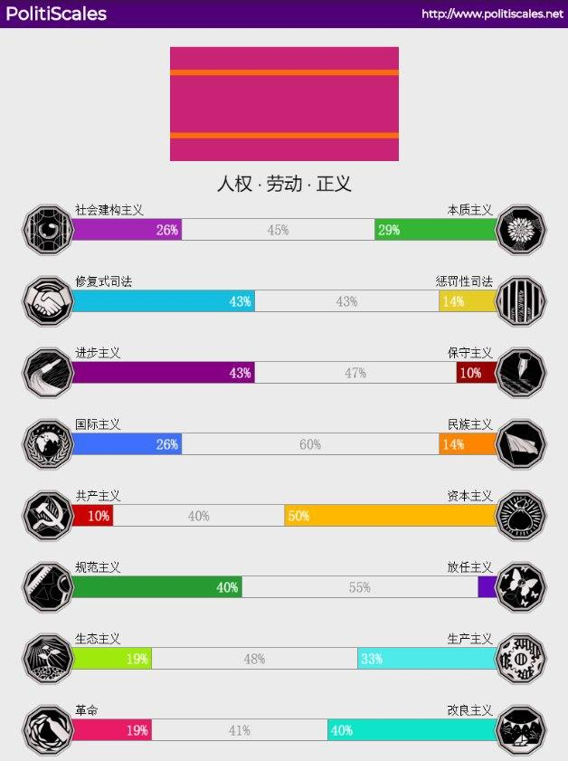

# About me

Hello, world!    
我是谁呢？这个问题并不是那么容易回答，如果是从现实角度来说，我是一个普通的大学生，喜欢折腾技术与阅读，值得一提的就是目前在学习深度学习（~~炼丹~~）。    
但是，这短短几句话不足以说明我是谁，我还有很多东西没说，最起码，我应该说清楚我喜欢什么与讨厌什么：  

**喜欢的东西：**    
1. 开源/自由软件（FOSS）
2. 能带来改变的思想与文字
3. 能与他人理性沟通的平台与机会

**讨厌的东西：**    
1. 封闭的环境
2. 无处不在的权威
3. 懒惰

在这里我想要解释一下为什么我讨厌懒惰，根据《少有人走的路：心智成熟的旅程》中所说的内容，懒惰是一种原罪，阻止人们寻求真相，阻止人们改变自我等等。而从我喜欢的东西可以看出，我是一个喜欢包容开放的环境的人，懒惰无疑会带来固执与封闭等等这些对开放社会（环境）有害的东西，而且，人们总是难以意识到自己的懒惰（包括我自己），所以我必须声明我讨厌懒惰，给予懒惰足够的重视。    

想要更直观地了解我的立场？可以看看我在[ PolitiScale 在线政治测试](https://www.politiscales.net/zh_CN/)上的测试结果（仅供参考）：    

目前，在政治立场上对我影响较大的应该就是[编程随想](https://program-think.blogspot.com/)了（从我选择的 ID 就可以看出这一点）。因为同样想说些什么，所以我开通了博客。要问本博客的主题是什么？我只能说博客偏向技术主题，当然，还有其它东西，偏向技术主题是因为作为程序猿的我同样相信技术能够改变世界，不过，仅仅拥有技术是不够的，还有很多方面需要考虑，所以博客上也会有一些我的感想与论述。    

最后，路还很长，有话慢慢说。欢迎各位与我交流，我的邮箱是 viflythink@gmail.com，你也可以通过[ Telegram ](https://t.me/viflythink)联系我，或者使用[ Twitter ](https://twitter.com/viflythink)（较少使用）私信我。 

# 交换友链
欢迎各位与我交换博客友链，想要交换友链的话，可以通过上面的联系方式联系我，或者直接在任意博文下留言，以下是一些可能用到的信息：  

博客简述：Vifly 的自留地，既包括技术折腾记录，也有对于各种东西的感想。  
头像：https://viflythink.com/img/avatar.png
