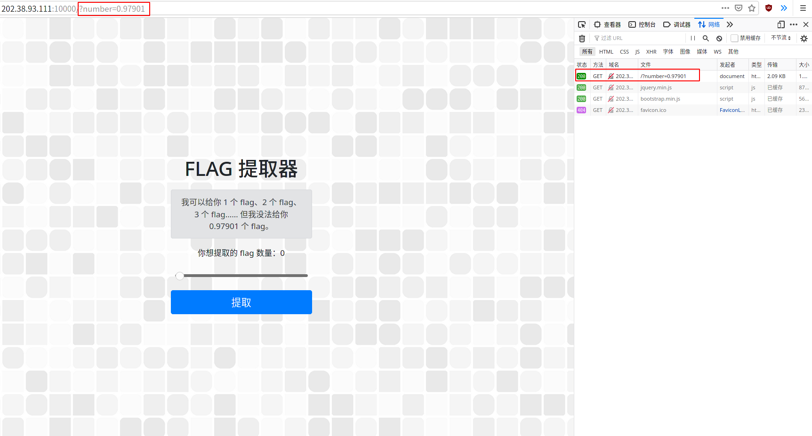
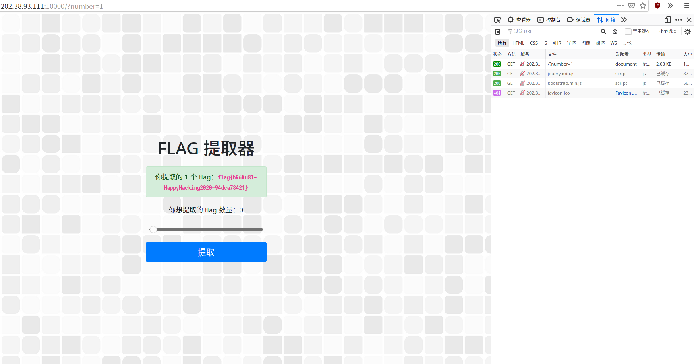
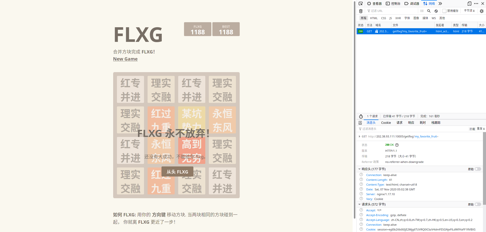
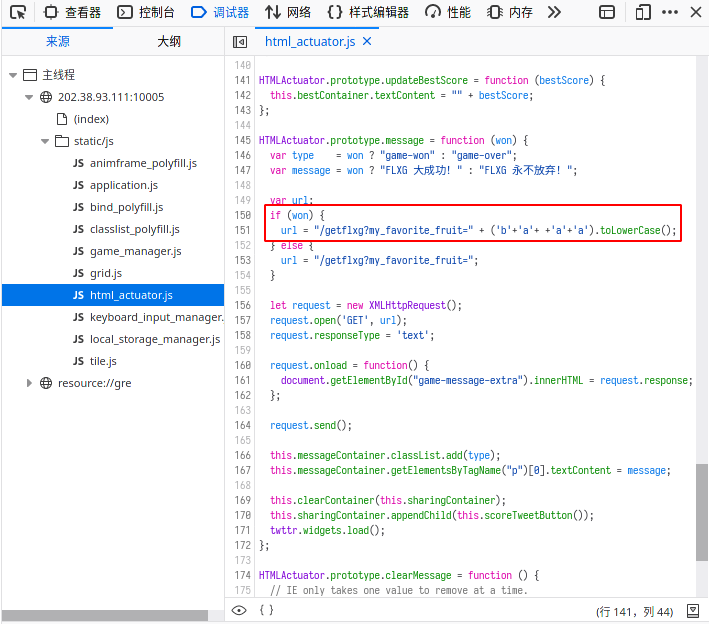
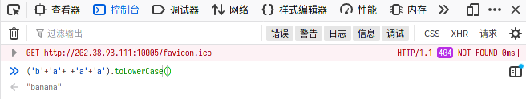
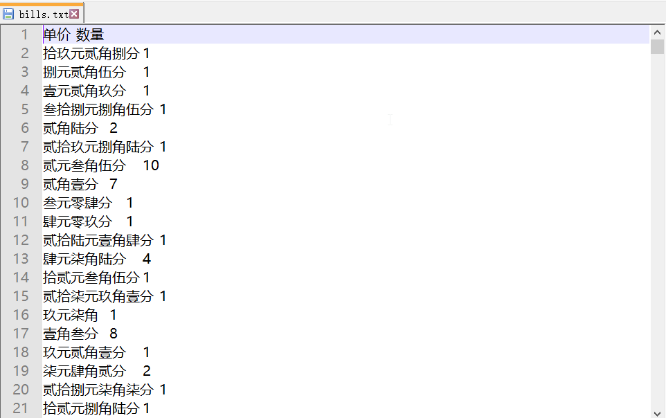
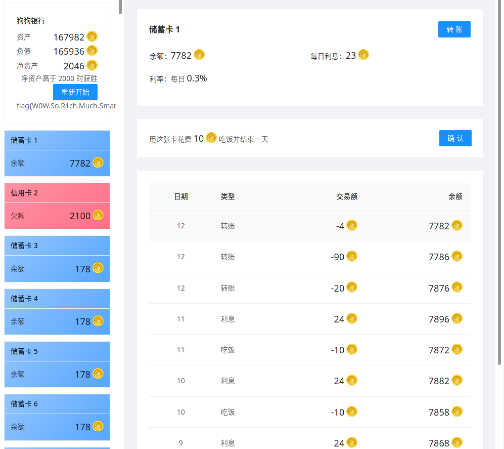

+++
title = "中科大信息安全大赛初体验"
date = "2020-11-09"
description = "第七届中科大信息安全大赛（Hackergame 2020）的经历与题解"
tags = [
    "信息安全",
]
image = "show.jpg"
+++

半年以来的第一篇新博文！九月底的时候放弃考研，然后尝试的秋招都凉了，处于颓废期的博主正好看到第七届中科大信息安全大赛（Hackergame 2020）即将举办，于是便去参加这个 CTF 比赛转换心情。作为一个非信安专业的学生，这是我第一次参加信息安全大赛，虽然之前也看过往年中科大信息安全大赛的题解，但自己真正参与时才发现自己与专业人士的差距。专业 CTF 选手轻松占据了排行榜前列，不过本菜鸡也玩的很开心，打完比赛后不得不说比赛的题目设置都相当有趣，对信安有点兴趣的人来这个比赛玩玩保证不会后悔。

很菜的只拿到了 800 分，但下面还是写一下成功解决的题目的题解吧。

# 签到
为了鼓励参与而设置的送分题，既然是 Web 类的题目那先在浏览器按 F12 打开开发者工具准没错，随便拉一下，点击提取，果然不能拿到 flag，不过看到浏览器发送了一个 GET 请求，其中的参数 number 就是刚才拉到的数字。



那么我们试试提**一个** flag 吧。把 number 参数的值改为 1，就成功拿到签到题的 flag 了！



# 猫咪问答++
这题很明显是考验参赛者使用搜索引擎的能力。不过嘛，看到 [2018 年猫咪问答题解](https://github.com/ustclug/hackergame2018-writeups/blob/master/official/ustcquiz/README.md)后我想到一些题目也可以靠脚本暴力尝试进行破解，第一和第四小题搜索起来都比较麻烦，所以这两题就靠[脚本](https://gist.github.com/vifly/751221f27ba89f670b8f2c56b96c24a7#file-cat_answers-py)破解好了。

第二小题的答案可以在[ RFC1149 文档](https://tools.ietf.org/html/rfc1149)上找到，原文是“A typical MTU is 256 milligrams.”，所以答案是 256。

第三小题的答案可以在[中国科学技术大学 Linux 用户协会新闻站](https://news.ustclug.org/2019/09/2019-sfd-ustc/)上找到，原文提到“最后一项是李文睿同学介绍了开源游戏 Teeworlds”，所以得到 9 这个数字。

第五小题的答案依然可以在[中国科学技术大学 Linux 用户协会新闻站](https://news.ustclug.org/2019/12/hackergame-2019/)上找到，答案是 17098。

对于第一小题，我先通过粗略估计得出答案至少为 6 的结论，接着就是毫无技巧的脚本暴力破解时间，最后得出第一小题答案是 12，第四小题答案是 9。

# 2048
非常有趣的 2048 游戏，但是，既然这是打 CTF，那这题肯定不是考验我们玩 2048 的技术，首先像签到题那样胡乱尝试直到在开发者工具看到一个 GET 请求：



看来这题想要取得 flag 就需要找到出题者喜欢的水果，虽然可以靠脚本暴力尝试所有常见的水果名，不过通过分析网页源代码我们可以找到 2048 获胜时将会发送的网络请求：



好，水果名就藏在其中，只需在开发者工具的控制台里输入 ('b'+'a'+ +'a'+'a').toLowerCase() 就能得到“banana”这个答案了（神奇的 JavaScript 语法），发送这个网络请求即可获得 flag。



# 一闪而过的 Flag
在 Windows 下双击下载的 exe 文件发现黑窗一闪而过，那么很自然的想到在 exe 文件所在的目录下按住 Shift 键并点击右键选择“在此处打开 PowerShell”，输入 ./Untitled01.exe，然后可执行文件就输出了 flag{Are_you_eyes1ght_g00D?_can_you_dIst1nguish_1iI?} 这个答案（我还以为会有其它障碍）！本题难度非常低，基本上在终端里执行过可执行文件的人都知道先尝试这样做。

# 从零开始的记账工具人
中文大写数字转阿拉伯数字？这个需求想必很常见吧。我找到了一个能实现这个功能的 [Python 库](https://pypi.org/project/cn2an/)，接下来就是写一个[脚本](https://gist.github.com/vifly/751221f27ba89f670b8f2c56b96c24a7#file-bills-py)来帮我们进行计算了。

为了减少工作量（懒得写读取 xlsx 文件的代码），我用 MS Excel 导出文本文件，然后进行计算。



写脚本时需要注意 Excel 导出的 txt 文件采用的是 GBK 编码。根据计算结果得到 flag{11118.23}。

# 233 同学的 Docker
注意到题目描述里说明“写了一行命令删掉这个文件”，对 Docker 有点了解的人应该已经想到这个文件至少在某一层依然存在。

首先尝试[使用 Docker history 回滚](https://gist.github.com/dasgoll/476ecc7a057ac885f0be)到未删除 flag.txt 文件时的版本，执行 docker history 8b8d3c8324c7/stringtool 后输出：

```
IMAGE               CREATED             CREATED BY                                      SIZE                COMMENT
be6d023618d1        2 weeks ago         /bin/sh -c #(nop)  ENTRYPOINT ["/bin/sh" "-c…   0B                  
<missing>           2 weeks ago         /bin/sh -c rm /code/flag.txt                    0B                  
<missing>           2 weeks ago         /bin/sh -c #(nop) COPY dir:c36852c2989cd5e8b…   1.19kB              
<missing>           6 weeks ago         /bin/sh -c #(nop) WORKDIR /code                 0B                  
<missing>           6 weeks ago         /bin/sh -c mkdir /code                          0B                  
<missing>           6 weeks ago         /bin/sh -c #(nop)  ENV PYTHONUNBUFFERED=1       0B                  
<missing>           6 weeks ago         /bin/sh -c pip3 install pipenv                  37.5MB
...
```

这里执行的 rm /code/flag.txt 就是题目所说的删掉了 flag.txt，然而除了最新的 tag 外其它层的 ID 都是 `<missing>`，看来上面的教程并不适用。不过没关系，这里还有[一篇教程教你如何寻找机密信息](https://www.pushbeta.com/2019/04/10/stripping-the-layers-how-secure-is-your-docker-image/)。执行 docker save 8b8d3c8324c7/stringtool > out.tar 得到 dump 出来的文件。解压 out.tar，在 a39ee53cb7d2d86ef0...（省略）这个文件夹下解压 layer.tar 即可得到 flag.txt。

# 狗狗银行
不得不说这题难倒我几天了，看完规则就可以确定在**正常**情况下我们绝对赚不到钱，想要让净资产达到两千以上只能靠寻找漏洞了。刚开始时我以为需要用到整数溢出，没想到前端还对转账数额上限进行了限制，那就靠 F12 找到网络请求刷吧。没想到虽然网页显示的净资产已经超过 2000，但还是没法取得 flag。接着我又尝试了负数，浮点数等各种奇怪的输入，都没有办法取得成果，我被题目卡住了。

直到两天后组委会发布公告（仅截取重要内容）：
> 公告 1：本题前端计算存在浮点数导致的计算误差，数字特别极端时显示可能不正确。但后端采用大整数精确计算，只有净资产确实高于 2000 时才会给出 flag。

> 公告 3：本题新增限制：每个用户最多 1000 张卡，每张卡最多 100000 条交易......

嗯...公告 1 直接说明我之前的解题思路不对，不过公告 3 倒是给了我灵感：本题需要开多张卡才能解决。那么，也许是利息计算存在误差？我先做了一个测试，得出一张储蓄卡需要至少 167 元才能获得 1 元的利息这个结论。注意到储蓄卡的规则是“利率每日 0.3%“，1 / 0.003 = 333.33，也就是说正常情况下应当存入 334 元才能获得 1 元的利息，但这里只需 167 元即可。然后让我们看看信用卡的规则：利率每日 0.5%，最低 10 元。那么在每日增加 10 元负债的情况下我们最多能从一张信用卡中拿到多少钱呢，答案是 2099 元。2099 / 167 = 12.5689，这意味着我们终于发现了发家致富的好办法，因为此时从信用卡获取的贷款居然能给我们带来比负债利息更大的收益。
于是具体的赚钱方法就是：开一张信用卡，然后开 12 张储蓄卡，用信用卡给每张储蓄卡转帐 167 元，那么我们每日的净收益就是 12 - 10 = 2 元。不停重复上述步骤直到题目规定的上限，然后吃饭结束一天。具体代码可通过[ gist ](https://gist.github.com/vifly/751221f27ba89f670b8f2c56b96c24a7#file-hack_bank-py)查看。运行脚本后打开网页可看到 flag{W0W.So.R1ch.Much.Smart.52f2d579}。



# 一些没做出来的题目
先说一说令我觉得遗憾（感觉差点就能做出来）的题目吧。看了[官方/非官方题解](https://github.com/USTC-Hackergame/hackergame2020-writeups/)后，不得不说有些题目真的只是差一点就能做出来了，请容我在这里倒下苦水。

“从零开始的 HTTP 链接”，我已经找到[一篇文章提到 curl 可以连接零号端口](https://daniel.haxx.se/blog/2014/10/25/pretending-port-zero-is-a-normal-one/)，然而 Arch 上的 curl 版本过高，没法做到这一点，本博主居然忘了自己可以编译一个旧版本的 curl 尝试连接，错失了这一道题。除了 curl 外，这题[也可以通过 Python 解决](https://github.com/USTC-Hackergame/hackergame2020-writeups/blob/master/players/mcfx/writeup.md#%E6%9D%A5%E8%87%AA%E4%B8%80%E6%95%99%E7%9A%84%E5%9B%BE%E7%89%87)。

“来自一教的图片”，作为一个学过图像处理的人士，居然没想到可以使用 [np.fft.fft2](https://numpy.org/doc/stable/reference/generated/numpy.fft.fft2.html#numpy.fft.fft2) 得到答案，真是非常惭愧啊（狗头保命）。

“生活在博弈树上”，虽然知道可以靠 C 语言 gets 函数的安全缺陷进行栈溢出攻击跳转到输出 flag 的位置，但是不会构造 payload，所以只能放弃这题。

除了上面这些让我遗憾的题目外，还有一些有趣的题目值得一提。

“室友的加密硬盘”，什么，居然有 512 位 AES 加密？看完题解后发现这不是重点，并不需要猜测这里的加密实现是否存在缺陷，使用冷启动攻击才是正道。这也提醒我们全盘加密并不能 100 % 确保数据不会泄露，遇到懂得在 dump 的内存中寻找密钥的攻击者还是有可能被破解的。

“超简易的网盘服务器”，很有趣的一点是这题与上一题产生了联动，数据放本地不安全，那么放在云端就能确保万事大吉了吗？为了解决这题我特意去研究了 Nginx 的 location 匹配规则，虽然得知针对本题的 nginx.conf 访问 php 文件可以绕过认证，但对于如何访问 private 文件夹下的 flag 还是一筹莫展，尝试了 ../../ 这样的路径，但可惜 h5ai 并没有这么容易被攻破。比赛结束后发现自己吃了没认真阅读 h5ai 源代码的亏，没想到在没认证的情况下可以通过 h5ai 的下载功能把全部文件下载。不得不说，这题成功吓到了我，让我也赶快去检查自己的 Nginx 配置，避免出现同样由于忽略匹配优先级而导致的漏洞。

# 总结
谢谢中科大信息安全大赛，让我体验到了久违的解决问题的乐趣，我已经很久没体会过躺在床上时依然在思考比赛题目的感觉了，这次比赛成功做到了这点，对我来说这就足够了。名次并不重要，重要的是解题的乐趣。

如果明年还有中科大信息安全大赛，那我肯定会参加，当然，与今年没什么准备就仓促上阵不同，至少我会先看下 [CTF Wiki](https://ctf-wiki.github.io/ctf-wiki/) 再来解题，争取更好的名次。也强烈安利各位还没参加过 CTF 的童鞋尝试一下中科大的信息安全大赛，并不需要多少专业技能也可解题，既可以体会到这种充满乐趣的过程，顺便还能学到一点冷门的东西。 
