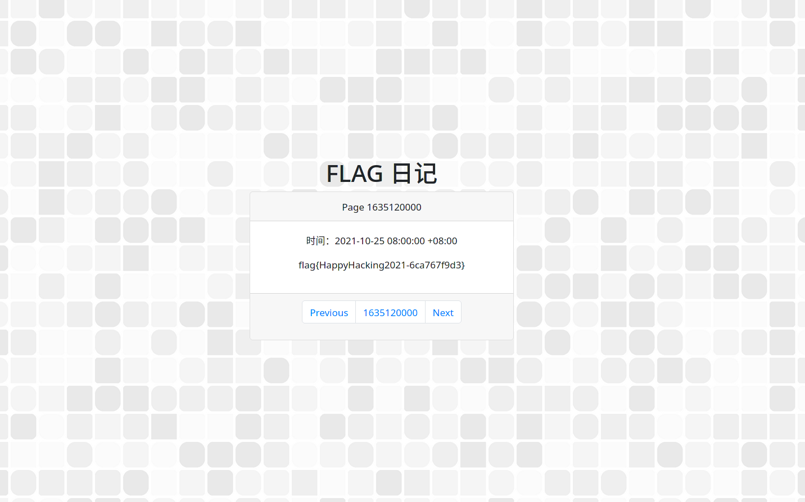
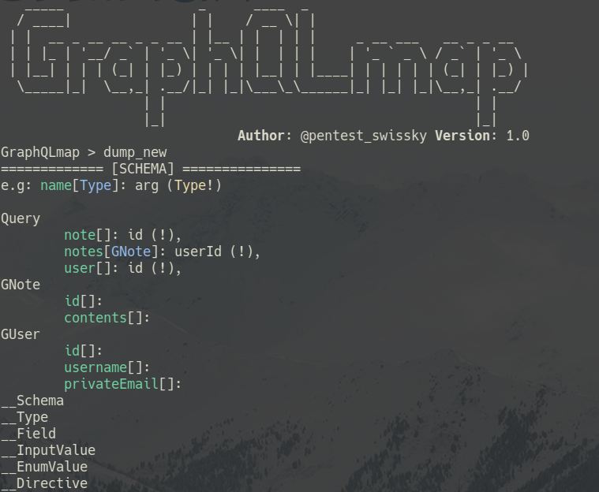
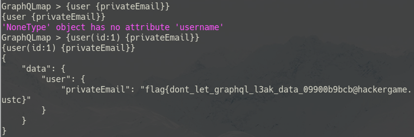
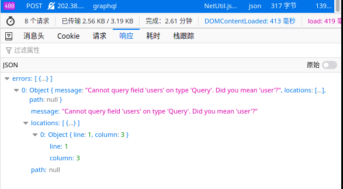
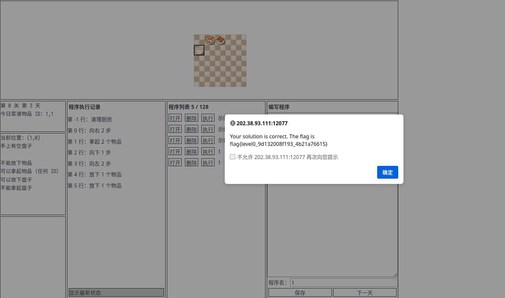
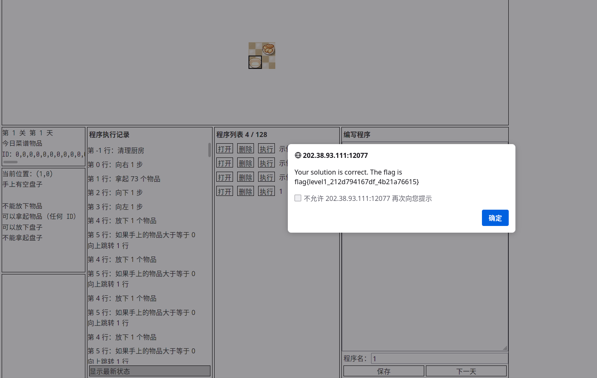

+++
title = "2021 中科大信息安全大赛题解"
date = "2021-10-31"
description = "第八届中科大信息安全大赛（Hackergame 2021）的经历与题解"
tags = [
    "信息安全",
]
image = "show.jpg"
+++

这是我第二次参加 Hackergame 了，今年依然玩的很开心，感受到了来自不同领域的考验，更开心的是与[上一年](https://viflythink.com/Hackergame_2020_writeups/)的 800 分相比，今年拿到了 1150 分，有所进步😂。虽然我做出来的题并不多，而且有些简单的题目没解决，但还是写一篇博文提供题解吧。希望本篇博文能够帮到想参加 Hackergame 的各位小伙伴。

# 签到
与上一年的签到题相比，今年连脑筋急转弯都不需要了，每次点 Next 时间都会 +1s（唐突玩梗），我们只要把时间翻到本届大赛的举办日期即可，也就是说需要计算出 1970 年 1 月 1 日与 2021 年 CTF 大赛的时间差（用秒表示）。这里随便选取一个符合 2021 年 CTF 大赛时间范围的时间，然后使用 Python 计算：

```Python
import datetime

today = datetime.datetime(2021, 10, 25)
begin = datetime.datetime(1970, 1, 1)

delta = today - begin
print(int(delta.total_seconds()))
```

由于可选的范围较大，所以代码不考虑时区且日期只精确到日，最后得到 1635120000 这个数字，那么访问 http://202.38.93.111:10000/?page=1635120000 就可以得到 flag 了。



# 进制十六——参上
X 同学不会退出 Vim 着实让我笑了（[知名勒索软件](https://devhumor.com/content/uploads/images/June2018/vim.jpg)），只不过这题虽说标题含有十六进制，但主要考验的是参赛者对 ASCII 码的了解。看到图片中的数字时很容易就会猜测这是不是 ASCII 码，通过 `man ascii` 查十六进制表进行对比，发现前面的几个数字与图片右侧开头的字母完全能对上，那么接下来就简单了。先找到 flag 的开头，查表得“flag{”对应的十六进制 ASCII 码是 66 6C 61 67 7B，而末尾的“}”对应的是 7D，把图中属于这部分的数字手打出来，然后用 Python 进行转换即可，这里我直接抄 [stackoverflow 上的回答](https://stackoverflow.com/a/49400923)：

```Python
s = "66 6C 61 67 7B 59 30 55 5F 53 48 30 55 31 44 5F 6B 6E 30 77 5F 48 30 57 5F 74 30 5F 43 30 6E 76 33 72 74 5F 48 45 58 5F 74 6F 5F 54 65 78 54 7D"
l = list(map(lambda x: int(x, 16), s.split()))
print(''.join(map(chr, l)))
```

# 猫咪问答 Pro Max
与上一年的猫咪问答++一样，都是考验参赛者的信息搜索能力，我依然是采用了部分问题搜寻答案，另一些问题用脚本暴力破解的方案（脚本都没怎么改）。

第一小题有点意思，题目提到信息安全俱乐部的域名（sec.ustc.edu.cn）已经无法访问，如何找到现在已经无法访问的网页上的资源呢？答案当然是网页快照，这里我选择了 [Wayback Machine](https://web.archive.org)，其记录的[社团章程页面](https://web.archive.org/web/20170515053637/http://sec.ustc.edu.cn/doku.php/codes)正文第一句话就是“本章程在 2015 年 5 月 4 日，经会员代表大会审议通过。”，所以答案是 20150504。

*PS：对于中国大陆的网民来说，想看的文章 404 是一个家常便饭的事情，感谢 Wayback Machine 等提供网页快照的组织，他们让互联网的记忆不再转瞬即逝，避免了互联网内容的永久消失，运营这些服务所耗费的资源是巨大的，如果你有能力的话，可以考虑[向 Wayback Machine 捐款](https://archive.org/donate)以支持他们继续运营下去。*

第三小题可以通过搜索“中国科学技术大学 Linux 用户协会 西区活动室”这些关键词找到对应的[新闻稿](https://news.ustclug.org/2016/06/new-activity-room-in-west-library/)，其中就有现场照片，翻看图片得到 Development Team of Library 这个答案。

第五小题又是一个愚人节玩笑，谷歌找到对应的 [RFC](https://datatracker.ietf.org/doc/html/rfc8962)，在 Table of Contents 中看到存在 Reporting Offenses 这一章节，跳到该章节看到“Send all your reports of possible violations and all tips about wrongdoing to /dev/null.”这一句话提供了答案，所以本题的答案是 /dev/null。

剩下的题目就是靠[脚本](https://gist.github.com/vifly/d98bae07c3fffdbd44a908152afb1b75#file-cat_answers_pro_max-py)解决了。

# 卖瓜
不知道是不是每一届 Hackergame 的 Web 类都会有一道题目涉及数值运算。6 斤与 9 斤的瓜在放整数个的情况下是不可能凑够 20 斤的，我一开始以为这题需要想办法弄出浮点数，但经过了多次尝试后发现这题需要利用数值溢出来解决。随意尝试输入一个很大的数字，可以发现当输入的数值超过一定范围时正数会溢出变为负数。试了好一会后发现添加 5944674407370955162 个 9 斤的瓜后会导致记录变为 -1838162554790060032 斤，我们的目标是 20 斤，-1838162554790060032 加 20 正好是 9 的倍数，(-1838162554790060032 + 20) / 9 得到 -204240283865562228 这个数字，这个数并不会导致溢出，也就是说先加 5944674407370955162 个 9 斤的瓜，然后再加 204240283865562228 个 9 斤的瓜就可以凑够 20 斤了。前面进行尝试时顺便写了个[脚本](https://gist.github.com/vifly/d98bae07c3fffdbd44a908152afb1b75#file-sell_lemon-py)，于是最后用它提交并获得了 flag。

# Amnesia
## 轻度失忆
这是我第一次成功解决了一道 binary 类的题目！尽管只是完成了第一小题，但依然觉得非常开心。在轻度失忆的情况下，.data 和 .rodata 段会被清除，要知道这两个段是什么东西呢，就需要对 ELF 格式有所了解。一般来说，Linux 下我们编译后得到的产物都是 ELF 格式的，例如 `file /bin/bash` 会告诉我们 bash 是一个 x86 体系架构的 ELF 格式的可执行文件，ELF 要求把编译产物的不同部分放到不同的分段（section，不是 segment），具体有哪些分段，它们分别存放什么，[OSDev Wiki](https://wiki.osdev.org/ELF#File_Structure) 提供了一个表格进行说明。从表格可以得知 .data 段用来存放已初始化的全局变量等数据，而 .rodata 段用来存放不变的数据。既然这两个段会被清空，那么我们就不能把含有 “Hello, world!” 的字符串放到这些地方，在这里不得不说到 C 语言的一个麻烦点：C 语言中并不存在真正的字符串，所谓的字符串本质上是字符指针或字符数组。使用字符指针的话，在初始化时该指针会指向包含“Hello, world!”的只读数据（在 .rodata 段），所以字符指针不能用在这里，只能采用字符数组进行储存。同时也不能把该字符串放到函数外作为全局变量。另外，为了防止 printf("%s", s); 中的 %s 被清除，这里使用 putchar 函数把字符一个个输出。

```C
#include <stdio.h>

int main()
{
    char s[] = "Hello, world!";
    for(int i = 0; i < 13; i++) {
        putchar(s[i]);
    }

    return 0;
}
```

在编译完成后可以通过 `objdump -s -j .rodata hello_world` 与 `objdump -s -j .data hello_world` 检查 .data 和 .rodata 段是否还存在数据（自行替换文件名）。

# 图之上的信息
GraphQL 是一种新颖的接口设计方案，也是我目前还不了解的一个玩意，只不过我根据题目位置和分值推测这道题目的难度应该较低，抱着试一试的心态用谷歌搜寻了 GraphQL 的常见安全问题，然后发现[这篇博文](https://blog.yeswehack.com/yeswerhackers/how-exploit-graphql-endpoint-bug-bounty/)，还以为需要多动手试验几次，可没想到用文章里推荐的 [GraphQLmap](https://github.com/swisskyrepo/GraphQLmap) 就直接扒出了整个接口可用的字段（需要先靠浏览器 F12 找到接口地址和其它信息）。



知道字段后就好办了，只要没有另外的身份验证，接下来直接查询 admin 的邮箱即可。根据 [GraphQL 官方文档](https://graphql.org/learn/queries/)写出查询语句，此处需要填入参数，由于 guest 账号的 id 为 2，所以猜测 admin 的 id 为 1。在 GraphQLmap 内执行 {user(id: 1) {privateEmail}}，好了，黑客扒库成功。



*PS：我后来才发现服务端没禁用 [introspection](https://graphql.org/learn/introspection/)，例如我查询 users 时服务端会提示是不是想查询 user，所以其实不用 GraphQLmap，执行以下查询就可以取得所有字段了。*

```
{__schema{queryType{name}mutationType{name}subscriptionType{name}types{...FullType}directives{name description locations args{...InputValue}}}}fragment FullType on __Type{kind name description fields(includeDeprecated:true){name description args{...InputValue}type{...TypeRef}isDeprecated deprecationReason}inputFields{...InputValue}interfaces{...TypeRef}enumValues(includeDeprecated:true){name description isDeprecated deprecationReason}possibleTypes{...TypeRef}}fragment InputValue on __InputValue{name description type{...TypeRef}defaultValue}fragment TypeRef on __Type{kind name ofType{kind name ofType{kind name ofType{kind name ofType{kind name ofType{kind name ofType{kind name ofType{kind name}}}}}}}}
```




# 加密的 U 盘
与上一年 Hackergame 的[室友的加密硬盘](https://github.com/USTC-Hackergame/hackergame2020-writeups/blob/master/official/%E5%AE%A4%E5%8F%8B%E7%9A%84%E5%8A%A0%E5%AF%86%E7%A1%AC%E7%9B%98/README.md)一样都涉及到了 LUKS，上一年的题目由于没想到冷启动攻击这种高级玩意没做出来，今年的题目相比起来就简单多了，对 LUKS 的原理有一定了解的前提下可以很快找到思路。LUKS 有一个很有趣的设计，当我们解密使用 LUKS 加密的分区时，首先会使用我们输入的密码解密位于加密分区头部的主密钥（master key），此时使用的算法在设计上故意令运算速度非常慢（LUKS1 默认的是 PBKDF2），以此给尝试暴力破解的攻击者增加时间成本，然后才会使用这个主密钥解密分区内容，而此时算法的性能就非常好（默认采用 aes-xts-plain64，使用 `cryptsetup luksFormat` 创建加密分区时可以通过 --cipher 参数指定其它算法，通过 `cryptsetup benchmark` 查看各种算法的性能指标），不会让用户觉得访问速度慢。

知道了上述这一点后，我们可以想一想 day1 与 day2 这两个镜像会有什么区别，虽然 day2 的密码已经被改了，可两者之间是否有什么东西没有改变呢？答案就是主密钥没变。利用这点，我们可以从能够解密的 day1.img 中提取出主密钥，然后用主密钥解密 day2。

先根据[该回答](https://unix.stackexchange.com/a/504234)把两个镜像文件附到（attach）Loop 设备，并解密挂载 day1.img：

```
sudo losetup -P /dev/loop1 ./day1.img
sudo losetup -P /dev/loop2 ./day2.img
sudo cryptsetup open /dev/loop1p1 day1
mkdir /tmp/day1
sudo mount /dev/mapper/day1 /tmp/day1
```

接下来原以为按 [RedHat 的文章](https://access.redhat.com/solutions/1543373)操作就行了，没想到 [LUKS2 不支持通过 dmsetup 获得 masterkey](https://gitlab.com/cryptsetup/cryptsetup/-/issues/453)，那么只能先用 cryptsetup 导出主密钥了：

```
sudo cryptsetup luksDump /dev/loop1p1 --dump-master-key
```

这会警告你输出的信息很敏感，需要另外输入大写的 YES 进行确认才能继续。获得输出后复制 MK dump 里的一长串十六进制数，并用 xxd 进行转换，最后解密 day2.img：
```
echo "be 97 db 91 5c 30 47 ce 1c 59 c5 c0 8c 75 3c 40 72 35 85 9d fe 49 c0 52 c4 f5 26 60 af 3e d4 2c ec a3 60 53 aa 96 70 4d f3 f2 ff 56 8f 49 a1 82 60 18 7c 58 d7 6a ec e8 00 c1 90 c1 88 43 f8 9a" | xxd -r -p > masterkey
sudo cryptsetup open /dev/loop2p1 day2 --master-key-file ./masterkey
mkdir /tmp/day2
sudo mount /dev/mapper/day2 /tmp/day2
cat /tmp/day2/flag.txt
```

这是一种比较难以利用的破解 LUKS 的方式，需要取得已无效的密码与该密码有效时的 LUKS 分区。当然，这也提醒我们旧的加密数据最好不要随便公开，没准攻击者就靠这点破解了新的加密数据呢。

# 赛博厨房
## Level 0
第零天的菜谱是“0,1”，而写好指令后第一天变成了“1,1”，那只能更改指令重新学习后执行。指令如下：
```
向右 2 步
拿起 2 个物品
向下 1 步
向左 2 步
放下 1 个物品
放下 1 个物品
```



## Level 1
看到菜谱包含了这么多的 0，先复制并用 Python 统计总共有多少个 0，得到 73 这个数字。

接下来又是拿起物品并放下的流程了，别忘了一次只能放下一个物品，所以我们需要 73 次放下，这就需要构造一个循环语句了，如果把循环展开为 73 行“放下 1 个物品”，题目会由于行数过大而不予通过，具体指令如下（使用 goto 实现循环可真难受）：
```
向右 1 步
拿起 73 个物品
向下 1 步
向左 1 步
放下 1 个物品
如果手上的物品大于等于 0 向上跳转 1 行
```



# 一些没做出来的题目
不知道为什么，今年与上一年类似，一些题目看似很简单，可我就是没做出来，赛后看到题解时差点吐血，原来我就只差一点点就解决了。

“去吧！追寻自由的电波”，这题我已经发现 `ffmpeg -i radio.mp3 -af "atempo=0.5,asetrate=22050" res.mp3` 可以输出能让人听清楚读音的音频，而且也找到了无线电领域所使用的[字母表](https://zh.wikipedia.org/wiki/%E5%8C%97%E7%BA%A6%E9%9F%B3%E6%A0%87%E5%AD%97%E6%AF%8D)，可惜就差 November 这一个字母没听出来。

“透明的文件”，当我写 [rgrcat](https://github.com/vifly/rgrcat) 这个项目时（咕咕咕）已经了解到了 [ANSI 转义序列](https://en.wikipedia.org/wiki/ANSI_escape_code)，知道它可以让程序的输出附上颜色，所以我在每个“[”前加上了“\033”，唯一没想到的是还需要把所有空格替换为其它字符，不然会看不到输出。

“Easy RSA”，看到题目说“你还获得了构造 p 和 q 的方式”，我还以为今年终于能解决一道 math 类的题目，可惜自己的数理基础太差，连怎么计算 p 都没想到，只能明年继续努力了。

“FLAG 助力大红包”，还以为需要在应用层以下的协议栈当中寻找伪造 IP 的办法，没想到反代服务器存在 X-Forwarded-For 欺骗漏洞，可以很轻松地伪造 IP，这也提醒我以后在涉及 IP 识别的代码中不要信任 X-Forwarded-For 头标。

# 总结
今年的中科大信息安全大赛依然很好玩，就算没解决题目，很多题目的描述看了以后都让我发出了笑声。虽然做出来的题目不多，但面对每道题目都绞尽脑汁寻找解题方法时的感觉非常美妙。今年也是我第一次做出来一小道 binary 类题目，当然，我在这方面的基础还是不够，只能多学习点东西，在明年的 Hackergame 尝试再进一步。
