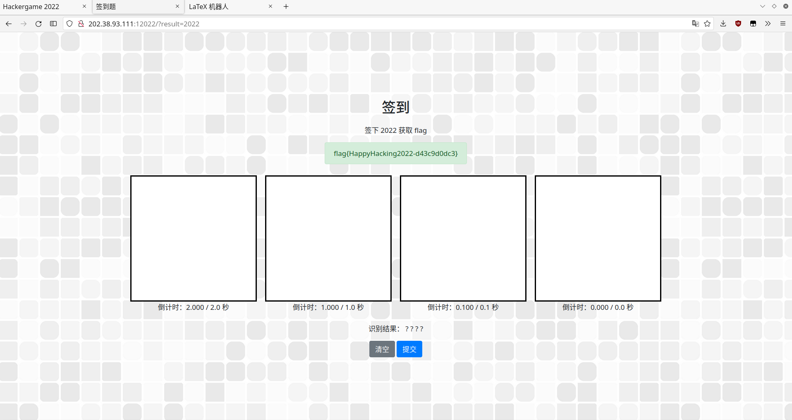
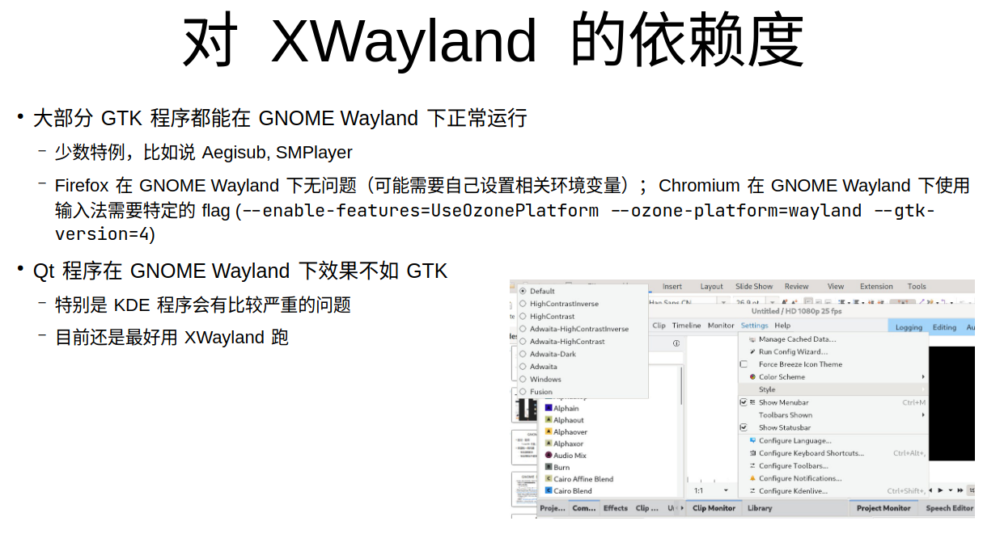
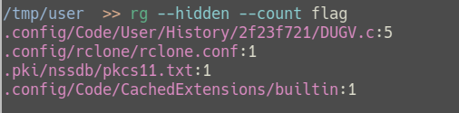
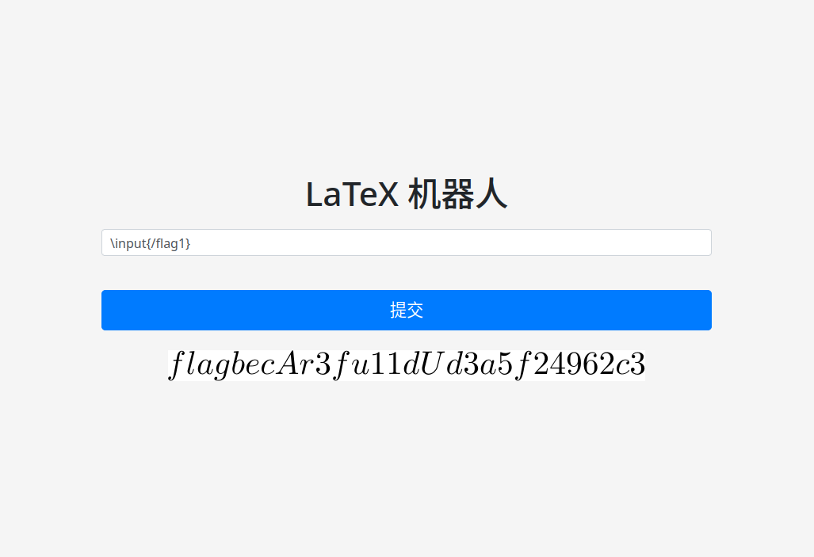
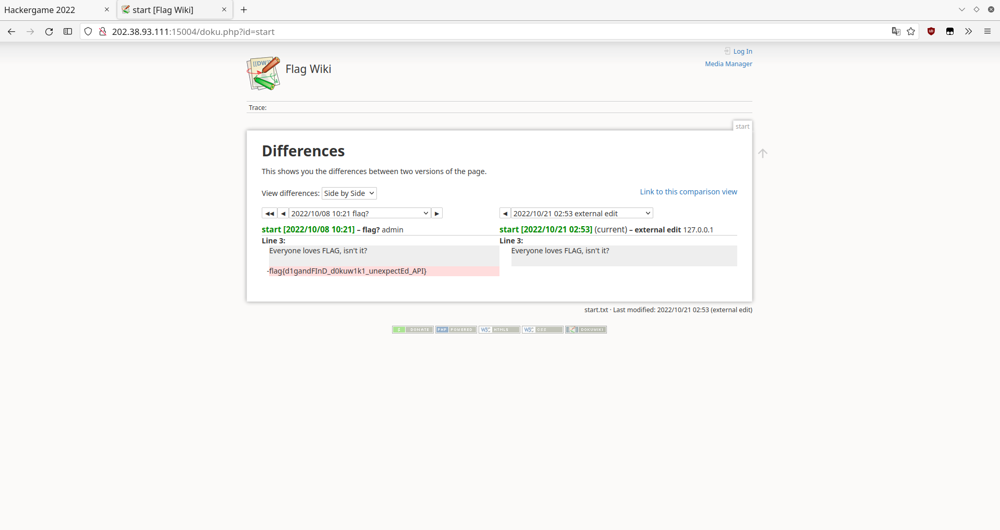

+++
title = "2022 中科大信息安全大赛题解"
date = "2022-11-05"
description = "第九届中科大信息安全大赛（Hackergame 2022）的经历与题解"
tags = [
    "信息安全",
]
image = "show.jpg"
+++

又到了游玩 Hackergame 的时节，欢迎各位读者阅读本期的年更博文。今年博主拿到了 1300 分，与[上一年](https://viflythink.com/Hackergame_2021_writeups/)相比，得分有所增加，排名反倒落后了😂；尽管如此，今年依然玩的很开心，下面就让我分享一下自己的题解吧。

# 签到
打开题目页面，随便点了两下后点击“提交”，发现跳转到的页面 URL 中含有一个 result 参数，既然是 web 方向的题目，那么估计今年的签到题也是简单修改一下请求参数就可以拿到 flag 了，注意到题目描述中有：

> 在 CPU 来得及反应之前顺利签下 2022

根据这个提示把 result 的值改为 2022 试试，flag 就这样出现了：



# 猫咪问答喵
这次的题目与之前两次的猫咪问答有点区别，基本上没有什么提问适合用暴力破解的方式解决，所以今年我全靠谷歌搜索完成。

第一小题，直接搜索关键词找到一篇[新闻稿](https://cybersec.ustc.edu.cn/2022/0826/c23847a565848/page.htm)，里面提到：

> 中国科学技术大学“星云战队（Nebula）”成立于2017年3月

第二小题找起来有点麻烦，首先找到[ USTC LUG 的软件自由日历史记录](https://lug.ustc.edu.cn/wiki/lug/events/sfd/#2022-%E5%B9%B4-sfd)，然后打开“闪电演讲：《GNOME Wayland 使用体验：一个普通用户的视角》”对应的[ slides](https://ftp.lug.ustc.edu.cn/%E6%B4%BB%E5%8A%A8/2022.9.20_%E8%BD%AF%E4%BB%B6%E8%87%AA%E7%94%B1%E6%97%A5/slides/gnome-wayland-user-perspective.pdf)，在其中找到如下内容：



在看到截图中标题包含的 HD 1080p 25 fps 以及菜单内容后，我们可以合理猜测这是一个视频剪辑应用，而 KDE 家的著名视频剪辑应用当然就是 Kdenlive。

第三小题玩了一个今年的梗，该梗出自[ Windows 2000 撑不下去了，还有其他 NT4.0 的系统可以用吗？](https://hostloc.com/thread-1078729-1-1.html)，该帖子里的楼主说经过他修改的 Firefox 能用到 28.0，而根据[ Mozilla 技术支持的说法](https://support.mozilla.org/en-US/questions/1052888#answer-706143)，官方支持 Windows 2000 的最后一个版本是 12.0，所以答案是 12。

第四小题是最麻烦的，搜索“CVE-2021-4034”与“Linux kernel argc == 0”等关键词后找到[ LWN 上的一篇文章](https://lwn.net/Articles/882799/)，当中提到了[最早尝试修复这个漏洞的补丁](https://lwn.net/ml/linux-kernel/20220126043947.10058-1-ariadne@dereferenced.org/)，根据这个补丁的内容，其修改了 fs/exec.c 中 do_execveat_common 函数的逻辑。接下来该怎么找对应的提交哈希值呢，在 Linux 内核官网的 Git 前端找？这可太麻烦了，值得庆幸的是内核源码在 GitHub 是有镜像仓库的，所以使用 GitHub 网页的 Blame 功能就比较轻松了，打开其中的 [fs/exec.c](https://github.com/torvalds/linux/blob/master/fs/exec.c)，点击 Blame 按钮然后 Ctrl + F 查找 do_execveat_common，就可以找到[已经经过修复的代码所在的位置](https://github.com/torvalds/linux/blame/27bc50fc90647bbf7b734c3fc306a5e61350da53/fs/exec.c#L1900)了，在网页左侧显示的就是[我们要找的提交](https://github.com/torvalds/linux/commit/dcd46d897adb70d63e025f175a00a89797d31a43)。

第五小题，直接搜索“e4:ff:65:d7:be:5d:c8:44:1d:89:6b:50:f5:50:a0:ce”这一串指纹，找到了一条[ Gist 记录](https://gist.github.com/jandryuk/61b286220447300ba9dca0faa26526dd)，所以该指纹对应的域名就是 sdf.org。

最后一道小题，搜索“USTC 网络通定价”的话首先就能看到[这个通知](https://www.ustc.edu.cn/info/1057/4931.htm)，当我据此输入 2011-01-01 后发现这是错的，仔细一看下面的价格变更表，发现网络通的价格没有变动，所以这里应该再查找通知开头提到的“网字〔2003〕1号《关于实行新的网络费用分担办法的通知》”，[其中](http://ustcnet.ustc.edu.cn/2003/0301/c11109a210890/pagem.htm)提到 2003 年 3 月 1 日起实行，由此得到 2003-03-01 这一正确答案。

# 家目录里的秘密 
尝试使用 ripgrep 暴力搜索 flag 相关的文字：



## VS Code 里的 flag
逐个查看找到的文件，在 .config/Code/User/History/2f23f721/DUGV.c 的第五行找到了 flag。

# HeiLang
黑话与蛇语有什么联系呢，研究一下本题给出的代码后就会发现所谓的 HeiLang 就是一个简单的 Python 魔改版。要用 Python 解释器执行的话，需要先转换一下语法，把含有“|”的语句展开为 Python 的列表赋值语句。总的来说是很轻松的文本查找替换工作，这里我写了[一个脚本](https://gist.github.com/vifly/1f23c692a07967c3a3175579656177cd#file-convert_hei-py)用来生成可以符合 Python 语法的 getflag.py。*PS：也可以不保存然后直接用 eval 执行。*

# Xcaptcha
如何证明自己是机器人，在一秒内解出三道计算题就行了。从题目描述来看是需要自己写代码进行计算了，本题可以算是 Web 爬虫的入门考验，没有任何反爬措施，只要发送请求获取网页内容，然后从中提取要计算的题目并把计算后的结果通过 post 请求发送回去即可。看[我的脚本](https://gist.github.com/vifly/1f23c692a07967c3a3175579656177cd#file-hack_xcaptcha-py)就可以理解这样一个简单的爬虫是如何实现的。

# 旅行照片 2.0
难得的社会工程学题目，再次说明了一张照片能暴露多少个人信息，此类题目都十分有趣，本题也不算难，仅仅是照片上的体育馆横幅文字就能看出拍摄地点在千叶市 Zozo 海洋球馆附近。虽说如此，上一年的旅行照片我没解出来，今年的这道题则因为没找到能免费显示五个月前航班历史记录的网站而没解决第二小题。*PS：赛后发现 [ADSB Exchange](https://globe.adsbexchange.com/?r) 提供了免费的长期历史回放功能，但由于其界面过于复古，我在比赛时没找到该功能。😂*

## 照片分析
安装 [exiftool](https://exiftool.org) 就可以查看照片的 EXIF 信息：

```Bash
exiftool ./travel-photo-2.jpg
```

这里有点坑的地方在于其显示的 EXIF 信息版本需要转换一下，0231 需要转为 2.31 才是正确的答案，其它的答案都是对照 EXIF 填写即可。

# LaTeX 机器人
## 纯文本
又是一个因完全信任用户输入而导致 flag 泄露的案例。我并不熟悉 LaTeX，在阅读了后端代码后以为是要在输入的 LaTeX 语句中注入 Shell 命令才能拿到 flag，随手一搜“LaTeX inject”就找到了[说明 CTF 中 LaTeX 可利用之处的文章](https://0day.work/hacking-with-latex/)。按该文的说法，存在 -no-shell-escape 参数的情况下，在 LaTeX 中执行 Shell 命令是不行的，但 LaTeX 自身就有一个用于读取文件的宏：\input，所以第一小题只需要输入`\input{/flag1}`就能把 flag 放到返回的图片中，然后对图片进行 OCR 并补上括号就可以完成本题了。



# Flag 的痕迹
Dokuwiki 作为一个成熟的软件，我们恐怕难以能找到绕过其 Action 管理的方法，所以需要从其它的方向着手。首先想到的是管理员是否忘记禁用某些同样能查看历史记录的接口，先从可能未禁用的 Action 开始尝试，翻阅[ Dokuwiki 支持的 Action 列表](https://www.dokuwiki.org/devel:action_modes)，发现在 revisions 下面有 diff 这个 Action，从名字来看它也是能获取历史记录的，于是尝试访问 http://202.38.93.111:15004/doku.php?do=diff 并发现 diff 没被禁用，查看之前的版本差异就得到了 flag。



# 微积分计算小练习
对我来说本题是兼具挑战性与趣味性的一道题目。首先从后端代码开始思考，可以看出其主要的逻辑就是先转换用户提供的 URL（杜绝访问外网的可能性）并把 flag 放到 cookie 里，用 headless chrome 访问转换后的 URL，执行 JavaScript 代码查询网页元素并把结果打印出来。

到此目标就很清楚了：想办法把 cookie 的内容偷出来，而能否取得 flag 与是否把微积分题目全做出来毫无关系。要获取 cookie 的内容，我们只能从输入的 URL 开始着手，因为从后端代码就可以看出没有其它的选项，所以现在的问题就变成了有什么办法能构造出一个 URL 让浏览器执行任意的代码。仔细一想，这不就是[ XSS 攻击](https://book.hacktricks.xyz/pentesting-web/xss-cross-site-scripting)吗，真没想到会遇到一道需要参赛者构造 XSS 攻击的题目。

要进行 XSS 攻击，首先要做的就是阅读目标站点的前端代码，从中寻找可供利用的地方。对于我们来说，浏览器访问的是展示测试分数的页面，所以该页面就是目标页面，其中重要的代码如下：

```JavaScript
const result = urlParams.get('result');
const b64decode = atob(result);
...
document.querySelector("#greeting").innerHTML = "您好，" + username + "！";
document.querySelector("#score").innerHTML = "您在练习中获得的分数为 <b>" + score + "</b>/100。";
```

可以看出这首先会对 result 参数进行 base64 解码，进行一番字符串操作后获得分数和姓名（上面已省略），最后更改对应的元素以进行显示。base64 解码和字符串操作看上去都没什么可利用的地方，那剩下的可能性就隐藏在显示部分了。回想起来，直接对 innerHTML 进行操作是一个不安全的行为，有可能利用这点吗？谷歌“XSS innerHTML”直接就找到了[一个例子](https://gist.github.com/caike/35522c3da161d29fc2ce)，先在做题页面输入名字 `` 试试，检查随后打开的显示结果的页面是不是弹出了内容为 42 的对话框。

测试成功后我们就可以开始构造实际的 payload 了，要做的事情就是把名字改为 ``，这样做会导致原本应该显示分数的地方被改为显示 cookie，交给 headless chrome 访问后就可以拿到 flag 了。所以本题输入 http://202.38.93.111:10056/share?result=MDo8aW1nIHNyYz14IG9uZXJyb3I9J2RvY3VtZW50LnF1ZXJ5U2VsZWN0b3IoIiNzY29yZSIpLmlubmVySFRNTD1kb2N1bWVudC5jb29raWUnPg%3D%3D 这个 URL 就能解决，你也可以通过以下命令构造 result 参数（我用的是 Zsh，注意 Shell 对引号的转义）：

```Zsh
echo "0:" | base64
```

拿到的 flag 是 flag{xS5_1OI_is_N0t_SOHARD_03d2ec39d4}，嗯，XSS 入门并不难。

# 一些没做出来的题目
家目录里的秘密的第二小题，虽然我知道 flag2 应该在 .config/rclone/rclone.conf 里，但居然没想到里面的 pass 项是以密文形式存储的，需要阅读 Rclone 中的对应源码才能将其还原为明文获取 flag。

猜数字，我只能说没有熟读 IEEE 754 标准真是容易吃亏啊，计算机的浮点数表示总有些违反直觉，本题就体现了这一点：对于任意 a，a ≠ NaN 成立，但 a < NaN 或 NaN < a 均不成立。所以对应的代码用了一种很奇怪的方式判断猜测的数字是否正确：

```Java
var isLess = guess < this.number - 1e-6 / 2;
var isMore = guess > this.number + 1e-6 / 2;
var isPassed = !isLess && !isMore;
```

二次元神经网络，作为一个炼丹师看到这题可谓是倍感亲切。除非弄个 web 九宫格，神经网络也算 web 类题目，不然本题是不需要参赛者训练神经网络的，我也猜出需要在上传的模型中注入代码并让其被执行，只是因懒得想需要执行什么代码才能拿到 flag 就放弃了。这道题提醒了我们要通过模型进行 RCE（任意代码执行）是如此的简单，所以不要随便加载从网上下载的模型。虽说如此，就我个人观察而言，别说只是想玩下 AI 生成图片的业余人士，就算是业内人士也有不少并不在意这个安全问题，感觉这会成为一个常见的安全风险来源。

# 总结
很不巧的，今年的比赛期间我正好沉迷于斯普拉遁3，所以没投入太多时间和精力来打比赛；而且这一年来也没怎么研究 binary 与 math 类的题目，所以对于这些类型的题目束手无策。总之，虽说今年的比赛也玩的挺开心，但并没有什么进步，我对于没能在 Hackergame 成功挑战自我这一点还是有些遗憾的，希望明年的自己能够更进一步吧。
