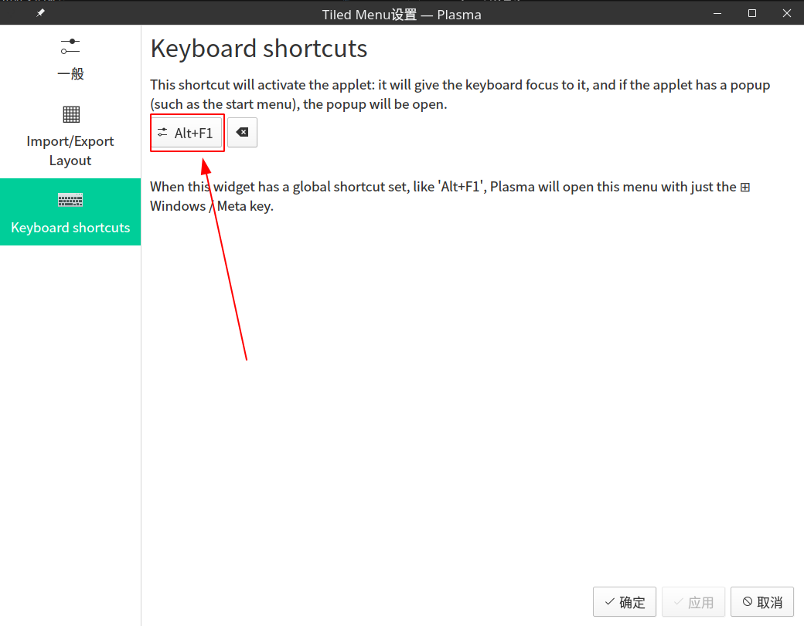
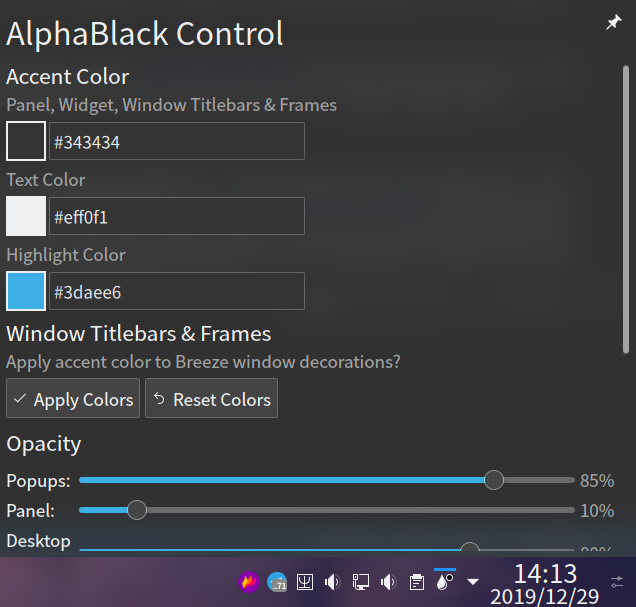
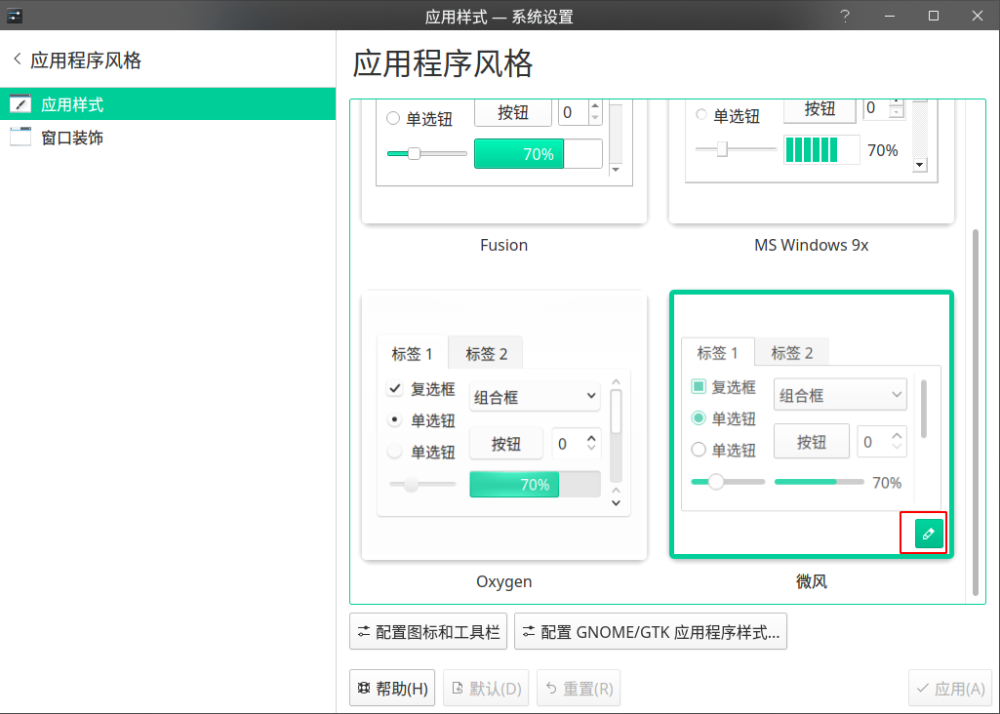
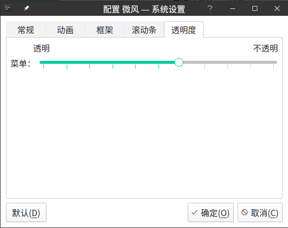
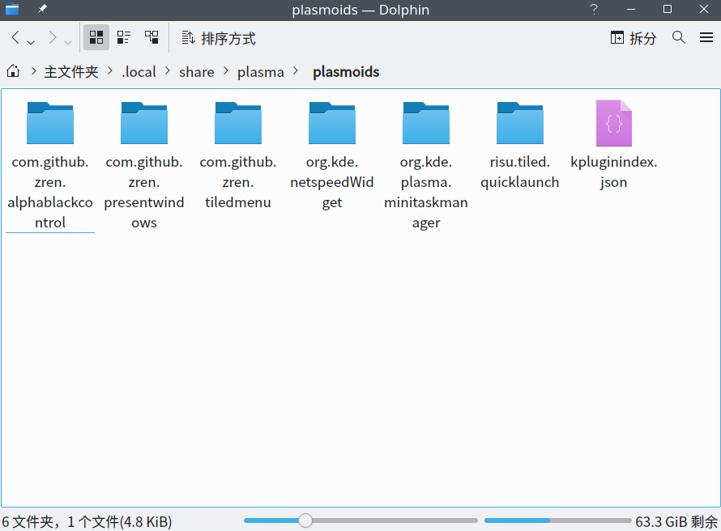
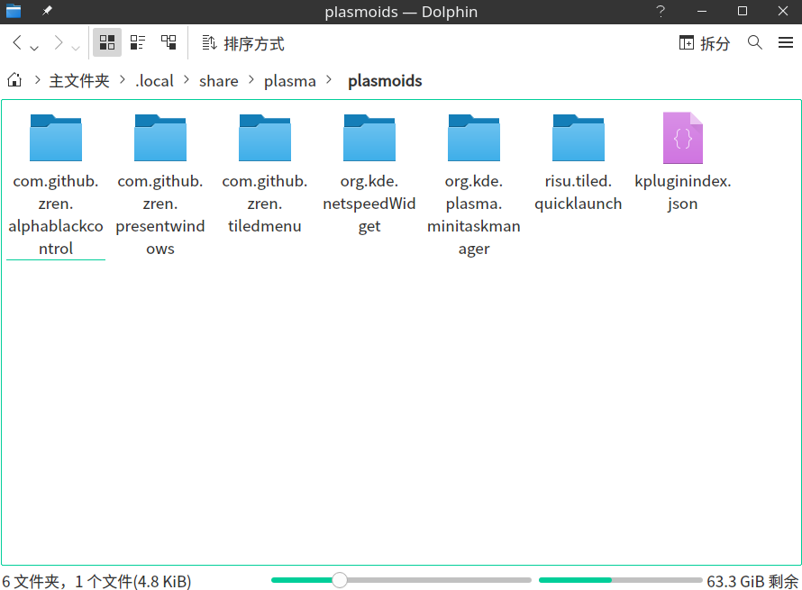

2020 年已然到来，一些博主已经发表了年度总结，总结了不少经验，我想了想，觉得自己好像没什么可以总结的经验，只好写一篇最近的 KDE 折腾记录给各位读者当新年礼物了。想必有不少刚开始使用 Linux 的新手总想着美化自己的桌面吧，我在开始使用 KDE 后也想着折腾美化，随便搜索了一下美化教程后发现不少都是将 KDE 改造为 Mac 风格的，之前听闻 KDE 粉说过“你可以将 KDE 捏成任何形状”，然而很多人都是将它捏成 Mac 的样子，那么，能把 KDE 捏成 win10 的形状吗？我决定挑战一下这个问题，当然，在这里我要承认这有点标题党的嫌疑，我只是想将我认为 win10 做得好的部分转嫁到 KDE 上，并不是将 KDE 完全变为 win10 的样子，后者是一件费力不讨好的事情，而且，在经过一波折腾后，我发现有些细节还暂时无法做到像 win10 那样优秀，只能寄希望于未来了。另外，本文只适用于 Arch，我尚未在其它发行版进行测试。       

先上一张图片看看改造后的效果（图中标注了下文用到的名词所指代的东西）：

觉得很漂亮吧？那么，接下来就开始我们的改造吧。

# 底部栏
在没有打开任何窗口时，底部栏是与 win10 相差最远的一个地方，所以我们的改造工作先从底部栏开始。可以先看看改造完成后的底部栏效果图：

## 开始菜单
喜欢 win10 那简洁的开始菜单吗，在 KDE 下只需安装一个部件（widgets）即可拥有同样的体验。下载 [Tiled Menu](https://store.kde.org/p/1160672/)，并在底部栏空白处单击右键，然后点击“添加部件”，按照下图所示进行安装。

想要使用的话有两种方法：在你左下角的开始菜单处鼠标右键单击，选择“显示替代方案”，选择 Tiled Menu；在底部栏右键单击，选择“编辑面板”，鼠标移到原来的开始菜单，选择移除，然后选择“添加部件”，选择 Tiled Menu。你可以在弹出的开始菜单右上角按住 ALT 和 鼠标右键进行拖拽以更改菜单大小。        

另外，想实现像在 Windows 那样按下 win 键便弹出开始菜单这一点，还需要做一点设置：右键单击开始菜单并选择“配置Tiled Menu”，点击“Keyboard shortcuts”，然后在下面截图所示位置左键单击并顺序按下 ALT 和 F1 键。

## 毛玻璃效果
是否觉得在我的截图中的底部栏非常好看呢，这在很大程度上都是毛玻璃效果带来的。想要做到这样的效果，只需安装一个被称为 [Breeze AlphaBlack](https://store.kde.org/p/1084931/) 的 Plasma Themes。下载完成后将其解压到 ~/.local/share/plasma/desktoptheme/，然后打开系统设置，在侧栏点击“Plasma 样式”，选择 Breeze AlphaBlack 并应用更改。重启电脑后就能在系统托盘处见到 AlphaBlack Control（长得像是个雨滴），单击即可进行调整：将“Accent Color”的“Panel, Widget, Window TitleBars & Frames”处的值改为 #343434（默认的纯黑不好看），将“Opacity”的“Panel”处的值调整为 10% 以加强底部栏透明度。

另外，你还可以通过以下方法令 QT 系的应用的右键菜单拥有毛玻璃效果：打开系统设置，在侧栏点击“应用程序风格”，选择“应用样式”，找到“微风”，点击右下角的配置按钮，点击“透明度”一栏，将透明度变大。将透明度变大能达到毛玻璃效果的原因是 KDE 默认的半透明是带有模糊效果的，而不是简单的透明，具体的模糊设置可在系统设置下的“工作空间行为”->“桌面特效”中找到。

## 任务管理器部件
依然是在底部栏右键单击，选择“编辑面板”，将鼠标移动到底部栏空白处，点击“显示替代方案”，选择图标任务管理器（Icon-Only Task Manager），然后你就可以看到类似于 win10 的底部窗口了，这里说明一下，图标任务管理器是自带的一个部件，无需安装。

## 快速查看已打开的窗口
win10 可点击左下角的按钮快速查看已打开的窗口，在安装了 [Present Windows Button](https://store.kde.org/p/1181039) 这个部件后，我们也可以做到这一点。这个部件的安装方法与 Tiled Menu 时相同，在安装完成后把这个部件放在开始菜单和任务管理器之间。这个部件产生的点击效果与在 Gnome 下将鼠标移动到屏幕左上角触发的效果差不多，KDE 也可设置这样的触发角，不过我觉得设置这样的一个按钮没什么实际意义，可能最大的好处就是没事点一下能有效消遣无聊吧（雾）。这里还有一个能让底部栏变得更美观的 Tips，在底部栏右键单击，选择“编辑面板”后点击“添加间距”，以此添加两个间距，将其缩到最小后对其右键取消勾选“设置可变大小”，然后将这两个间距拖到 Present Windows Button 两边，这能令 Present Windows Button 两边不会显得拥挤，从而变得美观。

## 其它
想要在其他人面前假装自己在使用 win10 吗，将开始菜单的图标更换为 win10 开始菜单的图标无疑能让 KDE 变得更像 win10。你可以在 [IconFinder](https://www.iconfinder.com/icons/1220364/microsoft_window_windows_icon) 上下载 win10 图标，也可使用我在该图标的基础上[使用 Inkscape 手动缩小后的 win10 图标](https://1drv.ms/u/s!AnrGd4m50K7QbMyHxI-JM4EWUu4?e=0JXp1I)。右键单击开始菜单并选择“配置Tiled Menu”即可更换图标。我知道存在 [Winux10](https://store.kde.org/p/1167558/) 之类的图标主题可以将默认的图标替换为 win10 图标，但我经过尝试后发现其覆盖不全面，用以截图假装自己在使用 win10 是可以的，但日常使用会感到违和，所以还是推荐使用默认的图标主题。让我们再关注另一个细节，那就是右下角的时钟，想让它像 win10 那样双栏显示日期和时间并不难：在底部栏空白处右键单击，选择“编辑面板”，左键按住“高度”并进行上下拖拽，这样可以调整面板高度，稍微调高一些后，右键单击时钟，选择“配置数字时钟”，勾选“显示日期”，并将时间显示改为24小时制。

# 窗口装饰
KDE 的窗口装饰指的是打开的应用程序窗口的顶部部分（就是包含了最小化、最大化、关闭按钮的那一栏）。我在 Google 搜索如何让 KDE 变得像 win10 时发现了一个非常新的 KDE 主题 [Breeze10](https://github.com/fauzie811/Breeze10)，从 Github 页面上的图片可以看出这个主题可以完美地将窗口装饰变为 win10 的风格。~~由于目前（2019年12月）还没人打包，所以需要按照其 Github 页面上的操作步骤进行编译安装~~。AUR 上已有人打包，所以我们可以在终端输入指令安装（需要安装 Yay 这个 AUR 助手）：     

    yay -S breeze10-kde-git

在安装完成后重启系统，打开系统设置，在侧栏点击“应用程序风格”，再点击“窗口装饰”，选择“Breeze10”并应用更改。另外，可以点击那个笔状的图标调整这个主题，例如把字体设置变大。完成后你的应用程序窗口会显得更为美观大方。

# 颜色
该怎么说呢，我总觉得开源项目的美工总是不在线：KDE 默认的颜色并不具备所谓的“现代感”。如果你不知道这有多大的影响，可以看看下面使用默认微风与 [Canta Light](https://aur.archlinux.org/packages/canta-kde-git/) 的 Dolphin 对比：

很明显，Canta Light 主题看上去非常好看，AUR 上已有包，这里依然使用 Yay 安装：     

    yay -S canta-kde-git

安装完成后，打开系统设置，在侧栏点击“颜色”，选择刚安装的 Cantalight，应用更改。虽然白色的窗口装饰看着也还不错，但我还是把窗口装饰的颜色改回黑色以配合整体样式：点击上文提到的 AlphaBlack Control 中的“Apply Colors”就能更改颜色。

# 其它细节
当你习惯性地用 ALT + TAB 键想要切换窗口时，就会发现在默认设置的情况下窗口列表将在左侧显示，我个人更喜欢 win10 或 Gnome 那样在切换窗口将列表显示在屏幕中间，为了做到这一点，打开系统设置，在侧栏点击“窗口管理”，然后点击“任务切换器”，在“可视化”处选择大图标，可看下图：

我并不喜欢每次点击关机按钮后都要进行确认，而是希望像 win10 那样直接关机，这也是稍微修改系统设置即可做到的事情，打开系统设置，在侧栏点击“开机和关机”，然后点击“桌面会话”，在“常规”处取消勾选“确认注销”。     

差点忘了还有一个细节问题：桌面右上角的按钮好像没什么用，如何隐藏它呢。只需在桌面单击鼠标右键，点击“配置桌面”，再点击侧栏的“调整”，取消勾选“显示桌面工具箱”并点击确定即可。

# 总结
经过这么多的折腾后，我总算是大概了解 KDE 了，“你可以将 KDE 捏成任何形状”毕竟只是一句用来吹嘘的话，除非动手改源代码，否则可自定义的部分总是有极限的，例如，在完成上述改造后，我对图标任务管理器并不完全满意，因为其显示的程序图标还是偏大，导致图标之间的间距不足，无法模拟 win10 底部栏的美观大方的感觉，当然，还有其它地方的间距设置也不尽人意，这些都难以通过安装主题等手段进行改造。当然，我个人认为没必要为此下结论说开源项目都处于美工下线的状态，其实无论是 KDE，亦或是 Gnome，它们的整体外观水平已经是与 Windows、Mac 这些商业公司开发的系统持平了，Linux 用户同样能有不差的桌面体验，KDE 等桌面所欠缺的只是一些审美细节，由于我也不懂设计，这里就不多说了。如果有兴趣的话，还可以多翻翻系统设置里的选项，其中包含了大量与桌面相关的自定义选项，这已经提供了非常大的改造空间。最后，在新的一年里，祝各位折腾愉快。
