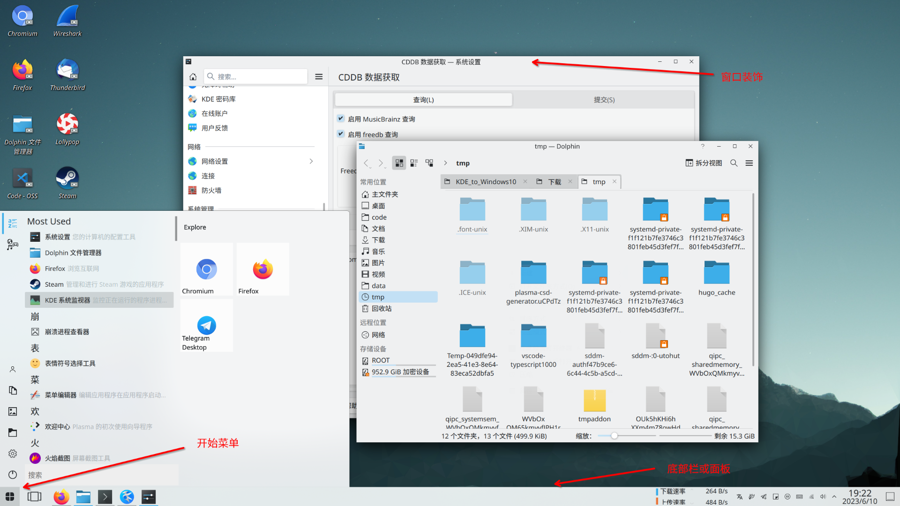
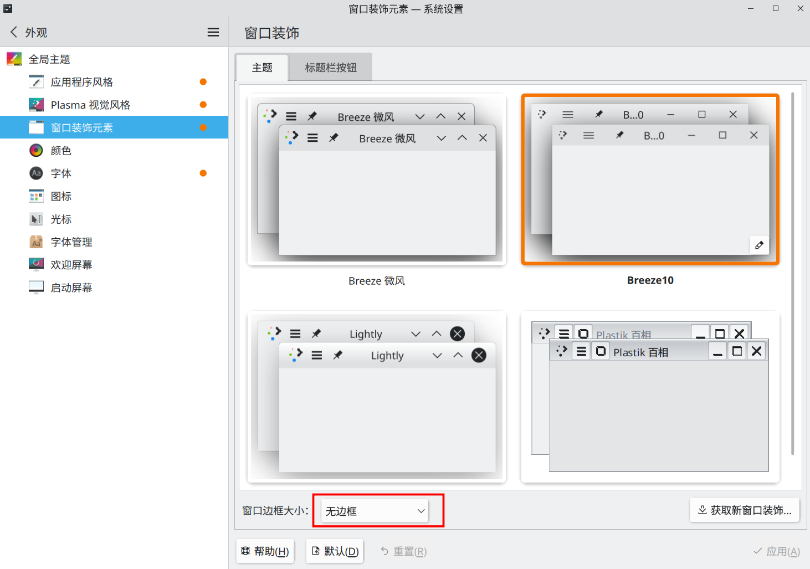

*2023.6.18.更新：为适配新版本的 KDE 以及找到了更好的方案，本文大部分内容已被更新。注意旧的一些配图依然有所保留，所以不要对截图风格不统一感到奇怪。*

2020 年已然到来，一些博主已经发表了年度总结，总结了不少经验，我想了想，觉得自己好像没什么可以总结的经验，只好写一篇最近的 KDE 折腾记录给各位读者当新年礼物了。想必有不少刚开始使用 Linux 的新手总想着美化自己的桌面吧，我在开始使用 KDE 后也想着折腾美化，随便搜索了一下美化教程后发现不少都是将 KDE 改造为 Mac 风格的，之前听闻 KDE 粉说过“你可以将 KDE 捏成任何形状”，然而很多人都是将它捏成 Mac 的样子，那么，能把 KDE 捏成 win10 的形状吗？我决定挑战一下这个问题，当然，在这里我要承认这有点标题党的嫌疑，我只是想将我认为 win10 做得好的部分转嫁到 KDE 上，并不是将 KDE 完全变为 win10 的样子，后者是一件费力不讨好的事情，而且，在经过一波折腾后，我发现有些细节还暂时无法做到像 win10 那样优秀，只能寄希望于未来了。另外，本文只适用于 Arch，我尚未在其它发行版进行测试。       

先上一张图片看看改造后的效果（图中标注了下文用到的名词所指代的东西）：

觉得很漂亮吧？那么，接下来就开始我们的改造吧。

# 底部栏
在没有打开任何窗口时，底部栏是与 win10 相差最远的一个地方，所以我们的改造工作先从底部栏开始。可以先看看改造完成后的底部栏效果图：

## 开始菜单
喜欢 win10 那简洁的开始菜单吗，在 KDE 下只需安装一个挂件（widgets）即可拥有同样的体验。下载 [Tiled Menu](https://store.kde.org/p/1160672/)，并在底部栏空白处单击右键，然后点击“添加挂件”，按照下图所示进行安装。

想要使用的话有两种方法：在你左下角的开始菜单处鼠标右键单击，选择“显示替代方案”，选择 Tiled Menu；在底部栏右键单击，选择“编辑面板”，鼠标移到原来的开始菜单，选择移除，然后选择“添加挂件”，选择 Tiled Menu。你可以在弹出的开始菜单右上角按住 ALT 和 鼠标右键进行拖拽以更改菜单大小。        

## 任务管理器挂件
依然是在底部栏右键单击，选择“编辑面板”，将鼠标移动到底部栏空白处，点击“显示替代方案”，选择图标任务管理器（Icon-Only Task Manager），然后你就可以看到类似于 win10 的底部窗口了，这里说明一下，图标任务管理器是自带的一个挂件，无需安装。

## 快速查看已打开的窗口
win10 可点击左下角的按钮快速查看已打开的窗口，在安装了 [Present Windows Button](https://store.kde.org/p/1181039) 这个挂件后，我们也可以做到这一点。这个挂件的安装方法与 Tiled Menu 时相同，在安装完成后把这个挂件放在开始菜单和任务管理器之间。这个挂件产生的点击效果与在 Gnome 下将鼠标移动到屏幕左上角触发的效果差不多，KDE 也可设置这样的触发角，不过我觉得设置这样的一个按钮没什么实际意义，可能最大的好处就是没事点一下能有效消遣无聊吧（雾）。这里还有一个能让底部栏变得更美观的 Tips，在底部栏右键单击，选择“编辑面板”后点击“添加间距”，以此添加两个间距，将其缩到最小后对其右键取消勾选“设置可变大小”，根据实际情况可能还需要把间距的空隔宽度设为非零值，然后将这两个间距拖到 Present Windows Button 两边，这能令 Present Windows Button 两边不会显得拥挤，从而变得美观。

## 其它
我知道存在 [Winux10](https://store.kde.org/p/1167558/) 之类的图标主题可以将默认的图标替换为 win10 图标，但我经过尝试后发现其覆盖不全面，用以截图假装自己在使用 win10 是可以的，但日常使用会感到违和，所以还是推荐使用默认的图标主题。还有一个细节，那就是右下角的时钟，想让它像 win10 那样双栏显示日期和时间并不难：在底部栏空白处右键单击，选择“编辑面板”，编辑“面板高度”的值，稍微调高一些后，右键单击时钟，选择“配置数字时钟”，勾选“显示日期”，并将时间显示改为24小时制。

# 样式大改
## 桌面整体样式
仅仅只是桌面布局接近 win10 是不够的，还有相当一部分的桌面细节可以继续改进。这一部分主要是对桌面面板的图标以及挂件的样式进行修改，基于 [Fluent-kde](https://github.com/vinceliuice/Fluent-kde) 这一项目来实现。Fluent-kde 包含了应用于各个方面的 Fluent 风格主题，由于我不打算折腾 Kvantum，所以仅使用其提供的 Plasma Desktop Themes。克隆 Fluent-kde 到本地后，进入项目目录并运行：

    cp -r ./plasma/desktoptheme/* ~/.local/share/plasma/desktoptheme

然后就可以在系统设置中的“外观”->“Plasma 视觉风格”中找到新增加的几个主题了，选择自己喜欢的 Fluent 风格主题并点击“应用”即可。

## 应用程序内部风格
经过上面的折腾后，桌面截图已经足够接近 win10 了，但一旦随便打开一个应用就会露馅，所以需要也让应用程序的风格向 win10 靠拢。首先我们需要安装 [Lightly](https://github.com/Luwx/Lightly) 主题，该主题虽然并非完全向 Fluent 靠拢，但也足够现代。由于目前其并不在积极维护状态，所以仅在 AUR 上有 PKGBUILD，可以在终端输入指令安装（需要安装 Yay 这个 AUR 助手）：

    yay -S lightly-git

在安装完成后重启系统，打开系统设置，在侧栏点击“外观”，再点击“应用程序风格”，选择“Lightly”并应用更改；此外为还建议点击那个笔状的图标调整这个主题，把透明度改为下图中的数值。

完成上面的操作随便打开一个 Qt 应用（如 Dolphin）都会发现其风格变得与 win10 应用很像，但 GTK 应用（如我使用的 lollypop）依然死性不改，原因就在于 GTK 应用与 Qt 应用所采用的主题是不一样的，为此我们需要安装同一个作者出品的 [Fluent round gtk theme](https://www.gnome-look.org/p/1574551)。打开该主题页面后选择并下载一个自己喜欢的 Fluent 主题，然后将其解压到 ~/.themes 下（如该路径不存在则自行创建），重回刚才设置应用程序风格的界面，点击“配置 GNOME/GTK 应用程序风格”，选择刚安装的主题并点击“应用”。

此时可以看到 lollypop 的风格也向 win10 靠拢了。

## 窗口装饰
KDE 的窗口装饰指的是打开的应用程序窗口的顶部部分（就是包含了最小化、最大化、关闭按钮的那一栏）。我在 Google 搜索如何让 KDE 变得像 win10 时发现了一个非常新的 KDE 主题 [Breeze10](https://github.com/fauzie811/Breeze10)，从 Github 页面上的图片可以看出这个主题可以完美地将窗口装饰变为 win10 的风格。~~由于目前（2019年12月）还没人打包，所以需要按照其 Github 页面上的操作步骤进行编译安装~~。AUR 上已有 PKGBUILD，所以我们可以在终端输入指令安装（需要 Yay）：     

    yay -S breeze10-kde-git

此外，我的[个人源](https://viflythink.com/Use_Vercel_and_OneDrive_to_setup_your_repo/)里也有该软件包，可以[添加我的 Arch 软件源](https://viflythink.com/service/#arch-%E8%BD%AF%E4%BB%B6%E6%BA%90)后安装：

    pacman -S breeze10-kde-git

在安装完成后重启系统，打开系统设置，在侧栏点击“外观”，再点击“窗口装饰元素”，选择“Breeze10”并应用更改；此外还可以点击那个笔状的图标调整这个主题，例如把字体设置变大，完成后你的应用程序窗口会显得更为美观大方。最后，把“窗口边框大小”设为“无边框”。

# 其它细节
当你习惯性地用 ALT + TAB 键想要切换窗口时，就会发现在默认设置的情况下窗口列表将在左侧显示，我个人更喜欢 win10 或 Gnome 那样在切换窗口将列表显示在屏幕中间，为了做到这一点，打开系统设置，在侧栏点击“窗口管理”，然后点击“任务切换器”，在“可视化”处选择大图标，可看下图：

我并不喜欢每次点击关机按钮后都要进行确认，而是希望像 win10 那样直接关机，这也是稍微修改系统设置即可做到的事情，打开系统设置，在侧栏点击“开机和关机”，然后点击“桌面会话”，取消勾选“注销屏幕”一栏的“显示”。     

# 总结
经过这么多的折腾后，我总算是大概了解 KDE 了，“你可以将 KDE 捏成任何形状”毕竟只是一句用来吹嘘的话，除非动手改源代码，否则可自定义的部分总是有极限的，例如，在完成上述改造后，我对图标任务管理器并不完全满意，因为其显示的程序图标还是偏大，导致图标之间的间距不足，无法模拟 win10 底部栏的美观大方的感觉，当然，还有其它地方的间距设置也不尽人意，这些都难以通过安装主题等手段进行改造。当然，我个人认为没必要为此下结论说开源项目都处于美工下线的状态，其实无论是 KDE，亦或是 Gnome，它们的整体外观水平已经是与 Windows、Mac 这些商业公司开发的系统持平了，Linux 用户同样能有不差的桌面体验，KDE 等桌面所欠缺的只是一些审美细节，由于我也不懂设计，这里就不多说了。如果有兴趣的话，还可以多翻翻系统设置里的选项，其中包含了大量与桌面相关的自定义选项，这已经提供了非常大的改造空间。最后，在新的一年里，祝各位折腾愉快。
