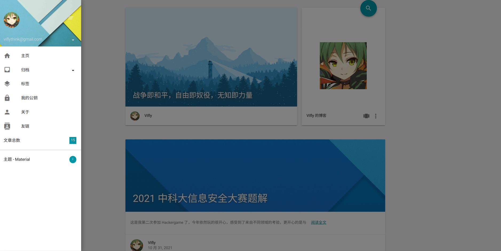
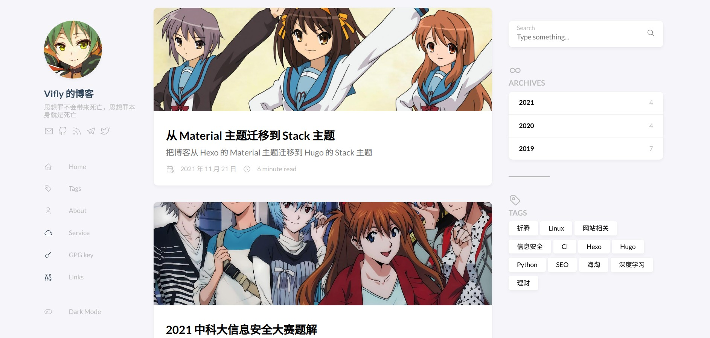

+++
title = "从 Material 主题迁移到 Stack 主题"
date = "2021-11-21"
description = "把博客从 Hexo 的 Material 主题迁移到 Hugo 的 Stack 主题"
tags = [
    "网站相关",
    "Hugo",
    "折腾",
]
image = "show.jpg"
+++

在用了近三年的 Material 主题后，我终于决定更换博客主题了。尽管当初在我开始写博客时，Material 主题已经不维护了，但我暂时没找到更符合自己需求的主题，于是便一直用到了现在。当然，那时的我已经有将来会更换主题的预感了，而如今这一只脚终于落地，给博客换上了看上去更现代的 [Stack 主题](https://github.com/CaiJimmy/hugo-theme-stack)，也从 Hexo 迁移到了 Hugo，于是写下本文说明一下相关的经过（~~又能水一篇博文了~~）。

# 为什么要换主题
先列举一下旧方案的不足吧。Material 主题并不差，设计风格符合我的胃口，而且提供了我所需要的功能，但用了这么久，由于各种原因令我想更换博客主题：

1. Material 主题已经不再维护，这是最核心的一个问题，考虑到前端圈在兼容性方面的“良好”名声，我毫不怀疑哪天 NodeJS 或 Hexo 一个更新就会令我的博客没法构建
2. 感觉当年的 Material Design 有点跟不上时代了（喜新厌旧），另外展开侧边栏时的动画给我的感觉有点慢，令我不禁怀疑在 PC 端模拟 Android 端 Material Design App 的必要性
3. 友链界面的卡片有一点问题，当描述较长时会出现文字溢出的问题，原本打算咬咬牙修一下 CSS 的，但想到迟早要换博客主题，不如赶快换了主题再处理友链界面

另外，还是由于偏主观的对前端工具链的不信任，我不想再用 Hexo 了，切换到使用自己更熟悉的语言写的静态站点生成器至少能确保在出现问题时我可以尝试自己动手修一修，所以 Python 写的 Pelican 和 Go 写的 Hugo 对我来说都是不错的选择（*PS：为什么还没人用 Rust 造一个强大的静态站点生成器*）。

# 迁移过程
先根据 [Hugo 官方的 Quick Start](https://gohugo.io/getting-started/quick-start/) 下载 Stack 主题并建了一个简单的站点，然后一步步把博客原有的配置迁移过去。

其中比较费时间且烦琐的步骤包含把 Stack 主题提供的示例配置从 YAML 改为了 [TOML 文件](https://github.com/vifly/blog/blob/main/config.toml)（非必要，个人偏好原因）；以及更改文章源码的结构：原本我是把所有的 Markdown 文件放在一个文件夹下，文章配图放到另外的文件夹，现在由于 Stack 主题的要求我给每篇博文新建了文件夹并把配图移动到对应博文所在的文件夹。

由于不是新建博客而是迁移博客，所以我还处理了 URL 相关的问题，确保原来的 URL 不变。在迁移前，我的 Markdown 文件都是像 Python_GIL_and_concurrency.md 这样首字母与专有名词大写，下划线用于分割单词的格式，Hexo 生成的博文 URL 与文件名相同；迁移后，每篇博文都放到单独的文件夹，具体存放结构可在[此](https://github.com/vifly/blog/tree/main/content/post)查看，按照 Stack 主题给的示例所生成的博文 URL 则是 viflythink.com/<文章标题>/ 的格式，我经过谷歌后按照 [Hugo 文档](https://gohugo.io/content-management/urls/)设定了新的 URL 生成规则：

```Toml
[permalinks]
post = "/:filename/"
page = "/:slug/"
```

这样就会用文件夹的名字而不是用文章标题来生成 URL，当然，这还不够，生成的 URL 虽然用的是文件夹的名字，但全都转为了小写字母，然后找到[这篇文章](https://www.jvt.me/posts/2019/11/10/hugo-case-sensitive-urls/)让 Hugo 生成大小写敏感的 URL：

```Toml
disablePathToLower = true
```

除了博文的 URL 外，还需要处理 RSS 订阅地址，原来的 RSS 地址是 viflythink.com/atom.xml ，可 Stack 默认产生 viflythink.com/index.xml 作为 RSS 地址，于是我又谷歌找到了 [Hugo 论坛的讨论](https://discourse.gohugo.io/t/how-can-i-change-the-rss-url/118)，据此修改了设置：

```Toml
[outputFormats.RSS]
mediatype = "application/rss"
baseName = "atom"
```

除了让 URL 保持不变外，我还设法把原本对 Material 主题修改的代码也迁移了过来。这里不得不提到 Hugo 的 [Theme Components](https://gohugo.io/hugo-modules/theme-components/)，通过它我可以在站点根目录下建立同样结构的目录以覆盖主题的部分内容，也就是说不用直接对主题的源代码动手了，接下来的修改都是靠这个特性完成的，具体可参考 [Stack 的修改主题章节](https://docs.stack.jimmycai.com/zh/modify-theme/)。

与 Material 主题相同，Stack 没有提供 Isso 评论系统，新建 [layouts/partials/comments/provider/isso.html](https://github.com/vifly/blog/blob/main/layouts/partials/comments/provider/isso.html) 并按 [Isso 文档](https://posativ.org/isso/docs/configuration/client/)的说明把内容复制粘贴进去就能添加对 Isso 的支持了（别忘了修改站点配置文件）。

还有验证网站所有权与插入 Matomo 统计代码都是通过新建与修改 [layouts/partials/head/custom.html](https://github.com/vifly/blog/blob/main/layouts/partials/head/custom.html) 完成的。设置 CNAME 让 viflythink.com 指向 vifly.github.io 则是新建 [/static/CNAME](https://github.com/vifly/blog/blob/main/static/CNAME)来完成（来源：[Hugo 文档](https://gohugo.io/hosting-and-deployment/hosting-on-github/#use-a-custom-domain)）。

我还想把随机标语也迁移到 Stack 上，这就需要覆盖主题原本的文件了。把 themes/hugo-theme-stack/layouts/partials/sidebar/left.html 复制为 [layouts/partials/sidebar/left.html](https://github.com/vifly/blog/blob/main/layouts/partials/sidebar/left.html)，然后对 `<h2 class="site-description">{{ .Site.Params.sidebar.subtitle }}</h2>` 进行修改，具体的修改可看我的代码，如何在 Gist 存放标语内容则请看我的旧博文[《使用 GitHub Pages 和 Hexo 搭建个人博客(进阶篇)》](https://viflythink.com/Use_GithubPages_and_Hexo_to_build_blog_advanced/)中的“Material 主题实现随机显示标语（slogan）”一节。*PS：翻阅旧博文后发现自己的前端技术也有所进步了，当年只会用一下 jQuery，而现在直接用 Vanilla JS 的 fetch 就完成了相同的任务*。为了让修改后的侧边栏看上去更好，我还微调了一下样式，具体可看 [assets/scss/partials](https://github.com/vifly/blog/tree/main/assets/scss/partials) 下的内容。

最后，我还把博客的构建从本地搬到了 GitHub Actions 上，当我把修改的 Markdown 文件推送到 GitHub 后博客就会自动更新，再也不用在本地构建好后再推送到 GitHub Page 所在的仓库了。

总的来说，迁移过程可说是十分平滑，没有踩到任何大坑就把博客迁移到 Stack 主题了，甚至没花多少时间就把对 Material 主题的修改也搬了过来。

# 新变化
既然把博客主题换了，那肯定要对比一下迁移前后的外观。





Stack 主题是典型的三栏式布局，右侧栏包括了常用的跳转链接与搜索功能，而 Material 则是单栏，侧边栏需要点击按钮才会出现。至于在主页上的博文呈现，两者都是卡片风格，同样是由上到下的图片 -> 标题 -> 文章摘要这样组成的布局。可以看出两者给人的感受有所区别，迁移到 Stack 主题后我博客的风格更柔和多彩了，这得益于圆角的使用与主题配色的区别，当然，也与我在迁移后给文章配上精心挑选的图片有关，之前的文章图片都是由 Material 自动生成的，虽然也挺好看，体现了 Material Design 的简洁风格，但看久了后总会觉得千篇一律。

除了外观上的变化，细心的读者可能会发现，在迁移后，我的博客左侧栏多了 [Service](https://viflythink.com/service/) 这一个链接，这是我新增的一个页面，用于列举出目前我提供的服务，当提供的服务有改动时，该页面也会有所说明。

另外，有一个读者无法察觉但我能明显感知到的变化：迁移后的博客构建速度变快了。这大概是 Hugo 的优化比 Hexo 好导致的，不过并不能完全怪罪 Hexo，因为这也与我之前用的 Material 主题许久不更新，没有用上 Hexo 的用于加快构建速度的新特性有关。总之目前的构建速度终于让我感到舒服了，能够快速看到改动效果这一点在修改主题样式时十分有用。

# 总结
我有时会开玩笑说：“写博客哪有写博客主题有意思”，包括这次迁移在内，看着刚开始时一个标准的模板被改造成了自己想要的样子的确很有意思，但我认为开设博客的目的更应该是写一些自己觉得有价值的内容，博客的外观与设计的确很重要，体现了博主的品位与喜好，但世界上并不缺少能展示自己品位的方法，写博客却是少有的通过文字阐述观点、分享知识与经历的行为，所以我会尽量不让与网站相关的博文占到总博文数的一半，而是尽量让博客涉及更多领域的内容，这也是我为本博客所设立的一个目标。

最后，希望本次愉快的博客迁移能激励我提高一些更新博客的频率（咕咕咕）。最近来说，我也有了一些新想法，考虑到不是所有的新想法都有必要写一篇博文来说明，未来我可能会在其它平台（Twitter、Telegram 频道等）或另一个自建站点记录与说明这些东西，也可能会考虑建立公开 Wiki 知识库这样的站点来分享自己的知识，总之这些都是目前只存在于脑海中的想法，这些任务就交给未来的自己了。本篇水文到此结束，谢谢有耐心读到最后的读者。
