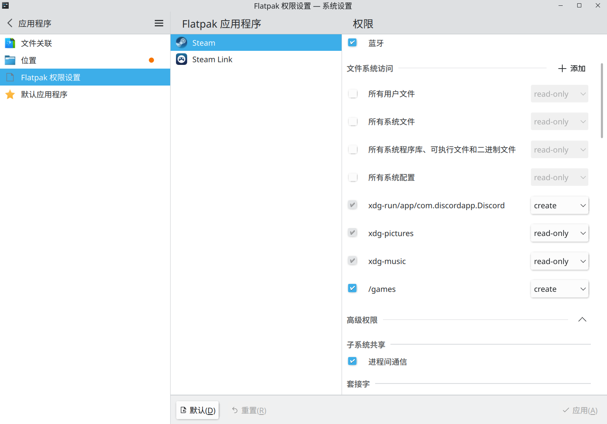
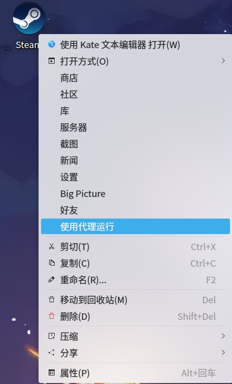

+++
title = "我的新 Arch"
date = "2023-08-08"
description = "在新电脑上的 Arch 安装随手记，以及一点新的软件安利"
tags = [
    "折腾",
    "Linux",
    "软件安利"
]
image = "show.jpg"
+++

前段时间存储相关的元件价格大跳水，博主终于等到了这个时机给自己组装了一台期待已久的台式机。不得不说今年的 PC 组件价格十分魔幻，SSD 甚至能比 HDD 便宜，于是我的台式机只配备了 SSD，另外基于不打算给老黄送钱的心理，也暂时没配置独显，以上使得自己的组装工作避免了一大堆麻烦，不用给 HDD 接 SATA 线，也不用给独显接电源线，整个装机过程非常的轻松愉快。在电脑能开机后，接下来当然是给它装上熟悉的 Arch Linux 用来日常工作与娱乐。尽管在之前的[从 Debian 迁移到 Arch Linux](https://viflythink.com/Try_Arch_Linux/) 一文已经说过了我是如何安装 Arch 的，然后还安利了一部分软件，但时过境迁，由于自己能力的进步与发现了更好的软件，这回也折腾了一些之前没试过的新玩意，所以本文既是新安装 Arch 的随手记录，也是对旧文的一个更新，推荐与上面的旧文对比阅读。


# 安装基本系统
与之前相比，这次安装 Arch 就大胆地实验了一些没尝试过的新玩意。之前完全按教程配置双系统时使用了 GRUB 作为引导加载程序（boot loader），而由于这次不打算在电脑上安装 Windows，所以用 systemd-boot 取而代之。然后也使用了 Btrfs 作为我的新 Arch 的根文件系统（具体原因见下文），当然，还要加上 LUKS 全盘加密，为了方便硬盘解密，还要配置 [systemd 248 版本新增的 systemd-cryptenroll](https://0pointer.net/blog/unlocking-luks2-volumes-with-tpm2-fido2-pkcs11-security-hardware-on-systemd-248.html) 让我能用 YubiKey 开机自动解密硬盘，避免输入一长串密码。以上组合使得我能参考的资料极其有限，仅仅 systemd-boot + Btrfs 的话看 Arch Wiki 足矣，但加上全盘加密后事情就变得相当复杂，[Arch Wiki 上的 Btrfs + LUKS 示例](https://wiki.archlinux.org/title/Dm-crypt/Encrypting_an_entire_system#Btrfs_subvolumes_with_swap)是假设用户也加密 /boot 的（须 EFI 与 boot 分区不同），仅仅不加密 EFI，所以只能用 GRUB，而我的分区规划是把 EFI 分区挂载到 /boot（即两者为同一个东西），且我的威胁模型中也没有那么高级的攻击者，因此我不打算加密 /boot。不同的情况导致我不得不另外查找资料，所幸的是还能找到一篇 [Installing Arch Linux with Btrfs, systemd-boot and LUKS](https://nerdstuff.org/posts/2020/2020-004_arch_linux_luks_btrfs_systemd-boot/)。根据这篇文章与 Arch Wiki 安装好了新系统，完成后确认可以通过密码解锁硬盘，然后还得研究如何使用 systemd-cryptenroll。按上面的文章配置是肯定不行的，initramfs 里都没有 systemd，开机根本就不会检测 YubiKey。为此我找到了一篇跟自己的需求较为相似的 [Setting up Arch + LUKS + BTRFS + systemd-boot + apparmor + Secure Boot + TPM 2.0](https://lemmy.eus/post/2898)，尽管我不打算像这篇文章一样配置安全启动与 TPM 以自动解锁硬盘，但我们都是使用 systemd-cryptenroll 的，按照其中的思路修改一下配置，转而使用 YubiKey 是没问题的。systemd-cryptenroll 支持的设备类型非常广泛，FIDO 2、TPM 2 与 PKCS#11 都可以，而 YubiKey 则能充当以上除了 TPM 外的其它安全设备（除了贵以外没什么缺点），这里我把 YubiKey 当作 FIDO 2 设备使用。经过折腾，最终确认 /etc/mkinitcpio.conf 应该包含以下内容（应该还可以删减一些 Hook，懒得试了）：

```Bash
HOOKS=(base udev systemd autodetect modconf kms keyboard sd-vconsole block sd-encrypt btrfs filesystems fsck)
```

/boot/loader/entries/arch.conf 则应该是（假设使用 linux 内核）：

```
title Arch Linux
linux /vmlinuz-linux
initrd /initramfs-linux.img
options rd.luks.name=<Your-UUID>=luks root=/dev/mapper/luks rootflags=subvol=@ rd.luks.options=<Your-UUID>=fido2-device=auto,discard rw
```

这里提醒一下想照抄作业的读者，我并没有加密 /boot，没有启用安全启动，且在挂载加密盘时允许 discard，这都会降低安全性，如果对此比较在意请选择别的方案。

## 为什么选择 Btrfs
此前我一直在用经典的 Ext4 作为使用 Linux 时的文件系统，但这么多年过去了，以下几点令我开始认真地考虑尝试使用 Btrfs：

1. Btrfs 可以说已是成熟状态，[绝大部分功能已经稳定](https://btrfs.readthedocs.io/en/latest/Status.html)，[Facebook 也在生产环境中使用 Btrfs](https://www.linux.com/news/how-facebook-uses-linux-and-btrfs-interview-chris-mason/)。
2. 从 Ext4 迁移到 Btrfs 没有太多的痛苦（前提是不使用问题较多的 btrfs-convert 原地替换 Ext4，所以在新系统上使用是最简单的），基本不需要多少额外的配置，只要理解 Btrfs 的子卷怎么挂载就行，而常见的数据库与容器应用都会自动创建 Btrfs 的子卷，用户确实不需要怎么操心。
3. 数据安全性更有保障，默认采用 CoW（Copy on Write），带有 checksum 等措施使得意外丢失数据的可能性大大降低。当然，这并不能完全杜绝断电丢失最新写入数据的情况，因为数据的可靠保存不仅需要底层的支持，还需要上层应用的额外关注。另外，checksum 的存在使得文件的任何损坏都可以被及时发现，即使你的硬盘里的内容翻转了一比特都能被检测出来，避免了静默错误的出现（至于如何处理损坏的内容则是另一回事了）。
4. 还有一堆现代的特性，例如[透明压缩](https://wiki.archlinux.org/title/Btrfs#Compression)，这个基本上每个人都会用到；快照，每次更新系统或折腾容易玩崩的东西前先拍个快照，方便一键还原；增量备份，通过[对子卷的 send/receive](https://wiki.archlinux.org/title/Btrfs#Send/receive)，可以轻松地把子卷增量备份到另一个使用 Btrfs 的硬盘中。除此以外还有一些我暂时用不到的特性与功能，如 RAID、容量配额等等，具体可在 [Arch Wiki](https://wiki.archlinux.org/title/Btrfs) 中查看。

当然，Btrfs 目前也还没到能受到所有人的欢迎的程度：它的读写速度要慢于 Ext4（CoW 的通病），而一旦检测到 checksum 出错则会强制要求用户进行处理也令有些人感到不爽。对于我来说，比较不满的一点是其本身没有加密功能，必须要与 LUKS 之类的方案一起使用才能达成全盘加密，希望未来能有更好的解决方案。

# 日常使用
## KDE
我在之前已经吐槽过安装 kde-applications 包组后会有一堆用不到的软件，甚至还写了一个[简单的 Python 脚本](https://gist.github.com/vifly/33d1a4f63b0b7319c6db9af9d3bdbdb0)来删除它们。现在我发现更好的解决方法应该是在安装时就对此进行处理，根据我的需求这里给各位推荐一个安装 KDE 的方案。首先不要按 [Arch Wiki](https://wiki.archlinux.org/title/KDE#Plasma) 上说的先安装 Xorg，直接安装 [plasma 包组](https://archlinux.org/groups/x86_64/plasma/)即可，其中的依赖关系会导致 plasma 所需的 Xorg 组件也被安装，如果你需要使用 Wayland 的话请再安装 plasma-wayland-session 包。另外，安装包组有一个好处，那就是可以排除自己不想安装的软件包，例如我就排除了：

```
discover
milou
oxygen
oxygen-sounds
plasma-sdk
plasma-vault
plasma-workspace-wallpapers
```

经过以上操作后已经装好了基础的桌面环境，但我们还需要配套的应用，而如果直接安装 kde-applications-meta 的话会装上一堆用不到的软件和游戏，选择 kde-applications 包组的话需要手动排除的项目也不少，更好的办法是根据 [kde-applications-meta 的 PKGBUILD](https://gitlab.archlinux.org/archlinux/packaging/packages/kde-applications-meta/-/blob/main/PKGBUILD) 创建一个属于自己的 kde-applications-meta。这里给出我日常使用软件所构成的 [meta 包](https://gist.github.com/vifly/253e3184f5a1d87c1292b131cba1c09c)，下载该 PKGBUILD 后在文件所处的目录下执行 `makepkg -si` 即可。*PS：如果你仔细查看该 PKGBUILD 就会发现里面没有包含 KDE 家的图片浏览器 gwenview，原因是我使用 nomacs 作为日常的图片浏览器。*

## 美化
在我刚开始使用 KDE 后没多久就写过一篇[ KDE 的美化教程](https://viflythink.com/KDE_to_Windows10/)，探索了将 KDE 的外观变成 Windows 10 的可能性。经过了几年，由于 KDE 的版本更新导致部分选项有所改变，且我找到了一些更好的美化方案，所以抽空大改了一波上面的博文，想要美化自己的 KDE 桌面的童鞋继续查看该博文即可。

## Steam
就日常娱乐来说，Steam 当然是一个好选择，感谢 V 社一直以来对 Linux 游戏的支持（特别是其开发的 Proton 极大地扩充了 Linux 下可游玩的游戏范围），现在 Linux 下大部分游戏的体验已经不亚于 Windows，只需要打开 Steam 一键安装就能开玩。不过对于一个强迫症来说，Steam 及其安装的游戏在家目录下乱扔垃圾这点还是令我挺不爽的。之前我一直在用 [systemd-nspawn](https://liolok.com/zhs/containerize-steam-with-systemd-nspawn/) 隔离相关应用，但后来发现为此专门准备一个容器所占的空间太大了点，而且隔离级别较高还要解决一些游戏的运行问题，于是在新系统上决定尝试改用 Flatpak 作为安装与使用 Steam 的方式（虽然 Flatpak 会创建 ~/.var 这个目录）。首先根据 [Arch Wiki](https://wiki.archlinux.org/title/steam#Flatpak) 先安装 Steam 本体，再加上一些个人使用的配套应用：

```Bash
flatpak install flathub com.valvesoftware.Steam com.valvesoftware.Steam.Utility.protontricks com.valvesoftware.SteamLink
```

然后直接在开始菜单找到并启动 Steam 看看效果，基本上与在本机系统内直接安装 steam 没什么区别。如果中文字体不对劲，安装 ttf-liberation 应该能解决。

如果你使用 KDE 且安装了 flatpak-kcm 这个包，此时便可以在系统设置中的“应用程序”->“Flatpak 权限设置”中对安装的 Flatpak 应用进行管理，比如设置更细分的权限与应用运行时的环境变量等等。举个例子，这里我就给 Steam 创建了一个新的 Btrfs 子卷（挂载到 /games）用于安装游戏：



除此以外，如果你因没有配置透明代理而在使用 Steam 时撞到墙，那么可以通过修改 desktop 文件让 Steam 使用代理。具体做法是，先执行 `cp /var/lib/flatpak/exports/share/applications/com.valvesoftware.Steam.desktop ~/.local/share/applications/` 把 Steam 的 desktop 文件复制到用户目录下，然后开始修改对应复制过来的文件，在 "Actions=" 开头的一行把 "RunWithProxy;" 添加到该行末尾，然后在文件的末尾添加以下内容：

```
[Desktop Action RunWithProxy]
Name=Run with proxy
Name[zh_CN]=使用代理运行
Name[zh_TW]=使用代理運行
Exec=/usr/bin/flatpak run --branch=stable --arch=x86_64 --command=/app/bin/steam-wrapper --file-forwarding --env=https_proxy=http://127.0.0.1:1090 com.valvesoftware.Steam -tcp @@u %U @@
```

以上的 Exec 就是在原来的默认值上加了两个参数，让 Steam 使用 TCP 连接，以遵循新增的 https_proxy 环境变量，记得把 https_proxy 修改为自己的 HTTP 代理地址与端口号，这里提供一下[我修改后的文件](https://gist.github.com/vifly/ccdfd05899263e43ed269bbca8ec40f4)以供参考。保存好文件后将其链接到 ~/Desktop 下，在需要让 Steam 翻墙时，只需右键点击桌面上的 Steam 图标然后选择“使用代理运行”即可。



## 输入法
目前我已经把输入法方案从 Fcitx4 + RIME 切换到了 Fcitx5 自带的拼音输入法。当年使用 RIME 的主要原因是包括 google pinyin 在内 Fcitx4 自带的拼音输入法的候选词算法都十分糟糕，而现在 fcitx5-chinese-addons 里的拼音输入法已经足够好用，与 RIME 相比，Fcitx5 拼音输入法更开箱即用，候选词算法更优秀，同时在可折腾性上也不输 RIME，支持 Lua 插件、导入第三方词库、输入法皮肤、快速输入 Emoji 与特殊 Unicode 等功能。所以除非有什么非常需要的 RIME 独占功能，否则我都一律推荐使用 Fcitx5 拼音输入法。

只需根据 [Arch Wiki](https://wiki.archlinuxcn.org/wiki/Fcitx5) 安装好对应的包组与包后重启即可：

```Bash
sudo pacman -S fcitx5-im fcitx5-lua fcitx5-chinese-addons
```

另外，想在 Android 手机上使用 Fcitx5 拼音输入法的童鞋可以尝试 [fcitx5-android](https://github.com/fcitx5-android/fcitx5-android) 这个项目。目前日常使用所需的功能已全部就位，可以确保在手机上也有与电脑相同的输入体验。

## 其它
我的音频播放器从 Rhythmbox 切换到了同属 Gnome 家的 Lollypop（KDE 请加油），与 Rhythmbox 相比，Lollypop 的界面更为现代（见下图），还支持自动从互联网下载歌曲封面图片，搜索歌词等功能。


而笔记工具则令我颇为头疼，考虑到前不久 [Evernote 的新母公司裁掉了几乎所有员工](https://news.ycombinator.com/item?id=36609641)的新闻，尽管后来解释称是准备将运营团队转移至欧洲，因而裁掉了原来的员工，但我实际上在 Evernote 被收购时就已经对 Evernote 的前景感到担忧，所以早就想物色一个新的笔记工具了。最近流行的笔记工具都声称自己受到了 [Zettelkasten](https://zettelkasten.de/introduction/)（卡片盒）笔记法的启发，设计出了从根基上与 Evernote 这种“传统”笔记不同的结构，例如 Logseq、Obsidian、Notion、Emacs 的 org-roam 等。对于是否迁移到它们之一，或继续坚守“传统”，我目前还在犹豫，欢迎各位读者向我推荐自己喜欢的笔记软件。无论如何，先用 [evernote-backup](https://github.com/vzhd1701/evernote-backup) 导出笔记后用 [Yarle](https://github.com/akosbalasko/yarle) 转为 markdown 做好最坏情况下的准备总是没错的，至少目前 Evernote 还保持着一贯的开放 API，使得迁移笔记还没什么问题。

还有之前没有推荐过的 KDE Connect，它可以实现手机与电脑的互联，例如同步通知、互传文件、多媒体控制、远程执行命令等，强大到足以被称为开源法拉利，而 Gnome 用户也可以使用 [GSConnect 扩展](https://extensions.gnome.org/extension/1319/gsconnect/)享受到同样的功能。
