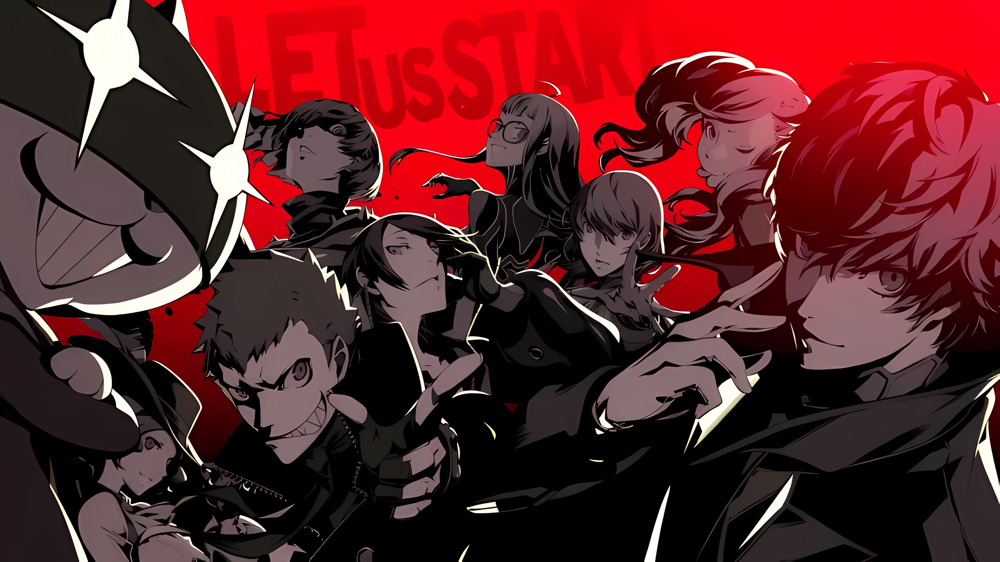
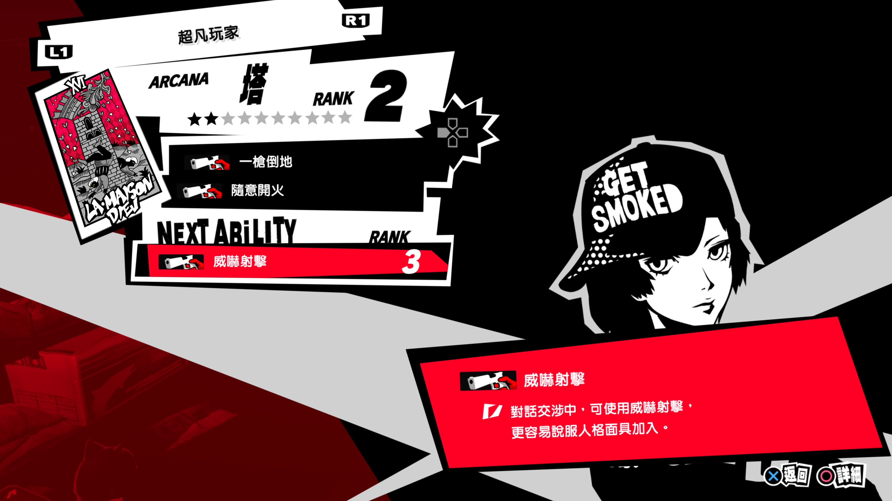

想必各位读者看到这个博文标题就知道这是一篇安利文了，今年年初通关《女神异闻录5皇家版》（简称 P5R）后觉得这可实在是太符合我的胃口了，一直有动笔狂吹一通 P5R 的冲动。只可惜 P5R 一直处于索尼 PS 平台独占状态，能玩到的玩家不多，没想到今年六月突然曝出一个令人万分惊喜的消息：P5R 将于今年十月下旬登陆包括 PC、Xbox、Switch 在内的各大平台，且首发加入 XGP。既然如此，在这之前我便简单介绍一下 P5R 并说明为什么有人评价它是“天下第一”好了；而对于已通关的玩家，这里还有对游戏涉及到的潜意识理论的整理，可以说是加量不加价了。

在开始安利之前先说明几点，在 P5R 之前还存在 P5，两者的差别在于后者是 PS 平台独占，前者在后者的基础上追加了第三学期以及一些内容，网上对 P5R 的负面评价大部分集中在已经通关 P5 的玩家要体验第三学期也要重新经历前两个学期，所以对新玩家而言现在要买的话无脑选择 P5R 就对了。以及，虽说 P5R 的画风在当今的大型游戏（本人通关时间为 110 小时）中是独树一帜的存在，但细看的话质量也就是日系厂商的一般水准，光看截图可看不出来为什么它能配得上天下第一这个称号。不过，只要你不排斥 JRPG，那么我相信 P5R 绝对会给你留下一个深刻的印象。那么，安利开始。

说到 JRPG，各位读者可能首先想到的就是像《勇者斗恶龙》、《最终幻想》等等这样将背景设定在另一个魔幻宇宙的知名作品，可是，如果把 JRPG 的背景放在现代会怎样呢？

> 少年主角因某个缘由转学到 “东京” 的高中后，开始做起了奇异的梦。    
—— 你确实是命运之『囚』啊。     
少年被告知不久之后他就会迎来毁灭。  
为了完成赋予他的 “更生” 任务，也为了将人们从邪恶欲望中拯救出来，    
成为怪盗的主角与各种人邂逅，结下羁绊。  
在度过了宝贵的一年后，等待你的将是……？

以上文字摘自 [P5R 移植版官网](https://asia.sega.com/persona-remaster/p5r/cn/)，看完后是不是有种很神秘的感觉，明明是现代背景却有梦、命运之囚、怪盗等等令人在意的词语，不过还不止于此，女神异闻录系列都有以集体潜意识理论为基础的异世界设定：拥有极端欲望的人会产生殿堂，普罗大众的潜意识组成了印象空间；而主角及其伙伴则拥有进入这些异世界的能力，将殿堂中的秘宝偷走的话则可以让对应的人悔改，换句话说，游戏中的主角团队可以改变人的心灵。说到这里可能各位读者会有所疑问，以心灵为主题的游戏虽不多，但也不是没有优秀的先例，它们也会突出心灵的神秘性，那与之对比 P5R 有什么独特之处呢？答案就是它完美实现了一种充满中二幻想气息的华丽感，看下图，其美术从一开始就在张扬着自己独特的风格。

如此华丽的画面自然也要配上同样华丽的设定，在游戏中，主角及其伙伴组成了心之怪盗团，表面上是普通的高中生，背地里则化身为神秘优雅的怪盗，潜入殿堂寻找秘宝，并在随后发布预告信，让充满丑恶嘴脸的大人痛改前非。总之，围绕着异世界，故事就此展开。



# 畅快的体验
要问玩 P5R 时是什么感觉，我想畅快是最能用来形容的词语。从一开始误入异世界到成立怪盗团，经历高低起伏的舆论反转，再到最后的拯救世界，整个剧情进展非常自然，是传统王道 JRPG 剧情的又一经典样例，打磨得足够好的老套剧情依然能给我带来很棒的感觉，特别是其中没有诸如为了推动剧情而降智等令人出戏的情况（个别人物的转变可能有些突兀）。

为了畅快的体验，P5R 确实避开了 JRPG 主要的通病，例如常见的跑腿支线之类的强行拖长游戏时间的设计在本作中根本不存在，所有的支线都是要求在印象空间击败某某精英怪以让现实中的人悔改，对我来说就是顺手完成的事情；而且逻辑在本作世界观下很自洽，与我最近玩的同样是现代背景的 JRPG 作品《如龙7》相比真的好多了，后者不少支线任务流程都是把某人暴打一顿后对方幡然醒悟，我只想吐槽：就算是黑道背景的游戏也不能这么夸大暴力的作用吧，还是在印象空间击败对方的阴影让对方悔改看上去更靠谱。至于另一常见的问题：刷级，在印象空间里开车撞撞怪，以及在主线迷宫中多杀点怪，没多久等级就升上来了，虽说还是得靠战斗获取经验升级，但得益于 Atlus 祖传的优秀战斗系统，相近等级的战斗我每次都需要开动脑筋对弱点进行攻击，敌人等级低的话直接靠战车瞬杀即可，并不会进入回合制战斗，这导致我玩到最后都没对普通战斗产生厌倦，所以等级设计上也没啥问题；唯一值得吐槽的就是印象空间撞怪频率高了点，基本上没听完队友之间的对话就又撞怪了，除此以外我真的没法鸡蛋里挑骨头了。

而上面所说的战斗系统是怎样的，好玩吗？要知道潜入异世界的过程可不是郊游，其中总是需要怪盗团控制人格面具以击败他人意识中的守卫（即阴影），一路过关斩将杀到目的地。尽管这是回合制的系统，却给了我一种在玩动作类游戏的感觉。在跑图的时候看到阴影时可以像潜行游戏那样背袭或直接用抓钩突袭它们，成功的话可以先制攻击而且有一定概率给敌人造成眩晕等 debuff，随后设法用特定属性技能攻击敌人的弱点再用因此获得的额外行动机会换手攻击，最后发动中二度爆表的总攻击。这种依靠自己的决策精妙地控制住全场的感觉真是让人欲罢不能，避免了老式 JRPG 那种你打一下我打一下的枯燥战斗流程，再加上摇滚十足的背景音乐，使得战斗相当带感。所以说，几乎每场战斗都要稍微开动下脑筋，而不是机械式地按按键就完事了。各位读者可以通过以下视频感受下打出总攻击的感受。

<video src="https://user-images.githubusercontent.com/48406926/196335991-1357d004-78fb-444d-9888-4359f14ad365.webm" controls="controls" preload="auto" style="max-width: 100%; height: auto;">
</video>

不止于此，战斗时使用的人格面具的培养也是很有深度的系统，由于主角可以在每回合更换一次人格面具，所以培养出具有各种特点的人格面具是一件挺花时间又有趣的事情。首先考虑到被敌人击中弱点后也会进入眩晕状态，所以确保自己没有弱点是第一要务，然后还需要在此基础上尽量获得更多的某类属性无效（有反射/吸收就更好了），只要属性安排恰当，经常会出现敌人攻击你却没有造成任何伤害的好玩场面。当理解完上面这点后，接下来还需要考虑人格面具的特性和主动技能/被动技能的搭配，让不同的人格面具能适用于不同的场合。要知道后期为了合成出一个符合自己需求的人格面具可要花不少心思精心设计与规划前置人格面具的继承，所以说培养人格面具的可玩性绝对不差。

最后我必须提到 P5R 的跑图也体现出了畅快感。游戏中的殿堂偏向“一本道”，像我这样的路痴都能不依靠攻略就可以找到前往 Boss 所在地（秘宝存放处）的路，像下图见到断崖，跳就对了。但地图也不是简单到让人感到无聊，不少地图都有所谓的“立体感”，而且有些地方也有分叉路，可以看出地图虽大但并不空洞，在处处都充满了精巧的设计，这令我在攻略殿堂时莫名有一种在玩任天堂系游戏的感觉，它们都是每走一会就会给你捎来一个新玩意，让人不由自主地就想继续探索。在每个殿堂几个小时的探索过程中，可以充分地欣赏到不同的欲望组成的殿堂所特有的景色，在此之中我作为怪盗时不时通过钻通风管道、用抓钩飞天等手段到达原本无法到达的地方，也会与每个殿堂独有的机关打交道，有时停下脚步欣赏殿堂内令人惊叹的风景，当然，路上见到阴影那肯定是果断背袭拿下经验，这样一来这几个小时的探索时间怎么能不充满乐趣呢；特别是想集齐欲石的话就更是如此：最后一个欲石往往藏在一条难以发现的支路尽头，对于像我这样总想着收集齐全的玩家来说每次找到它时总是充满了成就感并对这地图设计之精妙感到佩服。*PS：请放心，每个殿堂只有三个欲石。*

# JRPG 中的杰作

## 剧情与人物
对于经典的 JRPG 而言，情感体验都来源于剧情与人物，而 P5R 在这两者的表现上都十分出色。

在不剧透的前提下，我只能说在第三学期前的主线剧情是十分经典的展开，因种种机缘巧合主角在转学后与未来的同伴相结识，同时他们也接触到一些行为极其恶劣的人，例如学校里的体育老师鸭志田，其倚仗自己奥运会冠军得主的身份肆意体罚学生，还试图性侵其辅导的社团成员，为了拯救他人，主角及其同伴在获得了能潜入他人殿堂的能力后开始策划让这些人悔改的行动，以心之怪盗团的名义活动在社会之中，最后在经历了种种风雨后终于战胜了同样想利用异世界的幕后黑手，而主角也成功摆脱了“命运之囚”的状态。当然，在别的 JRPG 中战胜邪恶一般是指物理意义上的消灭，而 P5R 则是在别人的内心世界中战胜阴影，抛开这点不谈，上述的剧情都是很符合王道 JRPG 套路的，其要素可以被归纳为这一公式：羁绊 + 努力 = 胜利。尽管这听上去很老套，但 P5R 主线的承转起伏、埋下的伏笔与回收、各色反派的塑造都可以说是教科书般的经典，经典没有过不过时的说法，只要制作者用心讲好故事，那就是足够优秀的作品。凭着这样稳扎稳打的主线剧情，P5R 就确保了下限，而追加的第三学期更是拉高了上限，为了不剧透，还是请各位读者实际游玩进行体验吧。

说到人物，那值得一提的东西可太多了，对于王道 JRPG 而言，主角及其同伴的成长是绕不开的话题，像 P5R 这样以心灵为主题的游戏更是如此，只不过我把这个放到了潜意识理论一章进行说明，在这里我更想谈论的是 P5R 广受赞誉的社群（cooperation）系统，社群系统中包括其他怪盗团成员在内的人无疑是主角完成“更生”的最大助力，当主角在这个系统中推进进度时，我们也会感觉到情况在一步步地变好。简单来说，这个系统就是主角与他人的联结的体现，当你花费时间推进与某一人物的关系时，会为你解锁新的能力或帮助，其中的人无一例外地都与主角一样陷入了人生的低谷，因为主角能为他们提供特定的帮助而与主角达成了互相帮助的协议。在关系进展的最后，得益于主角的帮助，这些人都从低谷中走了出来并实现了自我的成长，在这过程中也给予了主角很大的帮助。由于现代社会分工明确，所以这些人都拥有不同的技能特长，在这样的情况下，总共二十多位人物所给予的帮助可是十分丰富的。例如下图的“塔”，主角花费时间与其练习带来的就是射击能力的全面增强，甚至可以让主角的子弹能对射击无效的敌人造成伤害；另一个人物，其中每个人

从上图也可以看出每个人都对应了一张塔罗牌，其经历、性格特征或能提供的帮助也与塔罗牌的名称有所关联。例如，“塔”的正位代表勇敢克服挫折，逆位则代表得意忘形与沉溺在自大的想象中，在游戏中这种象征确实与“塔”的经历相关，各位可以据此猜测一下具体情形；另一个例子，“死神”可以提供探图时最需要的药品，获得其售卖的气功贴后我们的续航能力可以迎来质的飞跃，从这点来看“死神”与医生是不是很配呢。

除了因塔罗牌而附上的一丝神秘性、丰富的解锁能力、优秀的配角剧情外，社群系统值得称道的还有拟真的时间安排，社群系统中的要么是学生要么是社畜，都有各自的工作生活，只有他们有空的时候才会联系主角，这就使得前中期的日程安排成了一个问题，而到了后期比较有空的时候，还可以约其中的人去各个值得游览的地方玩，另外，陪伴他人度过时光时还可能会有一些意外之喜。所以说，社群系统是 P5R 除了战斗外的一大核心系统，也是王道 JRPG 强调的人与人之间的联结的最好体现。

## 洗脑的音乐
P5R 的音乐不止是有自己的特色，而且还十分的洗脑，让人忍不住想循环播放。音乐特色从风格上就可略见一斑，一般来说，RPG 中的音乐都是以古典乐为主，原因有很多，最主要的理由就是能让人沉浸在史诗感中以及可以有效规避版权问题，但 P5R 却在很多地方用了现代风格的音乐（如摇滚、电音与爵士乐）。我现在都还记得在东京闹市闲逛时的[《Tokyo Daylight》](https://share.viflythink.com/music/P5R/Tokyo%20Daylight.mp3)，它很好的烘托出了闹市街头的热闹与繁华，甚至于有的时候我会听着这首乐曲站在游戏中的大街上什么都不干，就单纯地看着人来人往，仿佛自己也来到了东京街头驻足观赏；还有在静谧的场景出现的[《Beneath the Mask》](https://share.viflythink.com/music/P5R/Beneath%20the%20Mask.mp3)，[其雨天纯音乐版](https://share.viflythink.com/music/P5R/Beneath%20the%20Mask%20-rain%2C%20instrumental%20version-.mp3)在我工作时经常充当播放的背景音乐，静下心来聆听时很快就会浸入独自一人在雨天漫步，雨水为街景披上了一层薄纱的想像当中。

日常的背景音乐尚且如此令人印象深刻，战斗时的音乐更不用说，与普通阴影战斗时播放的[《Take Over》](https://share.viflythink.com/music/P5R/Take%20Over.mp3)，每次听到这激昂的开头我就有种能跟敌人再大战三百回合的错觉；还有[《Last Surprise》](https://share.viflythink.com/music/P5R/Last%20Surprise.mp3)，只要听到它就会觉得自己只要轻松地打个响指，敌人就会灰飞烟灭。而在 Boss 战前赶往秘宝所在处时响起的[《Life Will Change》](https://share.viflythink.com/music/P5R/Life%20Will%20Change.mp3)也值得一提，一听到这个旋律内心就会涌起不幸的现状一定会被改变的信念。至于每个殿堂特有的背景音乐（主要是 Boss 战），那就更是各有特色，[《Blooming Villain》](https://share.viflythink.com/music/P5R/Blooming%20Villain.mp3)、[《Keeper of Lust》](https://share.viflythink.com/music/P5R/Keeper%20of%20Lust.mp3)以及[《Rivers In the Desert》](https://share.viflythink.com/music/P5R/Rivers%20In%20the%20Desert.mp3)等都是既符合殿堂主题又令人印象深刻的曲子，听到它们就会自然地想起与 Boss 战斗时的情景。

上面这些音乐覆盖范围已经很广泛了，但还有没有即非日常又非战斗时的洗脑音乐呢，每次进入天鹅绒房间时都会听到的[《The Poem of Everyone’s Souls》](https://share.viflythink.com/music/P5R/The%20Poem%20of%20Everyone%E2%80%99s%20Souls.mp3)就是一个突出的存在，其开头的旋律有一种幽深的感觉，就像是从表意识一路下沉到潜意识一样，随后开始出现的人声咏唱又以逐渐升高的音调给我带来一种灵魂从底部开始不断升华的感觉。试想一下，当这首曲子飘荡在耳边时，你在天鹅绒房间又规划好了一个人格面具的合成路线，此时是不是有一种自己的灵魂也进行了一番蜕变的感觉呢。

## 令人怀念的高中生活
最后，我还想再夸一夸 P5R 不遗余力营造的高中生活。不知道是不是人老了就特别怀念年轻时候的生活（笑），当我在游戏中重回高中时莫名有了一种十分怀念的感觉：每天早起挤地铁上学，路上偶遇朋友闲聊几句，上课虽说也会听课，但玩手机、睡觉、看课外书也是不缺席的，放学后参与社团活动或当一个独行侠干自己的事情，游戏中的上学日都几乎会经历这些事情，这些日常看上去都如此的平淡，但对于已经在经受社会毒打的人来说却会觉得十分幸福，所以我总觉得 P5R 并不是给还处于中二时期的玩家准备的，而是献给与制作人一样已经步入社会的人的一个特别的纪念品。毫无疑问，P5R 的高中生活与我经历过的高中生活存在着不少差别，对我来说，游戏中的高中生活显然更为轻松与美好，甚至不禁设想这要是真的那该多好。

然而，在这平淡的日常背后别忘了你可是怪盗团的一员，如何在保持高中生正常生活的情况下开展怪盗活动无疑是一件具有挑战性的事情。想想看吧，作为怪盗团一员的你除了偶尔潜入殿堂/印象空间让人悔改外，平常还要作为一个正常的高中生进行活动，每一天都要决定是否去图书馆学习以确保自己的学习成绩，要决定是否为了未来的潜入而健身或制作道具，要决定是否为了加深牵绊而陪伴社群系统中的一员，要决定是否为了锻炼自己的能力而去打工，等等这些都是高中生与怪盗团成员双重身份下特有的烦恼。由于异世界的特殊性质，不少高中生可以做到的事情都可以在潜入中发挥作用，例如现实中的模型枪可以在异世界中当真枪使用，画家临摹的纸片可以成为技能卡片，购买的药物甚至可以让人满血复活，在这样的前提下，原本微小的事情也变得很有意义，不值一提的幻想也在此时变成了现实。如此一来，平淡的上学时光与紧张的怪盗团生涯便交杂在一起，构成了精彩的高中生活。

以及，俗话说得好，劳逸结合是最好的。在忙碌的日常之余，放长假时与同伴相约参加烟花大会，以及修学旅行一起去夏威夷游玩，光是隔着屏幕都能感受到其中洋溢着的欢快气息，这才是充满欢笑与美好回忆的青春该有的样子啊。

尽管以上所说的内容与我真实的高中经历相去甚远，但在这漫长的游戏过程中，我开始有了一种虚幻与真实的高中生活交织在一起的错觉，在通关后甚至感觉自己真的作为日本高中生在东京的高中上了一年多的学，并在此期间留下了不少宝贵的回忆，为此不得不感慨真的好久没遇到过这样能让我完全沉浸的游戏了。

# 潜意识理论
女神异闻录系列的人格面具等概念都是基于荣格的潜意识理论，正好我对此也有一些了解，所以这里不那么专业地介绍一下 P5R 哪些地方涉及到了该理论。在开始之前需要说明一下，潜意识理论并非科学理论，所以在属于现代社会科学的心理学分支下并没有它的一席之地，其所属的精神分析流派主要应用于心理咨询等领域（还记得吗，丸喜作为心理咨询师在上课时也提到过潜意识），它也流行于文学、电影等艺术领域，无数创作者基于该理论发挥他们的想象力创造了不少奇诡到令人印象深刻的作品，以及，由于荣格从神秘学借鉴了不少东西，所以神秘学也把这套理论吸纳回去了，从这点来说它与女神异闻录（乃至真女神转生）系列的风格可太搭了。

潜意识理论最早由弗洛伊德提出，而荣格作为弗洛伊德的学生，对该理论进行了不少的改造（并因此和老师闹翻了）。两人的理论有一些共同点，包括都认为在我们的表层思维（例如思考时出现在脑海内的声音）之下还有潜藏的意识，做梦就是一个潜意识活动的绝佳例子；与潜意识相比，表意识只是冰山一角（见下图）；潜意识与表意识的冲突会导致精神疾病的发生；一直以来我们都只顾着研究表意识而忽视了潜意识的重大作用，对其的探究不仅可以治疗精神疾病，还可以让我们对人类心灵有更深入的理解。

## 集体潜意识
所谓的集体潜意识是荣格首创的一个概念，也是与弗洛伊德的潜意识理论最大的一个分歧点。弗洛伊德专注于通过梦境等方式分析个人被长久压抑的情绪与想法（或者说情结，例如著名的恋母情结），而荣格从对个体精神分析的共同点出发，提出了集体潜意识并以此构建了自己的理论体系。在荣格看来，集体潜意识就像大树潜藏在地下的根系一样，规模庞大且任由地上风吹雨打也俨然不动，这正是其具有种种伟力的体现，它的存在就是对宗教中的奇迹的最好解释。

在游戏中，印象空间就是对集体潜意识的一种扩展的想像，事实上原版的理论并没有明确指出集体潜意识是什么样子的，而游戏将理论扩展为每个人的潜意识互相连接组成了印象空间这一实体，对印象空间的个体潜意识进行修改可以确实影响他人的思想。另外，游戏显然为主角团队开了金手指，例如印象空间还是太有秩序了，如果潜意识真的存在，那么对应的印象空间应该更为混沌无序才对，而且如何在集体潜意识中区分个体也应当是很难的，不应该随便开车转几层就能找到（印象空间分层也是有序的体现），至于殿堂这种个人欲望强到足以扭曲现实的情况就更不用说了，都是游戏设定。

那么游戏中还有哪些地方明显与集体潜意识理论有关系呢，很显然，人格面具与阴影的形象也是该理论的体现。尽管这些形象是来自于不同文化不同地区的神话人物，但其经历总是有相似之处，可以被概括为不同的抽象主题（如死亡与新生）。按荣格的说法，这些传说都是在原型的基础上加工而成的，同时由于集体潜意识的作用，我们都可以轻松地接受这些神话传说。

## 人格面具与阴影
人格面具与女神异闻录的英文名都是同一个单词：persona，从这点来看可以说理解了人格面具的概念就等于大致理解了女神异闻录的主题。根据定义，人格面具是个体用于适应世界的价值理念或迎合他人的方法，换句话说，它就是伪装用的面具（mask），在不同的人面前展现出不同的样子。人格面具固然可以让我们能与他人交流得很愉快，但在多个人格面具之下却会有迷失自我的风险，也就是说面具戴久后忘记自己的本来面目了。在游戏中，与社群系统的人进行活动时佩带相符的人格面具可以获得更高的牵绊值，这正是不同种类的人需要不同的方式来交流的体现。*PS：有关于人是怎么被分类的，由于涉及到人格原型这一概念，此处略过。*

至于阴影，则是一种（常见于梦中的）拟人形象，是看上去负面的东西，可以认为是个体潜意识的一部分。它具有多种形象，可以代表不同的东西，除了大家瞬间会想到的被压制的欲望以外，还可以是自己觉得尴尬丢人的一面，也可以是目前生活状态的叛逆与反思。阴影既可以是我们的敌人也可以是我们的朋友，当它与我们的表意识一直发生严重冲突时，是敌人，会导致多种精神疾病；当我们勇敢地面对与接纳阴影时，是朋友，做到这点后我们将来到一个新的人生阶段。在游戏中这体现在与阴影对战时可以通过语言沟通让其主动退出战斗或成为主角的人格面具。

## 心灵成长
终于来到了个人认为最重要的一节，前面谈了那么多概念，其实都是为心理学中的重要议题：心灵的成长而铺路的。对于王道 JRPG 而言，成长也是一个经久不衰的主题。很多人都曾想过，要符合什么条件才能说一个人是成熟的，心灵成长的过程中发生了什么，上面这些问题在精神分析流派看来都是与潜意识有密切关联的。当我们还是儿童时，思维是以自我为中心的，在接受教育后，我们逐渐认识到了这个世界并不是围着自己转的，并开始在与他人的接触中带上了一张张形式各异的面具。显然，能见人说人话，见鬼说鬼话并不一定是成熟的表现，我们在人格面具中越陷越深，以至于迷失了童真时期尚有的自我。成熟并不意味着处事圆滑，也不意味着每个人成熟后都是千篇一律的形态，事实上，每个人都有其独特之处，所以真正的成长之路第一步就是照照镜子，认识到自己所佩戴的人格面具是如此的厚重，随后勇敢地开始尝试脱去这些面具来直面独特的自我。如果这样做了，此时我们首先会遇到的就是自己的阴影。在游戏中，我们总能轻松地打败阴影，可在现实中该如何面对它呢？在我们需要改变时，阴影会以一种模糊的形状在我们的梦中出现，这就是潜意识对自我的一种启示。为了成长，我们首先需要大胆思考阴影的含义，了解它为什么会以那样的形态出现，在挖掘出背后的原因后，反思对应的背景，并勇敢地采取行动。面对阴影的方法就是如此的简单而又困难，面对自己一直回避的东西的勇气是如此的难得，我们总能找到各种借口继续逃避，所以这是相当艰难的一步。在跨过阴影后，我们将进入广袤的集体潜意识，此时依然存在迷失自我的风险，但与之前不同，之前是对自我的压抑，现在则是由于集体潜意识的广阔而找不到自我的独特之处。最后，通过在集体潜意识中发掘到自我意识（用原话来说应是生命中心）从而完成成长。总结来说，成长就是从认识到人格面具的存在开始，通过直面自我的阴影，一步步从狭隘的境地进入广阔的集体潜意识，最后发掘自我以到达成熟的境界，在荣格看来，这也是所谓的超脱之路。

对于初次接触荣格理论的人来说，以上内容是如此的抽象，所以在荣格的著作中其使用了大量的病例来说明（弗洛伊德也很喜欢用病例举例子）。有关这点除了怪盗团个人的心灵成长外，游戏中还有哪些地方有所体现呢？下面我将通过同样深受荣格影响的[《少有人走的路：心智成熟的旅程》](https://douban.com/book/subject/1775691/)一书并结合第二学期末的 Boss 来说明心灵的成长。

存在对第二学期的剧透

回想起在狮童悔改后，民众依然执迷不悟地认为狮童是绝对正义的，为此怪盗团不得不在十二月二十四号这天铤而走险闯进了印象空间的最深处，尝试盗取大众的心灵以让他们悔改。一路上看到的景象已经透露出了这背后的原因，普通民众与之前怪盗团击败的殿堂主人都自愿把自己关到了牢笼当中，认为在牢笼是最适合他们待的地方，狮童直言其原来统治世界的宏大计划不如被关在牢笼放弃思考来得舒服；最后遭遇的圣杯（统御之神）更是直接点出了这一点：因为人们想逃避责任，所以期待一个无所不能的存在来解决问题，这就是印象空间深处中孕育出了这一存在的原因。<em>PS：圣杯：为什么我每次出场都要被砸。</em>按《少有人走的路》的说法，这都是懒惰的体现，而懒惰无疑是成长的最大阻碍，懒惰驱散了动力，所以人们逃避责任，逃避选择的权力，逃避自我改变。对于原来的殿堂主人来说，尽管有怪盗团这样的外力击败了阴影，但之后他们并没有在成长的路上更进一步，没有发掘自我，所以依然会被懒惰控制。这些被懒惰所控制的人，尽管外表是成熟的，但其心灵却比小孩子好不了多少，用时髦一点的说法来说，这就是巨婴。若想击败统御之神这样由懒惰而孕育出来的存在，面对它的人必须拥有足够成熟的心灵，而怪盗团的成员在天鹅绒房间走出牢房这一行为完全可以解读为他们通过其对应的经历克服了懒惰，从而获得了成长。可以说，游戏的前半段就是怪盗团的心智成熟之旅，所有成员都认识到并经历了现实的痛苦，并在面对苦痛的过程中获得了心态的改变，觉醒了人格面具（这就是和自己的阴影成为朋友的体现），完成了从青年到成年的成长之路。例如，杏认识到了面对好友遭受侵害时的痛苦与无力感，并为了这样的事情不再发生而变得坚强。尽管荣格比较喜欢强调阴影与潜意识自我等概念，但在普遍的成长过程中，痛苦这一概念更为突出。人们都是先认识到了现实的痛苦，随后在痛苦的刺激下开始成长。痛苦有大有小，并不是说必须像怪盗团成员这样有沉重的经历才能成长，痛苦是一个契机，也是刺激对抗懒惰的动力，若是一昧逃避痛苦，那么出现统御之神这样依托于懒惰的存在可以说是必然的。

## 备注
再次强调，潜意识理论并非科学理论，与之相关的催眠等种种传说请自行判断真假。因为只是简单介绍且有些观点在今天来看相当过时，所以这里并没有介绍原型、人格、阿妮玛、阿尼姆斯等内容，对此感兴趣的请自行翻阅荣格的著作。另外，上面谈论心灵成长时掺杂了一点发展心理学的内容，对心灵的成长感兴趣的话，我想以上提到的《少有人走的路：心智成熟的旅程》是一本很好的指南，其本身面向非心理学背景的读者，将论述内容集中在了心灵成长而非荣格的其它观点上，更为易读与消化。

# 对第三学期的一点看法（剧透警告！）

存在对第三学期的全面剧透，如果你还没通关，请不要展开下面的内容

在第三学期（或者说从元旦开始），主角突然发现整个世界都变了，怪盗团之前所失去的亲人奇迹般的复原，其它主要心愿也都达成了，经过一番调查后主角和明智发现这一切的幕后黑手就是在十一月时离开学校的顾问官丸喜拓人。在这里，我觉得称呼丸喜为幕后黑手或敌人都是不太合适的，与之前所面临的狮童等人不同，丸喜并不是为了自己的私欲或野心而利用异世界来改变现实，而是出于一个（至少）看起来非常崇高的理想：创造出一个人们能幸福生活的世界。实际上他也不愿意和怪盗团敌对，希望能通过对话达成一致，在游戏中我们也确实可以选择接受丸喜所创作的世界，若是选择接受，那么怪盗团的各个成员死去的亲人都会复活，之前所经历的重大挫折也会被抹平，从此生活在一个理想幸福的世界。面对这一充满诱惑的选择，我也犹豫了好一会儿，要知道这个选择比之前的统御之神所规划的世界好多了，而且我也不太愿意和之前帮助过怪盗团的丸喜交战。

不得不说，这是一个很困难的抉择问题，也是一个很有思考乐趣的问题，以下我将大致讲述拒绝丸喜的提案的理由，欢迎各位读者对此发表不同的看法。

一般来说，让人们变得幸福这个目的是没错的，目的没有问题，那么需要考量的就只剩下手段了。丸喜的做法的确是只能利用印象空间才能达成的非常规手段：通过集体潜意识的力量达成人们的心愿，例如重现原本已经死亡的亲朋好友；对人们的思想进行修改，包括但不限于让人直接放弃原来的目标，对明显有问题的想法（例如嫉妒）进行修正。从这些手段上可以看出丸喜在掌握了印象空间后也不是无所不能的，有如此强大的能力为何还要让人放弃原来的想法呢，我想是因为有些目标确实无法达成，举个例子，多个人想取得比赛第一，那总会有些人无法达成，所以只能放弃。至于只有在让他人痛苦时才能快乐的人，恐怕只有修正其思想才能让他能感到幸福吧。对于直接达成心愿的作法我想不到什么问题，但对于其它手段我觉得就很有讨论价值了。

首先，让人放弃目标这一点看上去严重性不是很大，但我依然想对此提出质疑。本质上说，放弃目标就是一种逃避，其带来的轻松感是短期的，是不可持久的。若想一直保持幸福感，那么只会是不断放弃一个又一个目标，也就是一直在逃避。在我看来，若目标过于困难/失败的打击过于沉重，那短期来说逃避虽可耻却有用。逃避是给了人短暂修整的机会，这并不意味着一直逃避对人是有用的。从心理咨询的原则来说，对于这些因目标无法达成而感到沮丧的人，丸喜作为心理咨询师唯一应做的事情就是在这些沮丧的人想从泥泞的大坑中爬出来时拉一把手，而不是劝说对方待在坑里也很舒服，也不是直接把坑弄没。上面的“心灵成长”一节也已经说明，一直逃避只会剥夺人成长的可能性，所以说丸喜的作法看上去虽然让人变得幸福了，可让人放弃原来的想法以收获幸福这怎么看都是自欺欺人，大量滥用这一手段恐怕会让人的心灵变得畸形。这样充满畸形的心灵的世界真的是一个理想的世界吗，大量懒惰的人不会导致第二个统御之神的出现吗，我对此只能给出悲观的回答。

对于修正想法这点，很容易让人想到无数作品中反派进行的洗脑活动，只不过丸喜的目的与反派截然相反罢了。但是我们必须注意到一点，丸喜的这一作法从本质上来说和怪盗团的悔改没什么区别，只不过他的行动规模更大，针对的人群范围更广。所以我想据此引申出一个尖锐的问题，即我们所扮演的主角，怪盗团的所作所为是否正义。很显然，怪盗团的行动成功让为数不少的人避免受到或继续受到伤害，所以至少符合结果正义这一种正义。但是，虽然怪盗团成功让坏人悔改，然而这从本质上来说属于侵犯他人的思想自由，阻止不义的行为与直接改变他人观念是两码事，让人直接悔改总是会令其他人觉得可怕。就像欧美超级英雄题材的作品经常对英雄提出的质问那样，拥有这么强大力量的怪盗团是否有必要存在，他们有权力自主决定悔改的目标吗，虽然游戏尽力淡化了这些问题，但在现实中无疑对此存在很多争议，我在这里也想不到一个明确的回答。从老生常谈的“能力越大，责任越大”这点出发，丸喜想做的事情远比怪盗团更为激进，他并不只是想阻止明显的侵害他人的行为，还希望在别人没做出不义行为前修正其思想，为此他在拥有了远超怪盗团的能力后，能保证未来不会成为第二个统御之神吗，他真的能承担如此巨大的责任吗？

当然，我们也可以从其它角度出发对丸喜的作法进行评判。在一人拥有如此强大的能力的情况下，世界的多样性会受到怎样的影响。要知道世界上如此多独特的自我共同组成了广袤无垠的集体潜意识，在丸喜“刮削”掉了他认为不合适的部分后，占据着重要地位的集体潜意识的范围还会那么广阔吗，这一改变会带来什么后续影响恐怕谁都不知道。

总而言之，丸喜的作法更像是热血上头的中二青年一样不顾后果地乱来，尽管他的目标是如此的崇高，但我认为阻止他才是一件正确的事情。

在我看来，第三学期十分的独特，它的存在使得 P5R 的剧情从优秀进化到了神作级别。若说 P5 本身的主题是对作恶多端的大人的反叛，那 P5R 追加的第三学期就是对自身题材的反叛：P5 本来的正义打倒邪恶这一简单二元冲突被颠覆了，这里再进一步对更深入的内容进行了挖掘。在以往的王道 JRPG 作品中，很少有丸喜这样为人善良却因目标的分歧而成为敌人的存在，更别提丸喜所用的能力还隐含了对怪盗团让人悔改的合理性的质疑，当对选择产生犹豫时我就知道这确实给我抛出了不少棘手的问题：我该如何确保我所做的事情是正义的呢？我与丸喜有什么区别？英雄的目标是打倒邪恶，可是这里有邪恶存在吗，让人变得幸福不应该是值得赞同的吗？可以说这些问题对以往理所当然的一些概念进行了解构，令人忍不住想思考这是否有些更好的答案。另外，第三学期还对游戏本身的心灵成长主题进行了一次升华：丸喜给我们的选择恰恰说明了成长之路的复杂，成长可并不是简单地直面痛苦就能达成的，面对种种诱惑我们能想到自己真正想要的是什么吗。在通关游戏后，除了美好的高中生活回忆外，在我看来这些思考就是最宝贵的收获，对此不一定要有一个明确的答案，思考的过程本身就是一笔财富。

# 总结
P5R 在每个方面都是如此的完美，整体又是如此的天衣无缝，受限于本人的文笔，这篇博文恐怕并没有把这些完全展现给大家。总之，百闻不如一见，强烈建议各位读者购买游戏或通过 XGP 实际游玩 P5R 以感受其特有的韵味，相信各位在通关后也会跟我一样大喊：P5R 天下第一！
