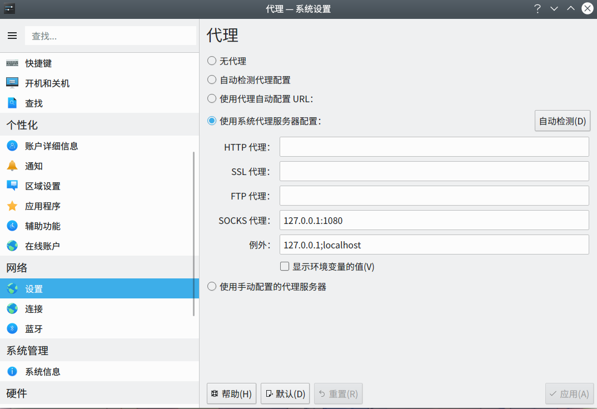
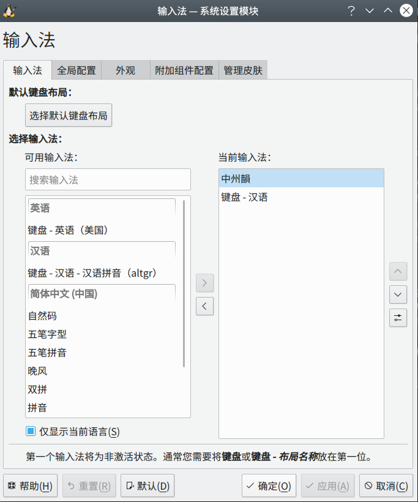
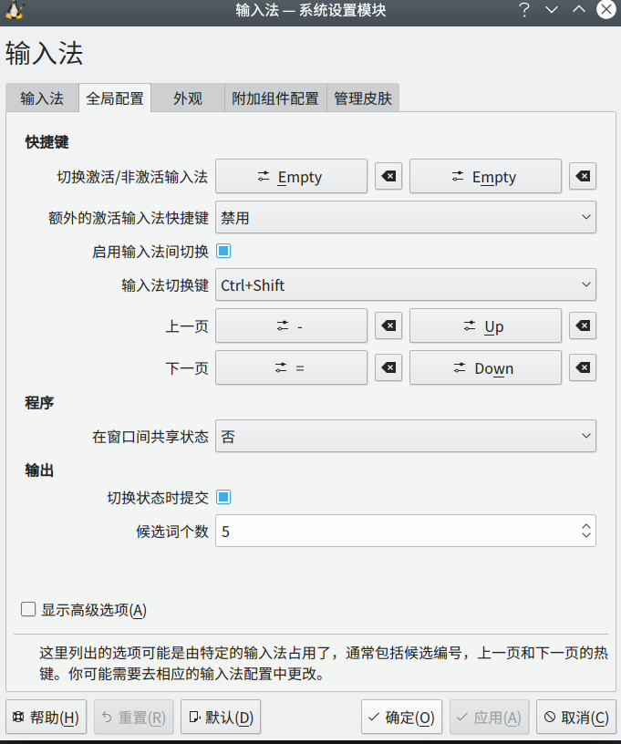
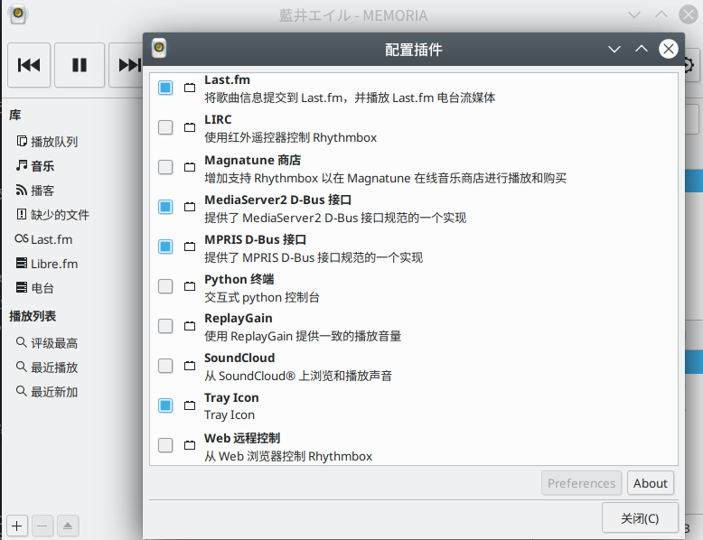
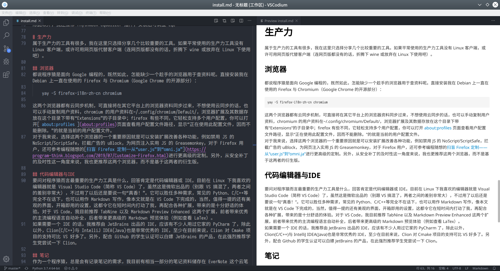

在用了将近两年的 Debian 后，我打算尝试另一个与 Debian 存在较大差别的发行版，做了一番比较后（~~并没有~~）选择了相比 Debian 激进许多（经常需要滚包）的 Arch Linux。其实我在刚开始使用 Debian 时便听说过 Arch Linux 了，这都要归功于活跃的[ Arch Linux 中文社区](https://www.archlinuxcn.org/)，里面的人整天忙着安利 Arch Linux（~~传教~~），而且，[ Arch Linux 的 Wiki ](https://wiki.archlinux.org/index.php/Main_page_%28%E7%AE%80%E4%BD%93%E4%B8%AD%E6%96%87%29)也是非常优秀的文档，我在 Debian 上遇到问题时也会参考 Arch Linux 的 Wiki，久而久之，便产生了尝试 Arch Linux 的想法，此外，对于现在的我而言，[Arch Linux 的哲学](https://wiki.archlinux.org/index.php/Arch_Linux_%28%E7%AE%80%E4%BD%93%E4%B8%AD%E6%96%87%29#%E5%8E%9F%E5%88%99)也非常有意思，其中提到：    

> Arch 适用于乐于自己动手的用户，他们愿意花时间阅读文档，解决自己的问题。

这完全符合我想折腾 Linux 的想法！当然，我认为 Arch Linux 并不适合 Linux 新手，因为光是第一步的命令行安装系统（Arch Linux 官方没有提供图形化安装界面）恐怕就能劝退不少人了，不过对于接触过 Linux 的人，通过理解 Arch Linux 安装过程中所需要输入的指令的含义，能体会到一种完全掌握自己的系统的快感（~~误入邪教~~）。总而言之，对于喜欢折腾的人来说，尝试 Arch Linux 是绝对不会后悔的决定。     

由于 Arch Linux 的激进策略，安装教程很容易过时，我也不打算费力不讨好地写具体的安装步骤了，本文主要分享我在 Arch Linux 下使用的软件，希望能安利更多人使用（提到的不少软件都是跨平台的，即使不使用 Arch Linux 也可使用这些软件）。先在这里说一下我挑选软件的原则：通用性是最重要的，无论在哪个平台上使用都具有近乎一致的体验，为此没有利用单个平台的特性也是可接受的；数据可无障碍导出与导入，尊重用户的选择自由；简单易用且具备可扩展性（例如可安装扩展增强功能），但我也不排斥“一次配置，终身受用”这样需要折腾的软件；当然，开源是最好的。能达到这些要求的软件实属少数派，我在下文仅仅推荐几个，有空再补充。

# 安装
考虑到 Arch Linux 经常变动，所以最好的安装指南应该是官方的[ Installation Guide](https://wiki.archlinux.org/index.php/Installation_guide)，我另外也参考了两篇博文，一个是萌狼的[给 GNU/Linux 萌新的 Arch Linux 安装指南 rev.B](https://blog.yoitsu.moe/arch-linux/installing_arch_linux_for_complete_newbies.html)，~~另一个是[以官方Wiki的方式安装ArchLinux](https://www.viseator.com/2017/05/17/arch_install/)~~（由于 2019 年 10 月 Arch Linux 将 base 包组替换为同名的元包，这篇教程已过时）。对于我这样存在多系统的情况，执行了 grub-mkconfig 后最好检查一下/boot/grub/grub.cfg 是否包括了所有的系统。     
有关于桌面环境的选择，鉴于之前总是看到各位大佬吹 Arch Linux 的 KDE 桌面的美观，而我一直在 Debian 下使用 Gnome，这回便决定尝试 KDE（~~其实是为了在出问题时更容易找到大佬求救~~），在安装了 kde-applications 后，开始嫌弃如此多的用不上的应用了（说的就是教育与游戏分类下的那堆东西），所以花了点时间写了一个[简单的 Python 脚本](https://gist.github.com/vifly/33d1a4f63b0b7319c6db9af9d3bdbdb0)删除这些软件（**需要 root 权限，使用需谨慎**）。安装完成后重启进入桌面，我不得不表示默认的 KDE 桌面比 Gnome 漂亮多了，相比之下，Gnome 的塑料风格看着实在是让我难受。另外，KDE 全家桶之间的配合也令我十分满意，统一的设计风格，美观的特效，让我忍不住想吹爆 KDE 了。有一个值得一提的细节，在 KDE 下的鼠标单击等于其它桌面环境下的鼠标双击（例如在其它桌面环境下打开文件需要双击），一开始我并不习惯这种设置，觉得不便于选中单个文件，但用多了以后发现这种操作明显更轻松，因为平常使用鼠标时双击的频率比单击要高，而双击肯定比单击累，将双击替换为单击肯定可以减缓疲劳，对于需要选中单个文件的情况，右键也能满足需求，这又成了一个我喜欢 KDE 的原因。  
除了桌面环境外，首先需要熟悉的还有 Arch Linux 的软件包管理器 Pacman，它的命令行参数与 apt 完全不一样，开始使用时经常需要查看其[ Wiki 页面](https://wiki.archlinux.org/index.php/Pacman)，值得一提的是，得益于[ AUR(Arch User Repository) ](https://wiki.archlinux.org/index.php/Arch_User_Repository)的存在以及 Arch Linux 打包的低门槛，Arch Linux 拥有数量庞大的软件包，考虑到可能会使用 AUR 里的软件包，所以我安装了[ Yay ](https://github.com/Jguer/yay)这个[ AUR 助手](https://wiki.archlinux.org/index.php/AUR_helpers)（Yay 完全兼容 Pacman 的命令行参数）帮我节省输入 makepkg 等指令的步骤，下文涉及到安装软件的指令既有可能使用 Pacman，也有可能使用 Yay。

# 中国大陆用户所需的东西
## 中文设置
我直接根据[ Linux 下的字体调校指南](https://szclsya.me/zh-cn/posts/fonts/linux-config-guide/)一文进行调教，在这里我想说一下该博文中提到的“archlinuxcn required”，这意味着需要[添加 archlinuxcn 源](https://www.archlinuxcn.org/archlinux-cn-repo-and-mirror/)，上面介绍已经提到了 Arch Linux 中文社区，而这个社区维护着一个非官方软件仓库，被称为 Arch Linux 中文社区仓库（archlinuxcn 源），该仓库包括了很多中文用户会用到的已编译好的软件包，而 AUR 提供的是 PKGBUILD 打包脚本（这就是为什么你可通过 AUR 安装不少明确禁止二次分发的闭源软件的原因，因为 AUR 分发的是打包脚本而不是软件本体），需要下载后进行编译打包安装，如果你懒得自己打包的话，建议添加 archlinuxcn 源。在配置完成中文字体的显示后，在 KDE 的系统设置中将语言设置为中文就行了。另外，强烈建议阅读官方的[ Arch Linux 中文化](https://wiki.archlinux.org/index.php/Arch_Linux_%E4%B8%AD%E6%96%87%E5%8C%96)页面。

## 翻墙
折腾 Linux 总是会遇到各种问题，这种时候便需要 Google 了，让我们先解决使用无法使用 Google 的问题（此处使用 V2Ray 作为例子，在官方软件仓库有 V2Ray 的软件包真是太好了）：  

    yay -S v2ray

安装后修改/etc/v2ray/config.json 的配置，然后：   

    sudo systemctl enable v2ray.service
    sudo systemctl start v2ray.service

如果想让桌面应用走代理，可以在 KDE 的系统设置中点击“网络”中的设置，然后点击“代理”，选中“使用系统代理服务器配置”，填入对应的代理信息，示例如下：

另外，V2Ray 支持 ShadowSocks 协议，可根据[ V2Ray 官方文档](https://www.v2ray.com/chapter_02/protocols/shadowsocks.html)写出配置文件，也可使用[在线工具](https://www.veekxt.com/utils/v2ray_gen)生成；如果你使用 SSR 翻墙，AUR 中有[ electron-ssr](https://aur.archlinux.org/packages/electron-ssr/)，也有[ shadowsocksr](https://aur.archlinux.org/packages/shadowsocksr/)，但需要注意的是 electron-ssr 无法在 KDE 下自动设置代理（它使用了 gsetting 设置系统代理，不支持 KDE）。总之，安装好翻墙软件后终于能在电脑上使用 Google 查问题了。

# 终端模拟器与 Shell
既然在 Linux 下，那么肯定免不了与终端打交道，既然如此，我们就需要一个美观、实用的终端（模拟器）。要说美观的话，KDE 自带的 Konsole 已经足够漂亮了，透明背景这一点让一直使用 Gnome Terminal 的我感到非常舒服，只需要稍微调整一下，就可以做到[ kiri 大佬这样的效果](https://kirikira.moe/post/28/#3)，让自己一整天都保持心情愉悦。不过在实用性方面我开始时遇到了一点问题，Konsole 使用的 Shell 是 Bash，而 Arch Linux 本身的 Bash 并没有自动补全配置，想要自动补全的话需要安装 bash-completion： 

    sudo pacman -S bash-completion

想要更高级的 Shell 体验的话（不知道终端模拟器与 Shell 有什么区别？请看[这](https://www.ihewro.com/archives/933/)），也可以安装 zsh 加 oh-my-zsh 这样一整套的懒人包（或者自己配置 zsh？），只不过这里有一个小坑，在 AUR 中的 oh-my-zsh-git 并不会在 home 目录下生成 .zshrc，查找后发现在 /usr/share/oh-my-zsh 下有 zshrc 文件，我直接复制到 home 目录了，这里贴出安装懒人包的操作命令（将 username 改为你的用户名）：   

    yay -S zsh
    sudo chsh -s /bin/zsh username
    yay -S oh-my-zsh-git
    cp /usr/share/oh-my-zsh/zshrc ~/.zshrc
    
更新：博主已经放弃启动速度慢的 oh-my-zsh，转向 Zinit 这个神器的怀抱了，另外，2021 年 11 月 Zinit 的原作者删除代码库，目前由 zdharma-continuum 组织接手进行维护，请注意 URL 的变化。Zinit 不仅轻松可以使用 oh-my-zsh 的各种插件，还拥有 Turbo mode 这个大幅减少插件加载时间的大杀器。如果你心动的话，请看[加速你的 zsh —— 最强 zsh 插件管理器 zplugin/zinit 教程](https://www.aloxaf.com/2019/11/zplugin_tutorial/)一文。仅仅是照抄文末的示例配置，我也在保留 oh-my-zsh 体验的前提下感受到了起飞的加载速度，所以请无视上面的 oh-my-zsh，使用以下指令体验顺滑如丝的 Zinit（这里用了配置难度低的 proxychains-ng 翻墙下载 GitHub 片段，也可使用其它手段）：

    yay -S zsh proxychains-ng
    git clone https://github.com/zdharma-continuum/zinit.git ~/.zinit/bin
    # 在 .zshrc 中添加 source ~/.zinit/bin/zinit.zsh 以及其它配置，可参考我的配置
    nano .zshrc
    # 配置 proxychains-ng，在最后一行添加类似 socks5 127.0.0.1 1080 的内容即可，自行谷歌了解配置
    sudo nano /etc/proxychains.conf
    # 启动 zsh，由于 .zshrc 已加载 Zinit，所以 zsh 首次启动时会自行下载 GitHub 上的片段
    proxychains zsh
    # 下载片段完成后退出执行这条指令更改默认 Shell，重启后见效果
    sudo chsh -s /bin/zsh username

你可以在[ GitHub ](https://github.com/vifly/dotfiles/blob/master/zsh/.zshrc)查看我的 zsh 配置，不过请记得根据自己的需求进行修改。

# 输入法
前面搞定了中文字体的显示，但是还没解决输入中文这个问题，在这里我选择了与使用 Debian 时同样的方案：基于 Fcitx 框架的 Rime 输入法。先贴一波安装指令（其它基于 Fcitx 框架的输入法请看[ Wiki 页面](https://wiki.archlinux.org/index.php/Fcitx)）：   

    sudo pacman -S fcitx fcitx-im fcitx-rime

为了确保能输入中文，修改一下/etc/profile，在开头加上：  

    export XMODIFIERS="@im=fcitx"
    export GTK_IM_MODULE="fcitx"
    export QT_IM_MODULE="fcitx"

另外，需要更改一下输入法配置，操作步骤是右键点击托盘中的输入法图标，选择“配置”，修改后的配置如下图所示（按 Shift 键可切换中英文）：

最后，将我已经在 Debian 上调校好的 Rime 输入法配置文件拷贝过来（调校 Rime 的教程太多了，这里懒得贴了～），就能畅快地输入中文了。

# 多媒体
这里选择在 Debian 上非常熟悉的 MPV 和 Rhythmbox 作为视频和音频播放器，之所以选择 MPV 是因为我已经有了一套[配置方案](https://github.com/vifly/dotfiles/blob/master/mpv/.config/mpv/mpv.conf)，没必要选择其它播放器了，如果你还没使用过 MPV，那么[这里](https://vcb-s.com/archives/7594/comment-page-1)有一篇相当不错的配置教程。而 Rhythmbox 支持不少插件，例如，在 KDE 桌面下，Rhythmbox 无法在关闭窗口时隐藏到托盘继续播放，可以通过安装 rhythmbox-tray-icon 插件解决：   

    yay -S rhythmbox-tray-icon

安装好插件后记得点击 Rhythmbox 右上角的设置按钮->“插件”，在弹出的窗口中勾选刚安装的插件以激活插件效果，如下图：   

除此以外，我还推荐 rhythmbox-equalizer 插件，安装后可调整 EQ。

# 生产力
属于生产力的工具有很多，我在这里只选择分享几个比较重要的工具。如果平常使用的生产力工具没有 Linux 客户端，或许可用网页版代替客户端（连网页版都没有的话，折腾下 wine 或放弃在 Linux 下使用吧）。

## 浏览器
都说程序猿是面向 Google 编程的，既然如此，怎能缺少一个趁手的浏览器用于查资料呢。直接安装我在 Debian 上一直在使用的 Firefox 与 Chromium（Google Chrome 的开源部分）：   

    yay -S firefox-i18n-zh-cn chromium

这两个浏览器都有云同步机制，可直接将在其它平台上的浏览器资料同步过来，不想使用云同步的话，也可以手动复制用户资料以进行数据备份和迁移，Chromium 的用户资料在~/.config/chromium/Default/，浏览器扩展及其数据存放在这个目录下带有“Extensions”的子目录中；Firefox 有些不同，它轻松支持多个用户配置，你可以打开[ about:profiles ](about:profiles)页面查看用户配置文件路径，显示“正在使用此配置文件，因而不能删除。”的就是当前的用户配置文件。    
对于我来说，选择这两个浏览器的一个重要原因就是可以安装扩展改善各种功能，例如禁用 JS 的 NoScript/ScriptSafe，拦截广告的 uBlock，为网页注入实用 JS 的 Greasemonkey，对于 Firefox 用户，还可参考编程随想的[无需任何插件或扩展，定制 Firefox 外观](https://program-think.blogspot.com/2016/10/custom-firefox-theme-without-extension.html)和[扫盲 Firefox 定制——从“user.js”到“omni.ja”](https://program-think.blogspot.com/2019/07/Customize-Firefox.html)进行更高级的定制。另外，从安全补丁的及时性这一角度来说，我也更推荐这两个浏览器，而不是基于这两者的衍生版。

## 代码编辑器与IDE
要问对程序猿而言最重要的生产力工具是什么，回答肯定是代码编辑器或 IDE。目前在 Linux 下我喜欢的编辑器就是 Visual Studio Code（简称 VS Code）了，虽然这是微软出品的（别跟 VS 搞混了，两者之间的差别非常大），不过用了以后还是要说一句“真香！”。它可以胜任多种需求，常见的 Python、C/C++等完全不在话下，也可以用作 Markdown 写作，像本文就是在 VS Code 下完成的，当然，值得一提的还有美观的界面，开箱即用的设置，这都令它在短时间内打动了我，再配合各种扩展，带来的是十分舒适的体验。对于 VS Code，我目前推荐 TabNine 以及 Markdown Preview Enhanced 这两个扩展，前者带来优秀的主流编程语言自动补全，后者带来更高级的 Markdown 预览体验（例如查看 LaTex）。     

如果需要一个 IDE 的话，我推荐由 JetBrains 出品的 IDE，应该有不少人用过它家的 PyCharm 了，除此以外，Clion(C/C++)与 IntelliJ IDEA(Java)也是非常优秀的 IDE，至少在目前来说，Clion 对 Cmake 项目的支持可比 VS 好多了。另外，配合 Github 的学生认证可以白嫖 JetBrains 的产品，在此强烈推荐学生党尝试一下 Clion。

## 笔记
作为一个程序猿，总是会有记录笔记的需求，我目前有相当一部分的笔记资料储存在 EverNote 这个云笔记上，而它并没有 Linux 官方客户端，不过，得益于它的开放 API，早就有开发者做了一个在 Linux 下的客户端：NixNote（原名 Nevernote），Arch Linux 官方仓库有这个软件包：   

    sudo pacman -S nixnote2 

~~只不过我遇到了在已设置应用程序使用语言为中文的情况下，菜单依然为英文的问题，Google 后找到一篇[让 NixNote 显示日语的教程](https://blue-leaf81.net/archives/nixnote-translate-jp/)，受到这篇教程的启发，我查看了一下/usr/share/nixnote2/translations/目录，发现其中只有 nixnote2_cs_CZ.qm 文件，看来想要让菜单显示中文，就必须在这个目录下添加中文翻译。具体来说，先前往 GitHub 仓库下载[中文翻译源文件](https://github.com/baumgarr/nixnote2/blob/master/translations/nixnote2_zh_CN.ts)，接着使用 Qt Linguist 打开下载回来的文件，然后点击左上角“File”->"Release As"导出到/usr/share/nixnote2/translations/nixnote2_zh_CN.qm。重启 NixNote 便可以看到中文菜单了~~。更新：2020年5月的更新已带上中文翻译，无需再按上面折腾。    
当然，EverNote 在 Linux 下还有[几个非官方客户端](https://itsfoss.com/evernote-on-linux/)，我选择 NixNote 的原因在于它是使用 C++ QT 开发的，而不是类似于[ Tusk ](https://github.com/klauscfhq/tusk)等使用前端技术开发的套壳 Web 应用，但对于 EverNote 的高级用户，我建议使用 EverNote 的网页版，而不是使用 NixNote，因为网页版的编辑功能比 NixNote 更优秀。

## 虚拟机
我有时候会有使用虚拟机运行 Windows 或其它 Linux 发行版的需求，这个时候就需要用到虚拟机了，VirtualBox 是一个操作简单且免费开源的虚拟机软件，根据[ Wiki 页面](https://wiki.archlinux.org/index.php/VirtualBox)进行安装（安装时会要求选择内核模块，没有更换默认内核的话，选择 virtualbox-host-modules-arch，不然选择 virtualbox-host-dkms）： 

    yay -S virtualbox virtualbox-ext-oracle virtualbox-guest-iso

假如你没有用过 VirtualBox，那么这里提醒一句，拖放文件和共享粘贴板等功能需要在运行中的虚拟机窗口上方点击“设备”->“安装增强功能”才可使用。

# 后记
得益于我对软件的通用性的要求，可以说是无痛从 Debian 迁移到了 Arch Linux，不少软件只需简单地复制粘贴配置文件即可（前提是已经有配置文件了），而且 Arch Linux 的系统安装过程也并不像我之前想象的那样复杂。折腾完这堆东西后最大的感触就是之前折腾积累的东西（如相关知识与配置）并没有浪费，若是没有相关的积累，面对安装 Arch Linux 以及安装完成后做什么这些问题恐怕会一头雾水，浪费不少时间，从节约时间的角度来说，编程随想所说的[重视个人 IT 基础设施的改善](https://program-think.blogspot.com/2013/10/personal-it-infrastructure.html)是很有道理的。总之，安装好 Arch Linux 的我就像是一个刚得到新玩具的小孩子，正迫不及待地想要探索这个新玩具的有趣之处，更多有趣的软件留待日后补充好了。
