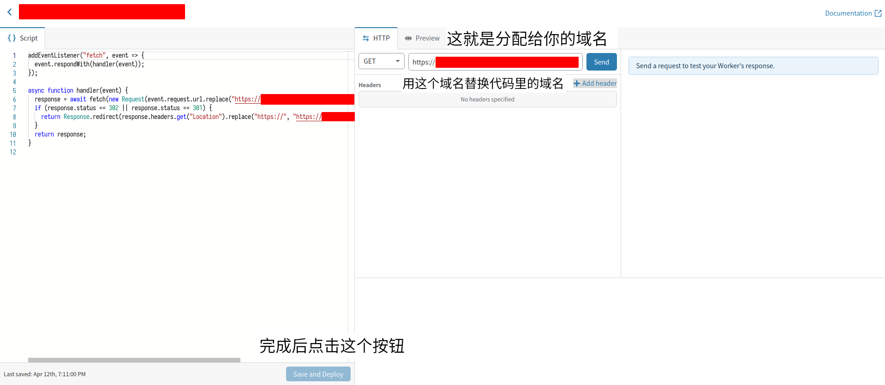

+++
title = "GitHub Actions 打造 AUR 打包下载一条龙服务"
date = "2020-04-28"
lastmod = "2021-02-02"
description = "使用免费的 GitHub Actions 体验全自动化的 Arch 软件打包安装的工作流"
tags = [
    "折腾",
    "Linux",
    "CI",
]
image = "show.png"
+++

*2021.2.2.更新：受 [Aloxaf 的博文](https://www.aloxaf.com/2020/06/build_aur_with_github_actions/)启发新增使用自己的 PKGBUILD 进行构建的说明。* 

尽管目前博主我还在考研，但最近还是经不住折腾 Arch 的诱惑，抽空对使用 Arch 以来一直觉得体验不够好的安装 AUR 软件包流程进行改造，最终的结果就是搭建了这一个自动化的 AUR 编译打包下载安装一条龙服务，并写下本文向各位安利。要问为什么我想折腾这个东西，当然是因为使用 AUR 助手安装 AUR 的软件包存在如下缺点：

1. 下载速度慢，由于很多时候都需要从 GitHub 下载文件，所以每秒 10 KB 的下载速度是很常见的（虽然这点可以通过设置 http_proxy 环境变量让 Yay 等 AUR 助手使用代理来解决）
2. 编译需要时间，如果你只是需要几个小软件包那可以无视这点
3. 给别人分享已打好的软件包有点麻烦，每次更新你都需要通过某种方式传输文件给对方（凑够三点 ／人◕‿‿◕人＼）

为了解决以上问题，本文使用免费的 GitHub Actions 与 Cloudflare Workers，手把手教你搭建一个自动化 AUR 软件构建流程，只需一次配置，你就可以享受船新的~~白嫖~~ AUR 使用体验。另外，这也是我第一次实际使用 CI（持续集成），通过配置整个工作流，我算是学习了一把 CI 的使用（*PS：这才是真正的目的*），所以你也可以把这篇文章当作我的 CI 学习笔记。

# GitHub Actions 简介

首先，GitHub Actions 是 GitHub 在 2019 年推出的一项 CI 服务。如果你没听说过 CI，那这里我尝试用一句话来解释，CI 就是对新的项目更改进行自动化构建，在本文的场景下，新的更改指的是 AUR 上的 PKGBUILD 文件发生变更（实际上我为了偷懒，选择了设置定时任务而不是监测 PKGBUILD 的变更），自动化构建就是自动编译加打包以及上传（如果是闭源软件那就不是编译而是拆包等操作）。嗯，就是这么简单，如果想知道 CI 的详细定义，可以看下[红帽的文章](https://www.redhat.com/zh/topics/devops/what-is-ci-cd)。

GitHub Actions 的特点是支持的触发条件种类数非常多，而且与 GitHub 的集成很好，学习难度也不高，只要简单地写一个配置文件即可，还可轻松调用别人写好的操作步骤，对于开源项目作者来说最大的好处就是可以白嫖 GitHub 的机器用来为不同的平台编译。如果你已经对 GitHub Actions 感到心动，那么不妨阅读[官方文档](https://help.github.com/en/actions/getting-started-with-github-actions)来学习一下用法，或者靠[阮一峰的介绍文](https://www.ruanyifeng.com/blog/2019/09/getting-started-with-github-actions.html)快速上手。想要更简短的介绍？没问题，来看看下面的讲解吧。   

想要使用 GitHub Actions，那首先需要在项目根目录下的 .github/workflows 文件夹下创建一个以 yml 为后缀名的 workflow 文件（如 build.yml），在这个 YAML 文件中写入我们的配置。那么配置该怎么写呢，让我们看一个示例：

```YAML
name: Greeting from Mona
on: push

jobs:
# ================== 第一个 job，这只有一个 job ==================
  my-job:
    name: My Job
    runs-on: ubuntu-latest
    steps:
    # ================== 第一个 step，执行单个命令 ==================
    - name: Print a greeting
      env:
        MY_VAR: Hi there! My name is
        FIRST_NAME: Mona
        MIDDLE_NAME: The
        LAST_NAME: Octocat
      run: echo $MY_VAR $FIRST_NAME $MIDDLE_NAME $LAST_NAME.
    # ================== 第二个 step，使用别人的 action ==================
    - uses: actions/checkout@v2
    # ================== 第三个 step，执行多个命令 ==================
    - name: Install the dependencies
      run: |
        sudo apt-get update
        sudo apt-get install pkg-config gettext
```

按从上到下的顺序来看，name 对象应该无需解释了，值得注意的是 [on](https://help.github.com/en/actions/reference/workflow-syntax-for-github-actions#on) 对象，可以填入单个事件或事件数组作为触发条件，当满足条件时便执行这个 YAML 文件里的内容（一个项目可以存在多个 workflow 文件），在示例中的 push 指的是 git push，即每次推送代码都会触发这个 workflow，完整的事件支持列表可通过[官方文档](https://help.github.com/en/articles/events-that-trigger-workflows)获知。

接下来就是 jobs 了，在这里我们只创建了一个名为 my-job 的 job，一般而言 jobs 是 workflow 文件的主体，一个 job 由若干个 step 组成，这些 step 会按顺序执行，为了便于阅读，我用分割线将各个 step 分开了。

在解释 step 前我们不妨先看下每一个 job 中都要填写的 [runs-on](https://help.github.com/en/actions/reference/workflow-syntax-for-github-actions#jobsjob_idruns-on) 对象，它指定了该 job 的工作系统环境，目前可选的系统有 windows-latest、ubuntu-latest、ubuntu-16.04、macos-latest，这覆盖了主流的操作系统平台，为不同平台的编译提供了便利。  

最后，就是每个 job 中必须存在的 step 了，每个 step 都代表一个单独的操作步骤，既可以在 [run](https://help.github.com/en/actions/reference/workflow-syntax-for-github-actions#jobsjob_idstepsrun) 对象内填入你需要执行的 Shell 命令，也可以在 [uses](https://help.github.com/en/actions/reference/workflow-syntax-for-github-actions#jobsjob_idstepsuses) 对象里填入对应的配置以使用别人的 action（在 [Marketplace](https://github.com/marketplace?type=actions) 中浏览全部 action）。[env](https://help.github.com/en/actions/reference/workflow-syntax-for-github-actions#jobsjob_idstepsenv) 对象用来设置环境变量，这个对象存在一个非常有趣的应用场景：如果你的 step 需要使用不宜公开的 Token，那你可以[在项目设置中设置该 Token](https://help.github.com/en/actions/configuring-and-managing-workflows/creating-and-storing-encrypted-secrets)，然后在 env 对象中使用 super_secret: $ 将这个 Token 设为一个环境变量，并在自己的 step 中读取该环境变量以取得 Token，这样就能避免在 workflow 文件中硬编码 Token。当你再次看到 $ 这样的变量时，你就应该明白这是一个私密变量，是不能公开的。

# 开始构造打包工作流

经过上文的介绍，各位应该对 GitHub Actions 有了一定的了解，接下来就让我们开始白嫖 GitHub Actions 吧。为了白嫖，我们需要先创建一个新的 GitHub 仓库，然后有两种方法创建 GitHub Actions 配置文件，第一种方案是在这个仓库创建 .github/workflows 文件夹，在这个文件夹下新建一个 YAML 文件（完整路径示例：.github/workflows/build.yml）；第二种方案是在仓库的 Action 页面按照指引随便新建一个。完成这个步骤后就可以根据下面的指导在 YAML 文件中配置 GitHub Actions 了，不想看详细配置过程的话可以跳到下方直接抄配置。

## 自动编译 AUR 的软件包

一般而言，我们都是在 Arch Linux 上构建 AUR 上的软件包，但是上文提到的 runs-on 对象可以填入的系统并不包括 Arch，那该怎么办呢？答案是使用基于 Arch 的容器，在容器内构建。这里要感谢 [Qv2ray](https://github.com/Qv2ray/Qv2ray) 的一位开发者 [DuckSoft](https://www.ducksoft.site/) 提供了这个思路，而且编写了 [build-aur-action](https://github.com/DuckSoft/build-aur-action) 这个 action 用来编译打包 AUR 上的软件。现在，我们需要考虑的就是如何自动进行编译，从 CI 的正常使用方式来说，我们应该在 on 对象中设定这样一个触发条件：当 AUR 特定的软件包更新时自动进行编译。不过这个方案还需要写检测更新的代码，为了偷懒，我选择设置定时任务来编译，由于 on 对象支持[通过 Cron 语法设定定时任务](https://help.github.com/en/actions/reference/workflow-syntax-for-github-actions#onschedule)，所以这个问题能被轻松解决。就这样，我们完成了一个简单的 workflow 文件：

```YAML
name: BUILD

on:
  schedule:
    - cron: '1 */8 * * *'

jobs:
  build:
    runs-on: ubuntu-latest

    steps:
    - uses: DuckSoft/build-aur-action@master
      with:
        repo-name: osu-lazer
```

提醒一下，使用别人的 action 时可能需要使用 with 对象输入一些变量，在这里我们输入的就是想要构建的 AUR 软件的软件包名。

## 上传到 GitHub Releases

在上一步中我们已成功地构建了想要的软件包，接下来需要解决的就是如何把软件包取出来这个问题了。最好的解决方案莫过于将构建出来的软件包上传到 Releases，GitHub 官方提供了 [upload-release-asset](https://github.com/actions/upload-release-asset) 来完成这个操作，但我看了说明文档后觉得这个太麻烦了，它不支持通过 Unix 终端规则（例如 “*.zst”）筛选要上传的文件，而且需要先创建 Releases 后才能上传文件。经过一番谷歌，我找到了 [release-action](https://github.com/ncipollo/release-action) 这个替代品，与 upload-release-asset 相比，这个 action 的配置明显更简单，从下面这段配置即可看得出来：

```YAML
- uses: ncipollo/release-action@v1.7.3
  with:
    allowUpdates: true
    tag: "packages"
    artifacts: "./*/*.zst"
    token: ${{ secrets.GITHUB_TOKEN }}
```

把这段配置添加到 workflow 中，然后我们先看看 with 对象中输入的变量。token 是上传文件到 Releases 时必需的一项变量，从它的形式就可以看出这是一个私密变量，不过这个私密变量是内置的，我们不需要在项目中手动设置这个变量，直接使用即可；接着就是 tag 了，为了方便管理，我们在仓库的 Releases 页面创建一个 tag，然后将 tag 的名字填入其中。完成配置后这个 action 就会把构建的软件包上传到指定 tag 下的 Releases，我们也可以下载该软件包了。

## 使用 matrix 进行改进

虽然目前我们的 workflow 已经能用了，但是需要编译多个 AUR 的软件时需要多次复制粘贴上面的 step，这可太难看了，是否存在更优雅的方法呢？答案是有的，经 DuckSoft 的提醒，可以使用 [matrix](https://help.github.com/en/actions/reference/workflow-syntax-for-github-actions#jobsjob_idstrategymatrix)，它基于单个 job 中定义的 steps 并行运行多个 job，多个 job 之间的差异就是特定变量的差异，这些变量以数组的形式存在。一般来说，matrix 的用处就是为不同平台采取同样的步骤进行构建，在本文的场景下就是采用同样的步骤构建不同的 AUR 软件。虽然听着有点抽象，但看一下这个例子你就应该能明白了：

```YAML
jobs:
  build:
    strategy:
      matrix:
        repos: [osu-lazer, mpv-mpris]

      fail-fast: false

    runs-on: ubuntu-latest

    steps:
    - uses: DuckSoft/build-aur-action@master
      with:
        repo-name: ${{ matrix.repos }}
```

与之前的 workflow 不同，我们先创建了 repos 数组，并在其中填入需要构建的软件名。如果不把 fail-fast 设置为 false，在并行 job 中出现一个运行失败的 job 时会导致其它的 job 被终止。另外，使用 build-aur-action 时我们没有直接输入 repo-name，而是以 $ 的形式输入，数组中的变量会自动应用到对应的 job 中。   

# 使用自己的 PKGBUILD（可选）
上述版本已经很完美了，不过还存在一个问题：我需要的某个软件包虽然在 AUR 中存在，但对应的 PKGBUILD 写的太烂了/无法构建成功，此时我写了一个 PKGBUILD，希望能白嫖 GitHub Actions 进行构建，该怎么办呢。这个需求也是早有人想到了，只需使用 [pkgbuild-action](https://github.com/edlanglois/pkgbuild-action) 就可解决，它还可以解决打的包还依赖了其它的 AUR 包的问题。为此，我们需要再添加一个 job，checkout 目前仓库获取 PKGBUILD，然后使用 pkgbuild-action 进行构建，需要的 pkgdir 参数就是 PKGBUILD 所在的路径（父文件夹），最后依然是使用 release-action 根据 pkgbuild-action 返回的构建产物路径将其上传到 GitHub Releases。

# 最终成品
最终版的 workflow 可以在[这](https://github.com/vifly/arch-build/blob/master/.github/workflows/build.yml)查看，只需 fork [arch-build](https://github.com/vifly/arch-build)，然后按下面的说明修改一下 workflow 文件即可食用。注意，经过一段时间的改进，最终版的配置已与上文存在一定区别，其中的 uploadToOneDrive 是[《使用 Vercel 与 OneDrive 自建软件源》](https://viflythink.com/Use_Vercel_and_OneDrive_to_setup_your_repo)中所需的 job，如果你不需要建立一个可公共访问的软件源请删掉它。

如果只是需要构建上传 AUR 包，那只需修改 buildAUR 这个 job 中的内容，根据自己的需要修改其 matrix 内的软件包名，buildNonAUR 的内容则可以删掉；如果想使用自己的 PKGBUILD 进行构建，那还需要修改 buildNonAUR 这个 job，依然需要修改其 matrix 内的软件包名，另外还需要在仓库的根目录下新建以软件包名命名的文件夹，在其中存放对应的 PKGBUILD 文件和其它构建过程中所需的资源文件。

到此为止，借助 GitHub Actions，我们拥有了一个 24 小时可用的编译机以及公开的软件包存储库，解决了本文开始提到的第二与第三点问题。这些都是全自动且免费的，为了更好的体验，下文将介绍如何让安装软件包也实现自动化。

# 简单的自动更新仓库
打开浏览器，从 Releases 页面下载软件包，然后执行 pacman -U xxx.pkg.tar.zst 安装软件包，这些操作实在太麻烦了，为何不建立一个软件源，令每次执行 pacman -Syu 时自动安装最新版本的软件呢。自建软件源听上去十分高大上，但其实只是建立一个本地软件源并不难，[Arch WiKi 几段文字](https://wiki.archlinux.org/index.php/Pacman/Tips_and_tricks#Custom_local_repository)便说明白了，当然，如果想建立一个在线的公用软件源会麻烦一些，所以这里只说明如何建立一个自动更新的本地软件源。想要建立公用软件源的话请跳过下文，阅读我的新博文[《使用 Vercel 与 OneDrive 自建软件源》](https://viflythink.com/Use_Vercel_and_OneDrive_to_setup_your_repo)。

## 使用自动化脚本

作为一个爱偷懒的人，我肯定希望能自动化下载软件包与更新软件仓库的操作，为此我写了一个脚本来完成这些事情，各位只需打开[项目地址](https://github.com/vifly/helper)，下载代码并根据说明进行操作即可。我在这里说明一下 conf.py 的配置：UserName 和 GitHubRepoName 并不难理解，举个例子，我的白嫖仓库地址是 [https://github.com/vifly/arch-build](https://github.com/vifly/arch-build) ，那么需要填写的 UserName 便是 vifly，GitHubRepoName 则是 arch-build；ProxyURL 在下一小节会提到，这里先不说；DownloadPath 是从 Releases 下载的软件包的存储路径；末尾的 ArchRepoDBPath 和 ArchRepoName 是用于生成本地软件源的数据库的，脚本会调用 repo-add 根据 DownloadPath 中的软件包生成路径为 ArchRepoDBPath/ArchRepoName.db.tar.gz 的数据库。   
当你成功运行脚本建立了一个本地软件源后，还需要修改 /etc/pacman.conf 文件，在末尾添加以下配置以让 Pacman 同步你的软件源的数据库（自行替换 ArchRepoName 与 ArchRepoDBPath）：

    [ArchRepoName]
    SigLevel = Optional TrustAll
    Server = file://ArchRepoDBPath
    

另外，为了让本地的软件仓库保持最新，我们可以通过 [Cron](https://wiki.archlinux.org/index.php/cron) 设置一个定时任务自动运行这个脚本。现在，我们得到了一个完全免费、自动更新的个人软件仓库，快执行 pacman -Syu 开始享受白嫖的快乐吧。

## 使用 Cloudflare Workers 反代加速下载（可选）

为了解决在国内 GitHub 下载速度慢的问题，让我们继续发扬白嫖的精神，使用 [Cloudflare Workers](https://workers.cloudflare.com/)（不需要拥有域名） 来加快下载速度。广大白嫖党早已发现可以使用免费的 Cloudflare Workers 部署 serverless 应用反代国内无法访问的网络资源，在这里我们也使用这种方式加速下载。刚开始时我使用了 [gh-proxy](https://github.com/hunshcn/gh-proxy) 这个加速 GitHub 下载的项目，不过后来 Arch 群的 [NickCao](https://nichi.co/) 同学推荐了他写的更通用的反代应用，感谢 NickCao，接下来我们便开始部署反代应用吧。     
首先，打开[官网](https://workers.cloudflare.com/)，注册或登录你的 Cloudflare 帐号，点击 Start building，选择免费方案并创建一个专属的子域名（是 workers.dev 的子域名），进入主页后点击 Create a Worker，复制[这份代码](https://gitlab.com/NickCao/experiments/-/blob/master/workers/r.js)，像下图这样粘贴到编辑框内：



注意，页面中间的域名是 Cloudflare Workers 分配给你的一个专属子域名（形如 xxx.xxx.workers.dev），复制这个域名并用它替换左侧代码中的两处域名，完成修改后点击 Save and Deploy 保存并部署，这样我们就得到了一个可以反代网络资源的应用了。

最后，还记得在上一小节中被忽略的 ProxyURL 配置项吗，这里各位只需填入刚刚得到的 xxx.xxx.workers.dev 域名就可以了，脚本会使用这个反代域名高速下载 GitHub Releases 的软件包。
