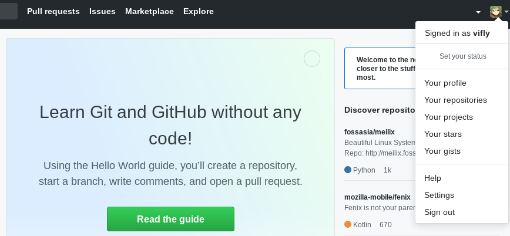
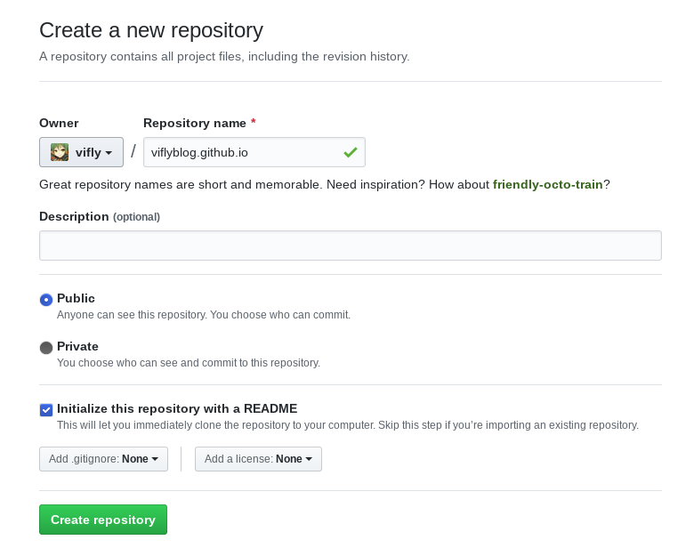
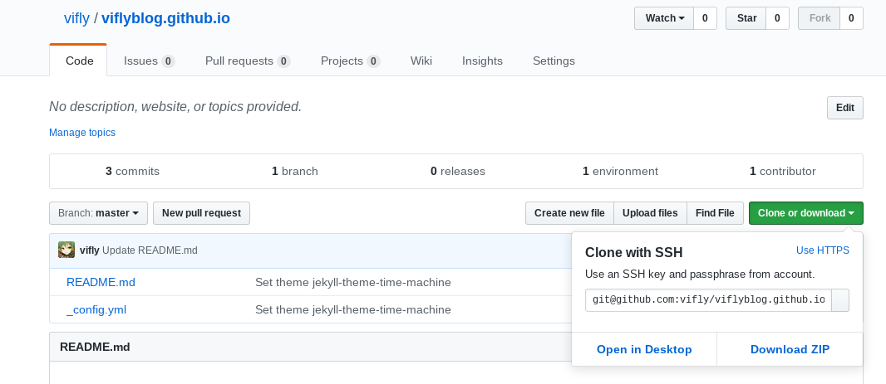

+++
title = "使用 Github Pages 和 Hexo 搭建个人博客"
date = "2019-04-07"
description = "使用hexo在GitHub Pages搭建博客，安利Material主题"
tags = [
    "折腾",
    "网站相关",
    "Hexo",
]
+++

# 简介
## Github Pages是什么
先看看维基百科的说法:  
> GitHub Pages是GitHub提供的一个网页寄存服务，于2008年推出。可以用于存放静态网页，包括博客、项目文档甚至整本书。

[阮一峰的这篇文章](http://www.ruanyifeng.com/blog/2012/08/blogging_with_jekyll.html)的说法更为简短：
> github Pages可以被认为是用户编写的、托管在github上的静态网页。

根据维基百科的介绍，我们可以得知 Github Pages 可用来存放博客，而且是免费且无限存储容量的，只不过它只支持静态网页，也就是说无法使用 WordPress 等工具建站。

## Hexo是什么
先上一个官方的介绍：
> Hexo 是一个快速、简洁且高效的博客框架。Hexo 使用 Markdown（或其他渲染引擎）解析文章，在几秒内，即可利用靓丽的主题生成静态网页。

从官方介绍中我们可以得知**Hexo 是用来生成静态网页的**。
由于 Github Pages 上只能发布静态网页，所以我们需要找到一个生成静态网页的软件来让我们能快速发布博文，Hexo 就是其中的一个。github 官方是推荐使用 Jekyll 来生成和发布的，然而 Hexo 有许多好看的主题，为此我选择了 Hexo。

# 本地搭建
## 安装与运行
Windows 下请自行下载安装 nodejs 与 git，Linux 请根据自己所使用的发行版安装 nodejs，npm，git。  
安装好后输入以下指令安装 hexo-cli（g 参数代表全局，请无视运行过程中出现的错误）：

    npm install hexo-cli -g
   
然后在博客目录下输入以下指令：

    npm install hexo --save  

完成后可输入 hexo -v 验证是否安装成功。  
接着输入以下指令进行初始化：
    
    hexo init

然后输入以下指令安装依赖：

    npm install 

搞定后就可以运行一下测试效果了，生成静态网页：

    hexo g

运行本地服务器：

    hexo s

根据输出信息使用浏览器打开[http://localhost:4000](http://localhost:4000)，即可看到效果

## 写文章
可以使用命令行或手动创建方法新建博文。
使用命令行：

    hexo new <title>

手动创建：在博客根目录下 source -> _posts 新建以 .md 为后缀的文件。

# 主题选择
就我个人而言，查看技术类博文时总是看到写博文的博主使用了 Next 主题，虽然很简洁，但我总感觉过度简单了，在 16：9 的屏幕上左右两侧的空白太多了。经过一番查找，我选择了在集成服务和美观程度上成功打动了我的 Material 主题。  

## 使用Material主题后运行报错
使用 Material 主题后，运行 hexo s 后打开网页报错：  
```
Unhandled rejection TypeError: /home/blog/themes/Material/layout/layout.ejs:3
    1| <!DOCTYPE html>
    2| <html style="display: none;" <% if(config.language !== null) { %>lang="<%- config.language.substring(0,2) %>"<% } %>>
 >> 3|     <%- partial('_partial/head') %>
    4| 
    5|     <% if(page.layout === 'gallery') { %>
```

在官方仓库的 issues 中找到了[解决方法](https://github.com/viosey/hexo-theme-Material/issues/686)，需要对 layout/_widget/dnsprefetch.ejs 进行修改：  
将

    <% } else if(theme.comment.use.startsWith("disqus")) { %> 
改为 

    <% } else if(theme.comment.use && theme.comment.use.startsWith("disqus")) { %>

# 配置
## 站点配置
首先打开 blog 根目录下的_config.yml（下面统称为**站点配置文件**），按照以下示例进行修改：  

    title: 你的站点名称
    author: 你的名字
    language: zh-CN

注意冒号后必须有空格，如果你不喜欢默认主题的话，可自行寻找 Hexo 主题，按照对应的主题的说明文档进行安装，记得修改 theme 内容：  

    theme: 新主题名字

## Material主题配置
这里按照[Material主题官方文档](https://github.com/neko-dev/Material-theme-docs/)配置即可，选择 Material 主题的一个重要原因就是这个主题提供了很多对第三方服务的支持（前端小白的福音），所以看看有什么需要的第三方服务吧（RSS，评论区，访问统计等等）,可以参考我写的[进阶篇](https://viflythink.com/Use_GithubPages_and_Hexo_to_build_blog_advanced)。

## Material主题文档的一个小坑
在配置过程中遇到了一个问题，不知道如何在侧边栏添加独立页面的入口（比如关于，友链之类的），添加后点击入口却无法进入对应的页面，官方文档说明如下：
> link 的参数为相对路径，对应 hexo 目录下的 source 文件夹内的相应文件夹。  

然而我已经按照说明创建了文件夹，为什么还是不行呢？最后在[这个页面](https://github.com/viosey/hexo-theme-Material/wiki/%E5%88%9B%E5%BB%BA%E3%80%8C%E5%8F%8B%E6%83%85%E9%93%BE%E6%8E%A5%E3%80%8D%E9%A1%B5%E9%9D%A2)找到了解决方法，以创建关于页面为例：  
在 source 文件夹下创建 about 文件夹，新建一个 index.md 文件，写下（其中 layout 的值不可修改）：  

    ---
    title: about
    date: 
    layout: about
    ---

*假如是创建友链页面的话，记得还要按照“添加数据”这个步骤进行操作。*
总结一下，其实是官方文档没有提到需要创建 index.md 这一点坑了我，我还一直以为是我对文档的理解有误呢。


# 部署到Github Pages
## Github上的准备
这部分参考知乎专栏上的[超详细Hexo+Github博客搭建小白教程](https://zhuanlan.zhihu.com/p/35668237)，打开[github](https://github.com)并登录你的帐号，如果你还没在 github 帐号中添加 ssh key，请参考[这篇文章](https://gist.github.com/yisibl/8019693)进行添加。接着点击右上角的个人头像，再点击 Your repositories：  



点击右侧的 New 新建项目。当然，你也可以直接点击[这个链接](https://github.com/new)新建项目。输入自己的项目名字，后面一定要加.github.io 后缀，README 初始化也要勾上。



创建好项目后，点击 Settings，向下拉到最后有个 GitHub Pages，点击 Choose a theme 选择一个主题。然后等一会儿就可看到页面了。

## 正式部署到Github Pages
打开**站点配置文件**，按以下示例进行修改：

    deploy:
        type: git
        repository: 你的github项目地址
        branch: master

repository 填写的应是类似于 git@github.com:vifly/viflyblog.github.io.git 这样的 ssh 地址。假如你不知道地址，那么可以打开你在 github 上的这个项目，点击右侧的 Clone or download，就会出现所需的地址：



最后，发布到 Github Pages：

    hexo d

假如一直卡住的话，可中断后加上 -debug 参数再次运行这个部署指令，查看哪里出现问题。
 
