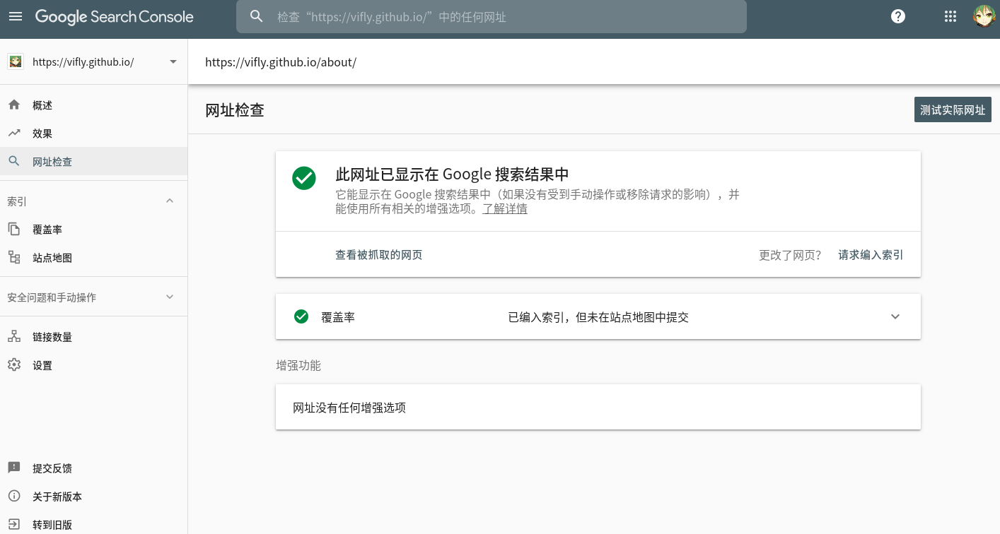

+++
title = "使用 GitHub Pages 和 Hexo 搭建个人博客(进阶篇)"
date = "2019-07-15"
lastmod = "2019-11-09"
description = "对使用 Material 主题的博客进行个性化定制，如添加 RSS，评论区，随机显示标语（slogan）等功能，进行 SEO"
tags = [
    "折腾",
    "网站相关",
    "Hexo",
    "SEO",
]
+++

*2019.8.18.更新：增加了如何搭建自己的统计分析服务的说明。*  
*2019.9.13.更新：增加了更多的 SEO 内容，对一些内容进行修改。*   
*2019.11.9.更新：增加了 Material 主题添加随机标语（slogan）的方法。*  
在[上一篇博文](https://viflythink.com/Use_GithubPages_and_Hexo_to_build_blog)当中我已经说完了使用 GitHub Pages 和 Hexo 搭建博客的基础操作了，只是这个刚搭建好的博客还缺了不少经常能在别人的博客上看到的东西，例如 RSS 订阅，评论区等功能。同时，不知道各位有没有发现一个问题，在搜索引擎当中搜索自己的站点时，搜索引擎返回的结果中并不会出现你的站点。本篇教程将会说明如何解决这些问题，如果还有更多的问题，请在评论区留言。

# 额外的功能与服务
*下面提到的这些功能与自己使用的 Hexo 主题相关，存在某些主题并没有提供某项功能的可能性*
## RSS 订阅
想要提供 RSS 订阅这个功能，各位需要查看自己使用的 Hexo 主题的文档进行操作，以我使用的 Material 主题为例，[官方文档](https://github.com/viosey/material-theme-docs/blob/master/services-zh-cn.md)简单地说明了一下，其实就是在安装了[ hexo-generator-feed ](https://github.com/hexojs/hexo-generator-feed)插件后，修改 Material 主题下的配置文件（_config.yml）中的 rss:的值：

    url:
        rss: atom.xml

按照这样配置的话，你的博客的 RSS 订阅地址就是 [https://你的博客域名/atom.xml](https://你的博客域名/atom.xml)，例如我的博客的 RSS 订阅地址就是 [https://vifly.github.io/atom.xml](https://vifly.github.io/atom.xml)。

## 评论区
依然使用 Material 主题举例子，[官方文档](https://github.com/viosey/material-theme-docs/blob/master/services-zh-cn.md)也说明了如何设置评论系统，为了能让读者畅所欲言，我否决了全部的国内评论系统，同时为了不翻墙的读者的体验以及匿名评论的需求，我最后选择了 Material 主题提供的 [Disqus](https://disqus.com/) 加自建 [Isso](https://posativ.org/isso/docs/) 评论系统（这里要感谢 [Alynx Zhou](https://alynx.one) 提供的多评论系统前端代码，话说周老师不去当前端工程师是不是太浪费了鸭≧▽≦）。

## 数据统计与分析
继续贴[官方文档](https://github.com/viosey/material-theme-docs/blob/master/services-zh-cn.md)。基于对读者隐私的考虑，我直接排除了百度和 CNZZ 的分析系统，至于 Google 分析，考虑到谷歌近年来的名声与未翻墙用户的体验，最终也决定不予采用，那么就只剩下一条路了，自己搭建分析系统。~~这个暂时也咕咕咕了，若是能成功搭建的话，再写一篇博文进行叙述。~~ 目前已经成功使用 Matemo 搭建了自己的网站统计分析服务，具体操作请看[ Debian 安装 Matomo (Piwik) 开源统计分析服务](https://viflythink.com/Install_matomo_on_debian/)。

# 搜索引擎优化（SEO）
假如你在搜索引擎中输入 site:xxxxx.github.io（自己的博客网址） 后发现没有出现自己的网站，那么请赶快看一下下面的“提交网站站点地图”小节。
## 验证网站所有权
为了便于以后在各个搜索引擎当中管理和查看我们的博客，我强烈建议在各个搜索引擎验证网站所有权，完成这一步后即可使用站长工具查看数据了，而且这也是完成后面某些步骤的必要前提。假如你将自己的域名（指的是 \*.github.io 以外的域名）用作博客的域名，那么便可以通过添加 DNS 记录的方式验证所有权（*PS：每家搜索引擎对这个验证方法有不同的称呼，谷歌称为“域名提供商”，而 Bing 称为“手动向 DNS 添加 CNAME 记录”*），不采用下面提到的方法了。
### Google
前往 Google 搜索的[控制台](https://search.google.com/search-console/ownership)添加自己的博客地址即可，Google 提供了几种验证方式:   
     
对于 Material 主题，请使用 HTML 标记或 Google 分析（假如你的博客使用了 Google 分析）进行验证，具体操作只需看[官方文档](https://github.com/viosey/material-theme-docs/blob/master/intro-zh-cn.md)。
### Bing（必应）
前往 Bing 的[网站管理员工具](https://www.bing.com/toolbox/webmaster/)进行验证。很不幸的是，Material 主题官方并没有提供 Bing 的站点所有权验证，那只能自己动手修改源代码了，经过一番查找，终于找到了用于在 HTML 页面当中标记所有权的部分，其代码位于 themes/material/layout/_partial/head.ejs 中，CTRL+F 查找“site_verification”发现在约 142 行的位置就是我们要找的代码，在下方照葫芦画瓢地加上： 

    <% if(theme.head.site_verification.bing) { %><meta name="msvalidate.01" content="<%= theme.head.site_verification.bing %>" /><% } %>

**注意，我感觉这里的 meta name 不一定对于每个人都适用，请观察一下 Bing 提供的 HTML 代码后再修改 head.ejs。**   

在复制了“&lt;meta name="msvalidate.01" content="xxxxxxxxxx" />”中的 xxxxxxxxxx 对应的值后，在主题的_config.yml 中进行修改：

    site_verification:
        bing: xxxxxxxxxx
        google: 
        baidu:

## 提交网站站点地图
这一步就是告诉搜索引擎你的网站有哪些链接，提交后搜索引擎就会自动顺着站点地图中的链接爬取你的站点内容了，若是没有这一步，在搜索引擎当中直接搜索自己的博客地址是没有任何结果的。要完成这一步骤，需要在博客目录下输入以下指令安装[ hexo-generator-sitemap ](https://github.com/hexojs/hexo-generator-sitemap)插件：

    npm install hexo-generator-sitemap --save

这个插件默认站点地图生成路径为 [https://你的博客域名/sitemap.xml](https://你的博客域名/sitemap.xml)，在使用 hexo g 重新生成网址内容后，将此网址提交到各个搜索引擎就可以了，以 Google 为例子，只需要发送 http://www.google.com/ping?sitemap=https://你的博客域名/sitemap.xml 这个网络请求即可，也可以在[Google 搜索控制台](https://search.google.com/search-console/)中的 sitemaps（站点地图）一栏提交自己的站点地图。而 Bing 则是需要在其 Web 面板中添加 sitemap。

## 提交网页地址（收录新页面）
虽然搜索引擎会自动顺着站点地图爬取网页内容，但是我就是想让它赶快收录刚发布的文章（因为不知道这个这个自动流程需要多少时间），这种时候该怎么办呢？我从[“SEO 技巧！如何最快时间让 Google 收录你的页面”](http://www.guxiaobei.com/submit-your-content-of-google.html)中了解到了如何让 Google 及时收录新发布的博文，然而 Google 的控制台页面已经进行了改版，经过一番搜索，在[ Google 官方的帮助文档](https://support.google.com/webmasters/answer/9012289)找到了新的提交新页面的方法，打开[https://www.google.com/webmasters/tools](https://www.google.com/webmasters/tools)，转到网址检查，输入你的新页面的网址，这就可以及时提交新的网页了。     

## SEO 进阶
为了让搜索引擎更好地爬取我们的网页，还需要使用一些技巧。这一部分主要参考了 [Hexo 博客 Next 主题 SEO 优化方法](https://hoxis.github.io/Hexo+Next%20SEO%E4%BC%98%E5%8C%96.html)这一博文，虽然 Material 主题与 Next 主题不同，不过有不少地方还是共通的。 

### 修改文章链接地址
Hexo 默认的文章链接形式为 domain/year/month/day/postname，这种四级 url 形式对于搜索引擎而言并不友好，我们可以修改为 domain/postname 这种形式。打开 blog 根目录下的_config.yml（下面统称为**站点配置文件**），找到 permalink 部分，将 permalink: :year/:month/:day/:title/改为 permalink: :title.html。  

    #permalink: :year/:month/:day/:title/
    permalink: :title.html  

### 出站链接添加 nofollow 标签
博文中总是会引用其它的文章，为了不让搜索引擎跳转到其它的网站，专注于我们的网页，我们需要为这些站外链接设置 nofollow 标签，可以通过安装[ hexo-autonofollow ](https://github.com/liuzc/hexo-autonofollow)自动完成这一个步骤。   

    npm install hexo-autonofollow --save

然后在**站点配置文件**中添加（更多配置请看 GitHub 页面）：  

    nofollow:
	    enable: true

### 添加文章描述
由于在 Material 主题中，文章的 tags 等于 keywords，所以无需再添加关键字了。不过我们可以为每篇博文添加描述，添加方法与添加 tags 等相似，在博客文章 markdown 文件开头添加 description：    

    ---
    title: 标题
    date: year-month-day xx:xx:xx
    tags: [tag01,tag02]
    description: 你的博文描述
    ---

# 个性化
## 启用自己的域名
千篇一律的 xxxxxxx.github.io 总是让人觉得厌烦，说到个性化，怎么能缺少使用自己喜欢的域名作为博客网址这一项呢？使用自定义的域名更有可能让人记住你的博客，而且只要不是前往 GoDaddy 这种价格偏高的网站购买域名，一个普通的 com 顶级域名每年也只需花费 10 美刀左右就可以拥有。在这么多的域名服务商当中，我选择了国外的[ namecheap](namecheap.com)，主要的好处就是以下几点：   
1. 价格便宜（从网站名字就可以看出来了） 
2. 老牌商家，服务可靠。别看这个网站的页面长得不好看，而且价格也比较便宜，但这个网站真的是老牌服务商，我并没有找到它坑客户的案例，基本可以放心。 
3. 提供免费的 WhoisGuard 服务，保护你的隐私。  
4. 不用备案，选择国外的域名服务商的话都能享受到这点。

### 自定义的域名与 GitHub Page 的绑定
买好了域名，接下来要做的事就是让我们的域名能够指向自己的博客啦。这个操作流程十分简单，只需前往自己的域名服务商的控制面板，然后参考这条[知乎回答](https://www.zhihu.com/question/31377141/answer/87541858)进行操作，只需在域名解析当中添加两条 CNAME 记录让域名（以我的域名为例就是 viflythink.com 和 www.viflythink.com ）指向 xxxxxx.github.io，大概就是下面这样：    
   
然后在 source 目录下新建一个叫 CNAME 的文本文件，里面填入你的域名（如 viflythink.com），与不少网上的操作不同，我们这里并不需要绑定 GitHub 的 IP，因为有时候 IP 地址会变化，所以绑定 xxxxxx.github.io 会更好。

### 启用 HTTPS 加密
为了保证读者的隐私，防止 ISP 的广告植入，稍微提高自己的网站在搜索引擎中的权重，我们需要为自己的域名启用 HTTPS 加密，当你成功启用 HTTPS 加密后读者访问你的网站时就会看到浏览器上出现一个绿色小锁头了，整个步骤也不难，这里参考了[为 GitHub Pages 自定义域名并添加SSL-开启https强制](https://tzhou2018.github.io/2018/04/%E4%B8%BAGitHub-Pages%E8%87%AA%E5%AE%9A%E4%B9%89%E5%9F%9F%E5%90%8D%E5%B9%B6%E6%B7%BB%E5%8A%A0SSL-%E5%BC%80%E5%90%AFHTTPS%E5%BC%BA%E5%88%B6/)这一篇博文，使用 cloudflare 提供的免费服务，这里必须提醒一句，使用 cloudflare 的 *Universal SSL* 并不意味着全程加密，这个服务其实是通过 cloudflare 自己的服务器进行中转，读者到 cloudflare 的服务器这一段路是加密的，而 cloudflare 到 GitHub 的这一段并没有加密，另外，我在部署后出现“重定向次数过多”的错误，将 cloudflare 的加密由 Flexible 转为默认的 FULL 后就可以了，暂不知道原因。  

## Material 主题的进阶设置
### Material 主题实现随机显示标语（slogan）
是否觉得仅仅一句标语（格言）不足以说明什么呢？我想要在博客首页的标语更能表达我自己，使用随机显示的标语是一个很好的主意，这样就可以使用多个名言警句了，但是 Google 了一番后并没有找到为 Material 主题设置随机标语的方案，那么只能自己动手了（~~在改源码的道路上越走越远~~）。这里主要参考了萌狼的[新约伊兹的萌狼乡手札诞生全过程伪实录](https://blog.yoitsu.moe/pelican/new_yoitsu_birth_notes.html)里的“实现动态格言”部分，由于我不懂前端，所以最后只能做到在每次刷新网页后显示随机的标语，而不能动态刷新。这里记录下我的折腾过程，欢迎前端大佬帮忙改进。   
首先找到 Material 主题负责显示标语的代码，其路径是 themes/material/layout/_partial/daily_pic.ejs，可以看到相关代码：    

    
)">
        
<a href="<%= theme.url.daily_pic %>">
            <% if(theme.uiux.slogan) { %>
                <% if(Array.isArray(theme.uiux.slogan)) { %>
                    <%- theme.uiux.slogan.join(' ') %>
                <% } else { %>
                    <%- theme.uiux.slogan %>
                <% } %>
            <% } %>
        </a>

    

这部分最后会被转换为 HTML 文本，然而我们需要每次加载时都能显示不同的标语，该怎么办呢？答案是使用 document.addEventListener() 设置一个监听器，加载多个标语后随机选择一个显示，这就是我写的代码的思路，当然，由于我是一个前端小白，所以借鉴了萌狼的代码，期间遇到了“$ is not defined”的错误，按照查到的[ stackoverflow 上的回答](https://stackoverflow.com/questions/10779148/javascript-jquery-is-not-defined-function-error)成功解决了（说的简单，其实为了读懂相关的代码花了不少时间），最后写出的能用的代码如下（使用下面的代码替换上面贴出的代码）：  

    
)">
        
<a href="<%= theme.url.daily_pic %>">
            无法加载 gists 上的标语
        </a>

    

    
    <!-- 动态显示标语 -->
    
    
    

可以看出，使用了 jQuery 来解析 json 文件和提取标语内容，也用来更改页面中的标语，用 myslogan 这个 ID 标记标语所在区域。另外，想要使用这个代码的话，需要在[ gist ](https://gist.github.com/)上创建一个 json 文件，其格式类似于这样（与萌狼不同的是，我的代码并没有显示名言作者，所以这里的 json 文件并不需要填写 author）：     

    [
        {
            "content":"example1"
        },
        {
            "content":"example2"
        },
    ]

然后将得到的类似于[https://gist.github.com/7a04e2188185ddb19cbd19d8217b9400](https://gist.github.com/7a04e2188185ddb19cbd19d8217b9400)这样的网址里的"gist.github.com"替换为"api.github.com/gists"，再用这个替换后的网址替换上面代码中的 gist 网址。完成后就能实现打开首页时随机显示标语了。 
