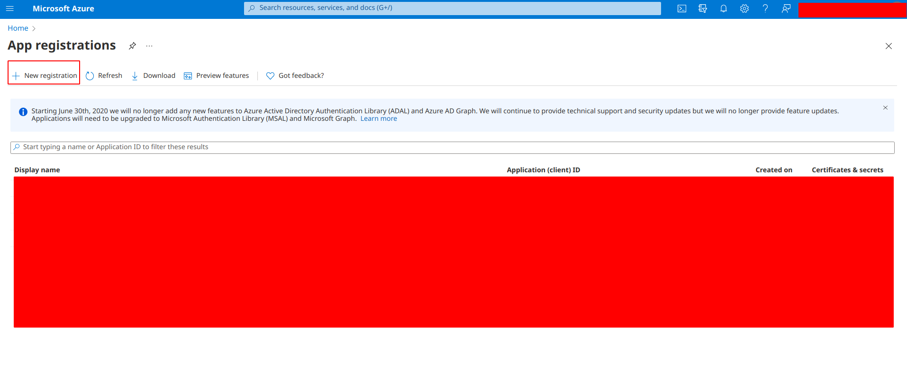
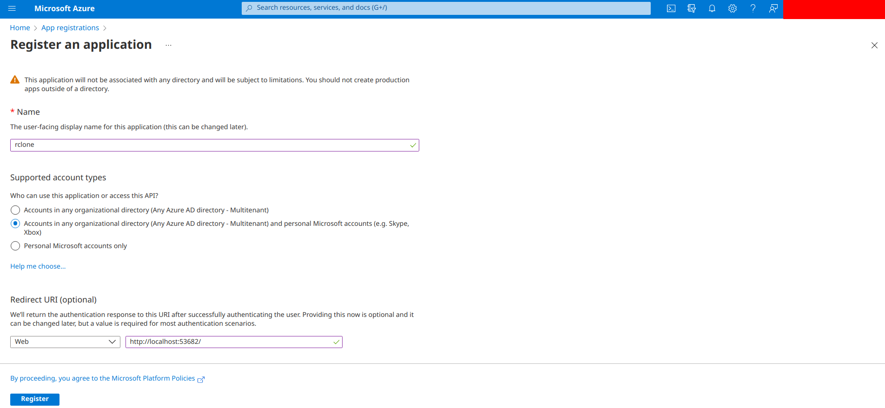
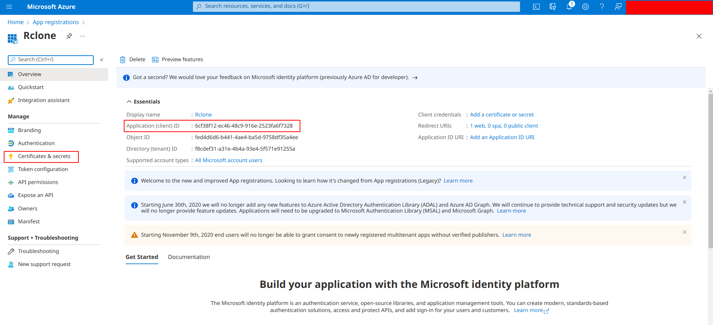
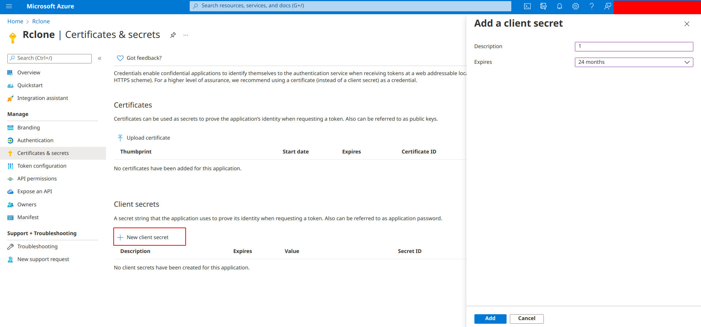
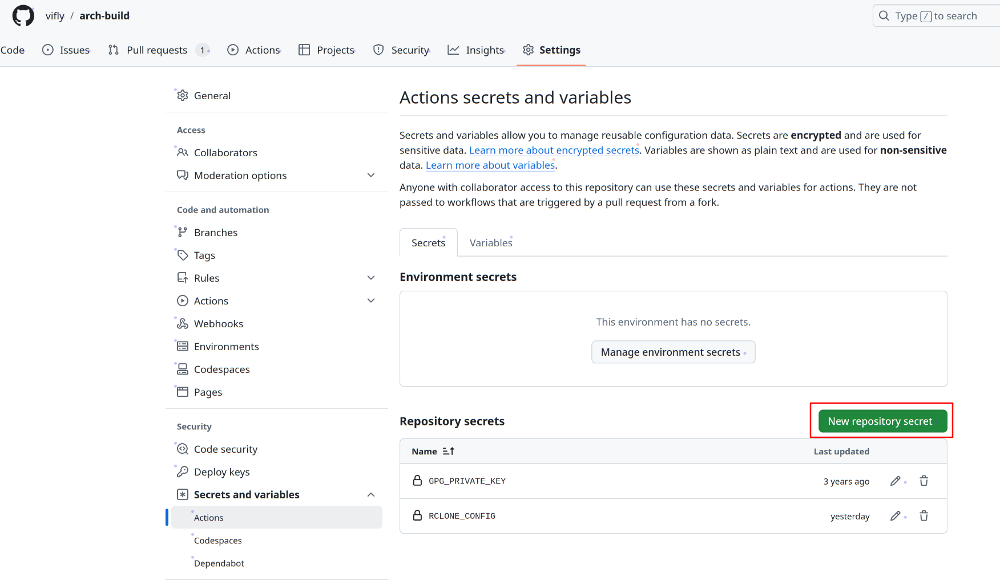
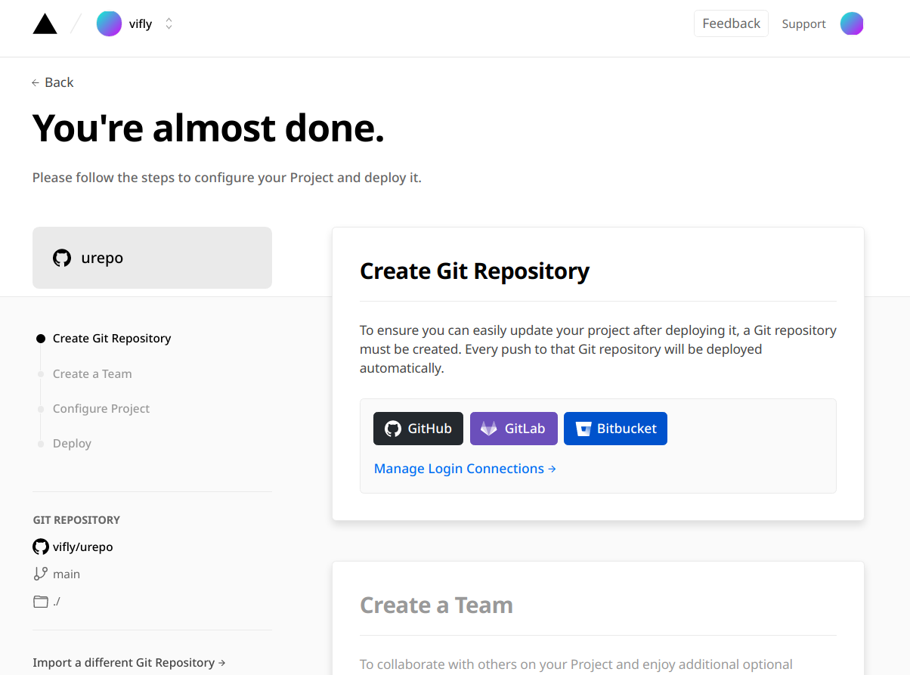
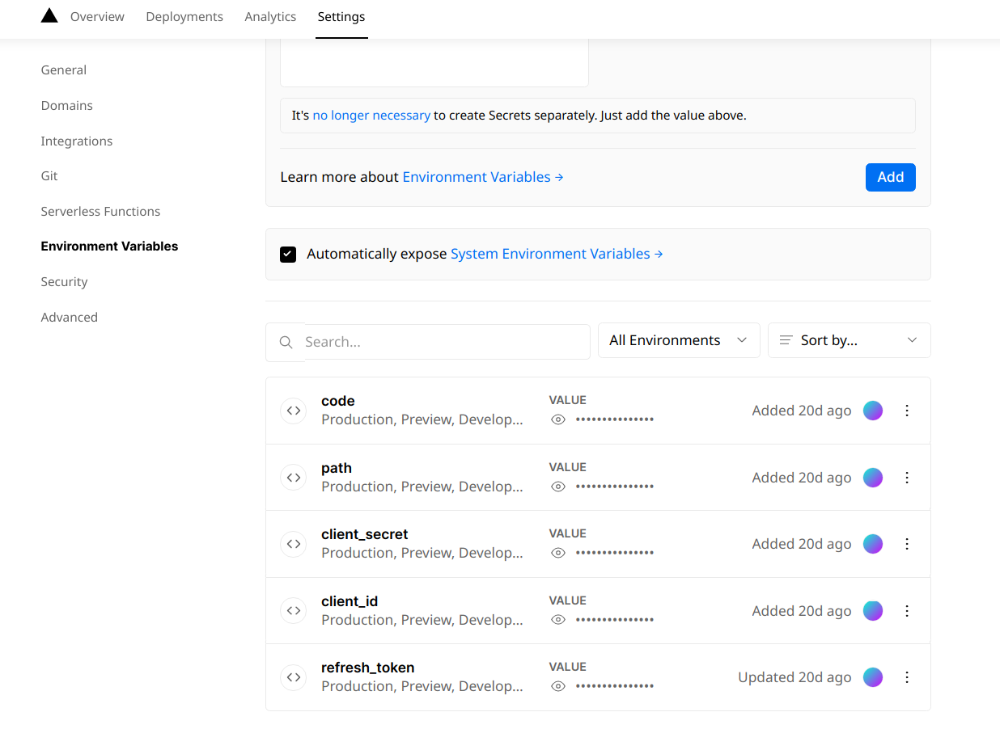
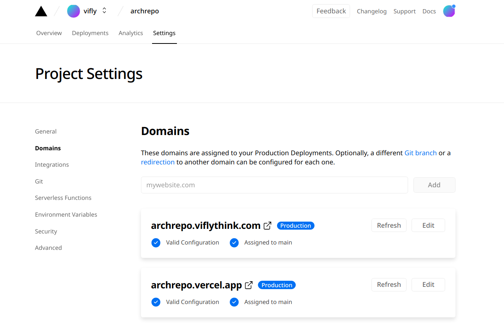
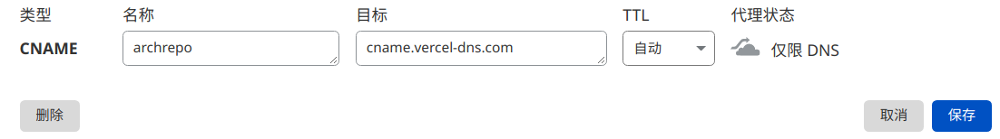

+++
title = "使用 Vercel 与 OneDrive 自建软件源"
date = "2021-09-04"
lastmod = "2021-11-12"
description = "使用 Vercel 与 OneDrive 自建完全免费且可以高速访问的软件源"
tags = [
    "折腾",
    "Linux",
    "CI",
]
image = "show.jpg"
+++

*2021.11.12.更新：增加了关于 GPG 签名的说明。*


大家好，又是本鸽子久违的博客更新。之前的[《GitHub Actions 打造 AUR 打包下载一条龙服务》](https://viflythink.com/Use_GitHubActions_to_build_AUR)已经折腾出了完全白嫖的编译机，可好景不长，当我的机器数量变多后，我发现在每台机器上运行脚本下载软件包的确有点麻烦，与其自己写一个脚本下载软件包，还不如直接自建一个软件源呢。经过一番研究后，我盯上了 OneDrive 与 Vercel 这两个可以免费使用的服务，通过它们实现了自建一个完全免费而且在国内外都可高速访问的软件源。

本文是对[《GitHub Actions 打造 AUR 打包下载一条龙服务》](https://viflythink.com/Use_GitHubActions_to_build_AUR)的扩展，如果你还没有读过该博文，请先读完它再回来阅读本文。通过前文与本文，你可以在没有服务器，不花一分钱的情况下搭建一个基于 OneDrive 的高速自建软件仓库，体验到白嫖与折腾 Linux 的双重快乐。

为了得到一个公开的软件仓库，只是把软件包构建出来并放到 GitHub Release 是不够的，没有软件包数据库，软件包管理器可不知道如何获取这些软件包，更不用提校验与安装等等。生成软件包数据库只需要一行 `repo-add ./reponame.db.tar.gz *.tar.zst`，然后把它们都放到 GitHub Release 这样的免费存储后端就可以解决分发问题了，实际上有一个 [arch-build 的 fork](https://github.com/Brx86/repo) 就是这样做的。当然，我对其还是不够满意，通过 fastgit 等 GitHub 反代服务的确可以加速 GitHub Release 的下载速度，但还是不够稳定；还有一个更重要的原因，我不仅想要自建 Arch 软件源，也想要自建 Debian 软件源，而 GitHub Release 的路径不够灵活，无法构造像 yourrepo.com/debian/pool/main/n/nginx/ 这样的 URL，没法满足自建 Debian 软件源的需求。所以嘛，只能自己再造一个轮子了。

在看下文之前，不妨先打开[我的自建仓库](https://archrepo.viflythink.com/)页面查看最终效果，如果想使用我的自建软件源，需要先执行以下指令导入 GPG 公钥：

```
wget -O /tmp/vifly-repo.key 'https://share.viflythink.com/arch-repo.key' && sudo pacman-key --add /tmp/vifly-repo.key
sudo pacman-key --lsign-key viflythink@gmail.com
```

然后在 /etc/pacman.conf 末尾添加下面几行后执行 pacman -Syu：

```
[vifly]
Server = https://archrepo.viflythink.com
```

尽管本文最终提供的成品目前只用在 Arch 自建源上，但对脚本稍加修改后也可以用来自建其它 Linux 发行版的软件仓库。

# 上传到 OneDrive
之前配置的 GitHub Actions 已经可以把软件包上传到 Release 上，现在只需要对原来的配置文件稍加改造就可以让 GitHub Actions 把软件包也上传到 OneDrive，为了尽量不重复造轮子，在这里我选择了 Rclone 进行上传，它提供了非常完善的文件传输功能，例如上传或下载时遇到文件内容相同的情况会自动跳过。

## 在 Azure 创建应用
根据 [Rclone 的官方文档](https://rclone.org/onedrive/#getting-your-own-client-id-and-key)操作即可，以下给出图文操作步骤。尽管 Rclone 官方认为这是可选的，但在 Vercel 部署直链下载应用时也需要在 Azure 创建应用获取 Token，所以便把相关步骤放这里了，另外基于权限最小化的原则，这里我们创建的是一个拥有读写权限的应用，而在 Vercel 部署时则是创建一个具有只读权限的应用，两个应用用在不同的地方，这样可有效提升安全性。

打开 [Azure 的应用管理页面](https://portal.azure.com/#blade/Microsoft_AAD_RegisteredApps/ApplicationsListBlade)，点击 New registration。



在打开的界面中输入应用的名字（这里我用了 rclone 这个名字），Supported account types 这一项选择 Accounts in any orGitHub Actionsnizational directory，在 Redirect URI (optional) 这一项选择 Web 并在右边的输入框里输入 http://localhost:53682/ 这一网址。完成后点击 Register。



此时应用已经注册完成，记录下 Application (client) ID 的值，这就是下文会用到的 client id。



点击左侧菜单的 Certificates & secrets，然后点击 New client secret，在 Description 一栏随便填点什么，把 Expires（过期时间）设为最长的 24 months（两年后记得更新 client secret），点击 Add。最后记录下新增的 client secret 的值（在图中标注的 Value）。



到此为止就完成了。有些同学可能会感到奇怪：Rclone 文档中不是还有第 4 与第 5 步设置权限吗？根据我的实测，这两步并没有必要执行，所以这里不会附上这两步操作的示意图。

## 获取 Token
在本地安装 Rclone（`pacman -S rclone`），运行 rclone config 进入交互式配置流程，接着[一步步地按照提示操作](https://rclone.org/onedrive)，当程序询问 Microsoft App Client Id 和 Microsoft App Client Secret 时，填入上一小节中记录的对应值。

完成配置后 Rclone 会把配置数据存放在 ~/.config/rclone/rclone.conf，使用 `cat ~/.config/rclone/rclone.conf` 查看。如下所示，下文需要复制对应的值时只需要把等号右边的东西按原样复制粘贴就行了。

```INI
[xxx]
type = onedrive
client_id = xxx
client_secret = xxx
region = global
drive_type = personal
token = {"access_token":"xxx","token_type":"Bearer","refresh_token":"xxx","expiry":"xxx"}
drive_id = xxx
```

*PS：一点安全提醒，在我们的用例中，client id 与 client secret 都可以公开，但 token 是绝对不能公开的。*

## 配置 GitHub Actions
首先 fork [arch-build 仓库](https://github.com/vifly/arch-build)，如果你在之前已经使用了它，记得同步到最新版本。与前文所给的例子相比，现在的 workflow 文件（.github/workflows/build.yml）多了 uploadToOneDrive 这一个 job，而用到的 action 需要填入近十个参数，参数量的确很多，接下来让我介绍一下该如何填写这些参数。

${{ secrets.xxx }} 这样的变量都是需要在 GitHub 的项目配置中的 Secrets 一栏设置的私密变量，打开项目的 Settings，找到下图所示的界面，然后点击 New repository secret，并填入 RCLONE_ONEDRIVE_CLIENT_ID、RCLONE_ONEDRIVE_CLIENT_SECRET、RCLONE_ONEDRIVE_TOKEN、RCLONE_ONEDRIVE_DRIVE_ID 这四个变量的值（从上一小节的 rclone.conf 中获得）。具体的操作也可参考 [GitHub 官方文档](https://docs.github.com/en/actions/reference/encrypted-secrets#creating-encrypted-secrets-for-a-repository)。



接着回来修改 workflow 文件，RCLONE_ONEDRIVE_REGION 与 RCLONE_ONEDRIVE_DRIVE_TYPE 也是按 rclone.conf 的值填写；而 dest_path 是 OneDrive 上传的目的地路径（如果该路径不存在，Rclone 会自动创建），以 Linux 文件路径的形式填写即可，不建议使用根路径，因为接下来将会把这个路径下的所有东西公开，各位肯定不希望别人打开你的软件仓库页面时还看到其它乱七八糟的文件；repo_name 是你的自建软件仓库的名字，[它用于 repo-add 的参数](https://wiki.archlinux.org/title/Pacman/Tips_and_tricks#Custom_local_repository)。

为了安全，建议为自己的软件源添加 GPG 签名，不签名的话，pacman.conf 中的仓库配置需要加上 `SigLevel = Never` 禁用签名校验才能使用。如果你想为自己的软件源添加 GPG 签名的话，建议先生成一个单独的 GPG 密钥对（不要设置密码），而不是使用原有的密钥对，并导出私钥：

```
gpg --gen-key
gpg --armor --export-secret-keys your_keyid > private.key
```

回到 GitHub 的项目配置新增 Secrets，Name 为 gpg_private_key，Value 则是导出的私钥内容。最后在 workflow 文件的 uploadToOneDrive job 的参数加上 gpg-privatekey: ${{ secrets.gpg_private_key }}（即 dest_path、repo_name 等配置所在的位置）。现在得到的软件源将具有 GPG 签名，需要按以下步骤导入公钥才能使用：

```
gpg --armor --export your_keyid > public.key
sudo pacman-key --add public.key
sudo pacman-key --lsign-key your_keyid
```

为了节省存储空间，这个 job 只会在 OneDrive 存储最新版本的软件包，不像 Arch 官方软件仓库那样还提供了归档。如果你对使用 Rclone 同步到 OneDrive 或构建软件包数据库的细节感兴趣，那么可以查看 [entrypoint.sh](https://github.com/vifly/arch-build/blob/master/create-db-and-upload-action/entrypoint.sh) 脚本了解细节，不到三十行便完成了这些工作（其实是因为我把复杂的逻辑用 Python 实现了）。

# 在 Vercel 部署直链下载应用
上面我们已经把软件包成功放到了 OneDrive 中，OneDrive 本身也有分享功能，可是它的分享链接地址没有任何的规律，Pacman 可不知道一个软件包对应的下载地址与 OneDrive 分享地址的联系，它只认 yourrepo.com/package 这样的下载地址（Apt 等包管理器认的 URL 更复杂，但依然有明显的规律），所以我们需要一个应用来实现链接的转换，这就是直链下载应用要干的事情。

GitHub 上已经有不少 onedrive index 项目实现 OneDrive 的直链下载，我嫌它们提供的功能太多了（没忍住自造轮子的冲动），所以也用 Python 造了一个非常简陋的应用 [urepo](https://github.com/vifly/urepo)，支持在 Vercel 上部署，也支持直接在 VPS 上部署，它和 Rclone 一样采用了微软官方提供的 API 实现提取文件下载链接的功能。下文将使用 urepo 实现直链下载，如果你之前已经部署了其它的 onedrive index 应用，那参照下文继续用原来的应用也是可以的。

## 获取访问令牌
既然 urepo 和 Rclone 一样采用了微软官方提供的 API，那么它同样也要像使用 Rclone 那样获取访问令牌。回到上面的“在 Azure 创建应用”这一小节，按同样的步骤再创建一个应用，只是这次的 Redirect URI (optional) 应输入 http://localhost/ ，完成后得到 client id 与 client secret。

与上面依靠 Rclone 获取 Token 不同的是，这次则是使用一个脚本获取 Token，它不会像 Rclone 那样申请写入权限。下载我写好的[获取 Token 脚本](https://github.com/vifly/urepo/blob/main/client-tools/get_deploy_config.py)与[配置示例](https://github.com/vifly/urepo/blob/main/client-tools/config.py.example)，并确保已经安装了 Python 的 Requests 库（`pacman -S python-requests`），然后把配置示例（config.py.example）重命名为 config.py，并填入 CLITENT_ID 与 CLITENT_SECRET。

运行脚本：

```
cd downloadpath
python3 get_deploy_config.py
```

根据提示操作，最后得到 code 与 refresh_token。此时我们已经获得 client id、client secret、code、refresh_token 这四项配置。至于下文中需要用到的 path，那就是在“配置 GitHub Actions”这一小节中的 dest_path。

## 部署到 Vercel
[Vercel](https://vercel.com/) 是一个免费的应用部署平台，主要用来测试和部署 Serverless 应用，通过它，我们可以零成本地部署直链下载应用。Vercel 提供了两种部署方式，从下面两种方式任选其一执行即可。

### 打开链接部署（推荐）
注册或登录你的 Vercel 账号，然后打开我创建的[部署链接](https://vercel.com/new/clone?repository-url=https%3A%2F%2Fgithub.com%2Fvifly%2Furepo&env=code,path,client_secret,client_id,refresh_token)，会出现如下界面，在 GitHub、GitLab、Bitbucket 这三个 Git 平台中选择一个进行连接，Vercel 会把 urepo 仓库复制到连接的平台上。



接下来的 Create a Team 只要点击 Skip 跳过就行，然后就是环境变量的设置，urepo 会首先尝试从环境变量中读取这些私密信息，无法找到对应的信息时才会去读取项目根目录下的 auth.json 获取配置，与把访问令牌写在配置文件相比，利用环境变量配置可以避免自己不小心把私密信息公开，根据上文填写这五个环境变量后就完成部署了。

### 从本地上传部署
本方法需要安装 NodeJS 相关的工具链，我不太想和这些工具打交道，但 Vercel 本来是一个部署前端应用的平台，所以官方的客户端使用 JS 编写是很正常的事情，如果不想安装这些软件，那可以使用上面的部署方法。

首先安装 Yarn 或其它 NodeJS 包管理器：`pacman -S yarn`，由于 JS 应用总是喜欢在用户的家目录乱丢东西，所以为了让 Yarn 遵循[ XDG 目录规范](https://specifications.freedesktop.org/basedir-spec/basedir-spec-latest.html)，我们可以执行 `yarn config set prefix ~/.local`。然后执行下面的指令全局安装 vercel 应用，这会把它安装到你的家目录（~/.local/bin，记得让你的 $PATH 包含这个路径）：

```
yarn global add vercel
```

安装完成后执行下面的指令进行登录，在打开的浏览器窗口注册或登录你的 Vercel 账号并进行验证：

```
vercel login
```

下载 urepo 源码：

```
git clone git@github.com:vifly/urepo.git
```

把 urepo 根目录下的 auth.json.example 重命名为 auth.json，然后把对应的配置填入里面。或者，也可以在上传部署后到 Vercel 的项目面板中设置 code、path、client_secret、client_id、refresh_token 这五个环境变量。



最后就是上传部署：

```
cd urepo
vercel .
```

## 使用自己的域名（可选）
尽管 Vercel 会为部署的应用分配一个二级域名（xxx.vercel.app），但自建源使用自己的域名无疑是一个更好的选择。根据[官方文档](https://vercel.com/docs/custom-domains#subdomains)，首先需要打开项目的域名管理界面，添加自己想使用的域名。



假设各位和我一样使用了自己的子域名，那么在自己的 DNS 解析服务提供商管理面板添加一条 CNAME 解析记录即可，我使用的是 cloudflare，还需要把代理状态设为“仅限 DNS”以确保不会使用 cloudflare 的反代。



# 有待改进的地方
尽管这一流程已经能工作了，但有些地方还是可以再改进一下的。~~首先，目前并没有数字签名，添加这一自建软件源时需要禁用对此的签名校验，在乎安全性的同学可能会对此表示不爽，所以日后有必要加上对软件包签名的支持。其次，urepo 应该无需修改就可以用于分发其它发行版的软件包与数据库（它的本质就是一个简陋的 onedrive index），但前面的 GitHub Actions 只支持 Arch，我未来肯定会加上对 Debian/Ubuntu 的支持，具体什么时候搞定这个，就要看我什么时候有需求了，对其它发行版的支持也是同样的😂~~。目前已支持 GPG 签名，也新增了 [debian-build](https://github.com/vifly/debian-build) 用于构建 deb 软件包。

另外，我编写的 urepo 与 GitHub Actions 脚本的报错信息并不够用户友好，由于大量采用了 Python 进行编写，假如出现错误的话对于没学过 Python 的同学来说可能难以根据输出的错误信息解决问题。这个问题也是留待日后解决。
