+++
title = "【译】椭圆曲线密码介绍"
date = "2019-12-14"
description = "对 Elliptic Curve Cryptography Explained 的翻译，科普椭圆曲线密码"
tags = [
    "翻译",
    "信息安全",
]
math = true
image = "show.jpg"
+++

前段时间我看到了一篇标题为 Elliptic Curve Cryptography Explained 的既通俗易懂又较为全面的介绍椭圆曲线密码的英语博文，可以说是非常优秀的一篇科普文了。看到目前在中文互联网上介绍非对称加密算法中的 RSA 加密算法的高质量文章有很多，而介绍同样属于非对称加密算法的椭圆曲线密码的高质量文章并不多，所以我将该文章翻译为中文并在我的博客上发表。原文链接是 https://fangpenlin.com/posts/2019/10/07/elliptic-curve-cryptography-explained/ ，已获得原作者授权翻译。由于作者仅要求我注明原文链接，所以**这篇译文的文字部分依然按本博客的默认授权协议 CC-BY-NC-SA 4.0 进行授权**。对于普通读者而言，这篇文章基本不需要数学知识就可以理解，当然，还是需要了解一些对称加密和非对称加密的基础概念的，为了便于读者理解，我还在一些地方添加了译者注。下面，我们便开始对椭圆曲线密码的介绍吧。       

最近，我正在学习椭圆曲线密码（Elliptic Curve Cryptography）的工作原理（译者注：为了少打点字，下文统一使用 ECC 这一缩写指代椭圆曲线密码）。我在互联网上搜索相关内容，发现了很多解释它的文章和视频。其中大多数仅涵盖了 ECC 中的一部分内容，有一些跳过了许多关于你如何能从这处到达另一处的关键步骤。最后，我找不到真正的能以直观的方式从头到尾解释它的文章。考虑到这一点，我想写一篇解释 ECC 的文章，其内容从基础知识到密钥交换，加密和解密。       

为了绘制本文所需要的曲线，且了解 ECC 的运作方式，我写了两个 Jupyter Notebook 用于使用 Python 进行曲线绘制和计算，用到的绘图库是 [matplotlib](https://matplotlib.org/)。另外，如果你想随意操作椭圆曲线，并自己体验一下其运作方式，那你很幸运！我[在 GitHub 上开源了源代码](https://github.com/fangpenlin/elliptic-curve-explained)，一个[适用于实数](https://github.com/fangpenlin/elliptic-curve-explained/blob/master/elliptic-curve.ipynb)，还有一个[适用于有限域](https://github.com/fangpenlin/elliptic-curve-explained/blob/master/elliptic-curve-on-finite-field.ipynb)：

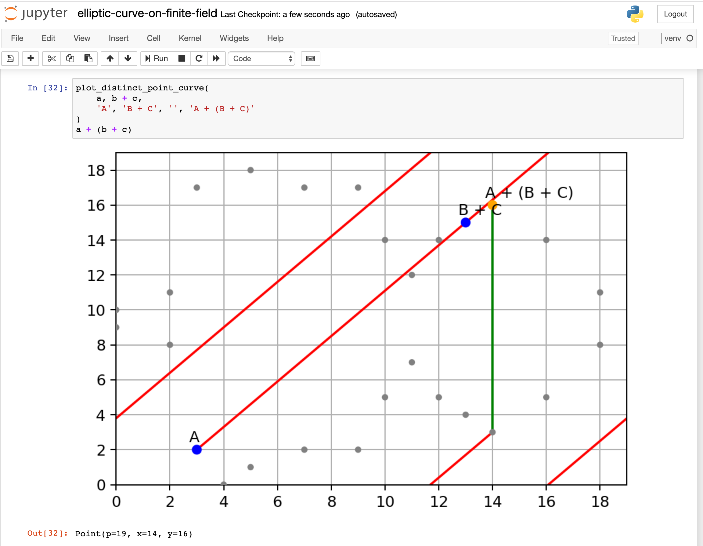

你可以在 Jupyter Notebook 中找到大多数本文用到的图表。      

请注意，本文并**不是为了说明如何安全地实现 ECC**，我们在此使用的示例只是为了使你和我自己便于理解或使用（译者注：警告，除非你是专家，否则不要在软件项目中自己实现加密算法，而应当使用现有的成熟的加密算法库）。我们也不想在数学这个兔子洞挖得太深，我只想集中精力了解它的本质的运作方式。因此，我们将剔除许多数学细节，仅提供参考资料供感兴趣的读者阅读。（译者注：本文存在不少星球大战的梗）      

现在，我们开始吧？


# 让我们先来玩个游戏

一个椭圆曲线是由 $y^{2} = x^{3} + a x + b$ 定义的曲线。     
举个例子，让 a = −3 和 b = 5，然后当你绘制这条曲线时，它看起来像这样：

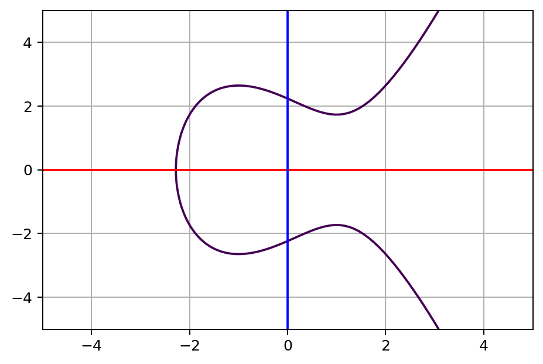

现在，让我们玩一个游戏。随机选取曲线上 x 值不相同的两个点，并用一条直线连接这两个点，这两个点我们称为 A 和 B。然后你会注意到直线在除了 A 与 B 外的第三点与曲线接触。让我们找到第三个点并将其 y 值翻转到 x 轴的另一侧（译者注：也就是说以 x 轴为对称轴，将第三个点翻转到另一侧），我们将翻转后的点称为 A + B。       

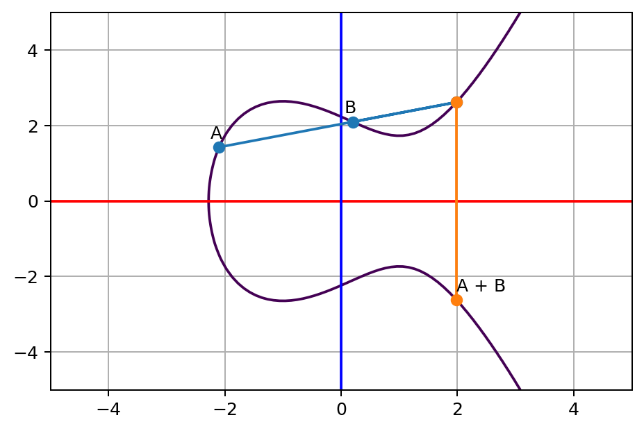

点 A + B 是 A 与 B 的和。你可以认为此过程是某种太空旅行。想象有敌人正紧跟着你的飞船。要摆脱你的敌人，你可以在航线上走直线捷径，到达航线上的另一点，一旦到达第三个点，就会迅速弹跳到路线的另一侧。


好吧，敌人仍然跟着你，让我们再来一次。这次我们从最新的点 A + B 开始，到达另一点 C。

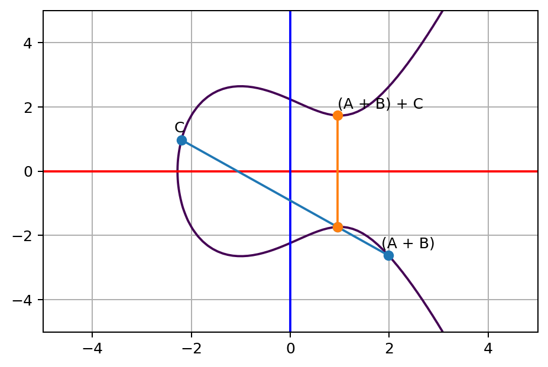

如你所见，只要新增的线不是垂直的，我们就可以通过添加新的点来重复相同的技巧，以此跳到一个新的数字。      

随着时间的流逝，你意识到寻找一个新的弹跳落点很麻烦。为了使这个技巧更直观，更容易重复使用，现在让我们沿当前位置 P 的切线走捷径，它看起来像这样：

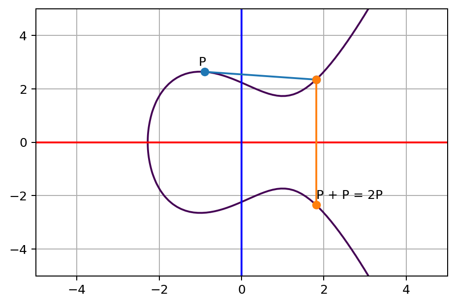

考虑前面提到的两点式跳跃技巧，就像你看到点 A 和点 B 在 P 处彼此无限靠近，这实际上是相同的技巧。因此我们可以应用前面的规则，称 P 和 P 的结果之和为 P + P，即 2P。

同样的，我们可以再一次重复执行相同的步骤以摆脱我们的敌人，这一次，我们从 2P 开始回到起始点 P：

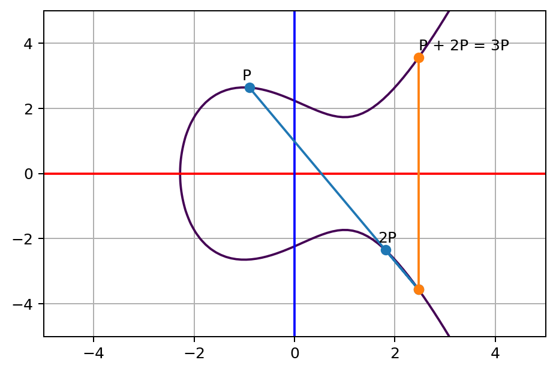

对于结果，我们将它称为 P + 2P 或 3P。显然，我们可以多次这样做以到达 NP。现在，问题来了，给定点 NP 的坐标，你能找出 N 值吗？换句话说，像下图这样，我们从 P 到 NP 跳了多少次呢？

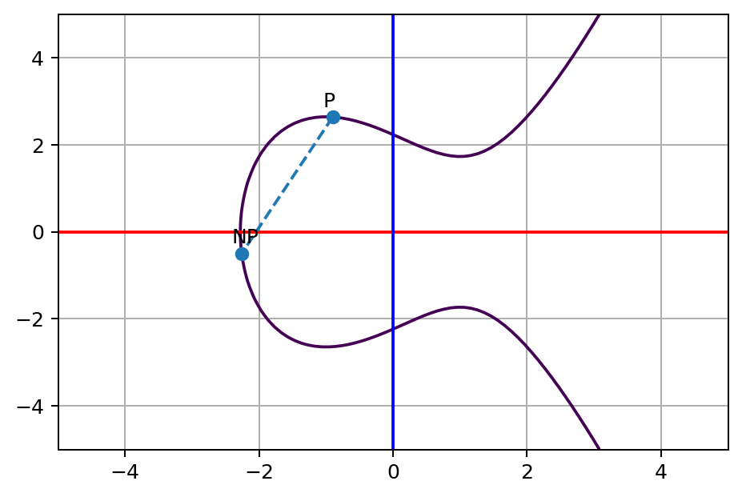

我可以告诉你，在上图中的 NP 点的 N 值为 13。我很容易说出来，因为我选择了这个数字。但你很难找出答案，因为没有已知的简单而又有效率的方法来计算 N 值。      

就是这样，你已经了解了 ECC 的基础！曲线和起始点 P 是每个人都知道并同意使用的共享值，终点 NP 是你的**公钥**，分享给任何人都是安全的。你跳了多少步，所对应的值 N 是你的**私钥**。正如我们上面所说的，只知道 NP 和 P 的人很难推断出你的私钥，因为众所周知这是一个很难解决的问题。

> 没这么快！

我听到你这样对我大喊。

> 要到达 NP 点，并不意味着你需要进行 N 次这样的操作。如果你可以在合理的时间内完成该操作，那么我是否可以做同样的事情，即一步一步前进，直到遇到相同的点 NP，这不就确切地发现了需要走多少步了吗？

这是一个好问题，实际上我在网上阅读了许多文章后也产生了相同的疑问，但是我发现其中一些文章可以清楚地解释这一点。因此，接下来，我们来讨论在太空中如何真正地使你的敌人无法对你进行跟踪。

# 以曲速前进
我们提到了用沿曲线跳跃的技巧以摆脱敌人，然而以缓慢的速度使用这个技巧是不明智的，因为它很容易被追踪。你的敌人可以简单地做同样的事情，直到他们弄清楚到达目的地需要跳跃多少次。为了真正使你无法被追踪，你需要以曲速前进。


对于求和运算，或者我们在椭圆曲线上使用的技巧存在着一个有趣的特点，这个有趣的特点在于，曲线上的点与其求和运算都遵循[群律](https://en.wikipedia.org/wiki/Group_(mathematics))。其主要想法是，你可以对一个组中的元素进行某些操作，在这里我们称其为“相加”，进行该操作后它们仍将留在这个组中，而且，该操作具有一些特殊的属性。其中被称为关联性（associativity）的一种特殊属性是像这样的：

(A + B) + C 与 A + (B + C) 是相同的

这个概念背后的数学证明实际上并不简单，如果你感兴趣，可以在[这](https://www.andrew.cmu.edu/user/tnayak/papers/EllipticCurves.pdf)或[这](https://math.rice.edu/~friedl/papers/AAELLIPTIC.PDF)阅读相关资料。虽然很难证明，但是当你画出曲线和直线时很容易看出这一点。让我们来看一个例子。如你所见，我们在上面已得到一个点 (A + B) + C，根据关联性，我们应该能够先执行 B + C，然后再执行 A + (B + C)（译者注：也就是说将 A 与上一步 B + C 的结果相加），并且执行这两步后应该到达相同的终点。下图是 B + C：

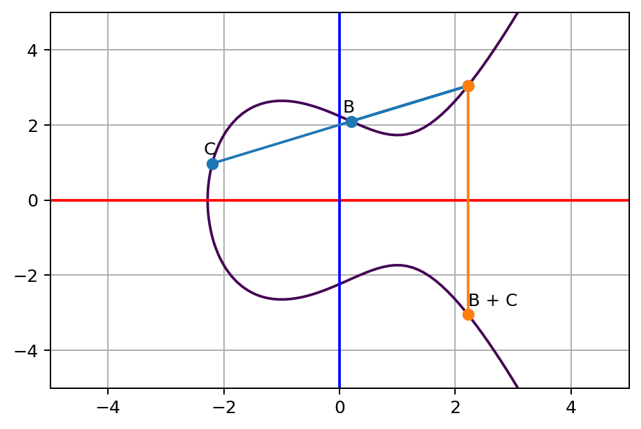

接下来，让我们执行 A +（B + C）：

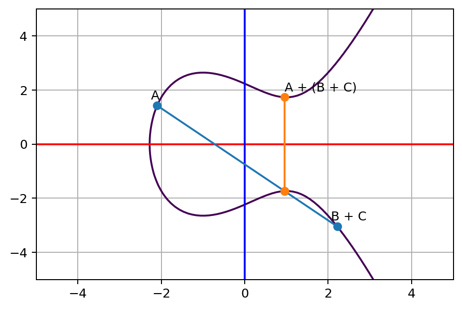

看下终点，它与（A + B）+ C 完全相同。不相信我吗？这是我编写的程序中输出的值：   

```Python
ab_c = ab + c
a_bc = a + bc
(ab_c, a_bc)
```

```
(Point(0.9531851331698311, 1.733918191357413),
 Point(0.9531851331698316, 1.7339181913574133))
```
 
如你所见，ab_c 与 a_bc 几乎是相同的。其中的差异是由浮点运算的舍入误差造成的。这实际上是一个**大**问题，我们将在后面讨论这一点。     

类似地，对于单点情况，群律允许我们以不同的顺序进行求和以到达相同的位置。这一点很关键，还记得我们如何通过 P + 2P 到达 3P 吗？现在我想告诉你 P + 3P = 4P 与 2P + 2P = 4P 是相同的。       

首先，让我们看一下愚蠢的计算方式，即只是继续将 P 与 3P 相加。这是计算 P + 3P 的最后一步：

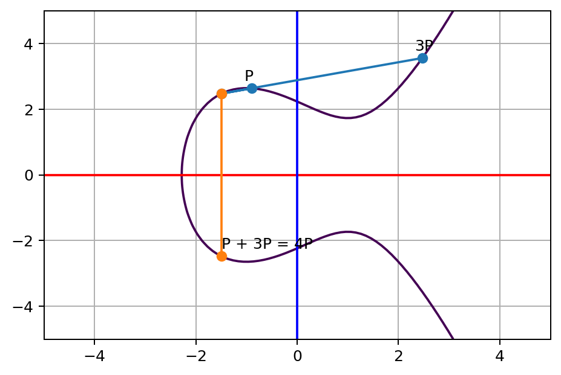

然后，让我们尝试将 2P 与自身相加，这恰好是我们之前使用的技巧：

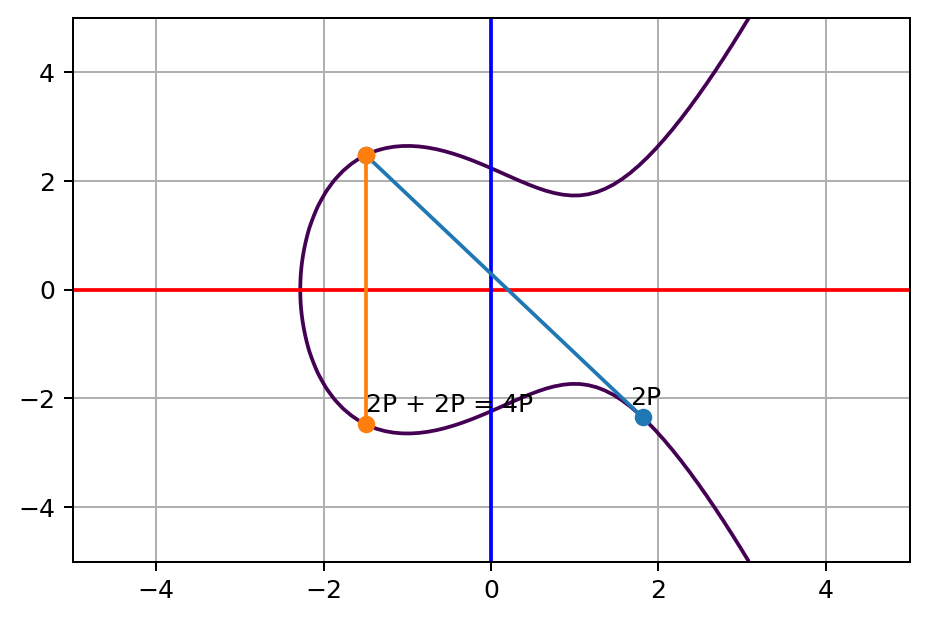

看到没有？两种方式都产生了相同的结果。就这样，我们可以轻松地将一个点加倍(double)，并且进行相加操作的顺序无关紧要。我们可以通过不断对一个点进行加倍操作来“作弊”，从而快速生成我们想要的值，不再需要将其一一加起来。      

让我们尝试通过求和到达一个更大的数字，例如 227P，我们首先将其转化为二进制数字，以便获得其两个成分的幂。其二进制表示为 11100011。换句话说，将两个值的所有幂加起来就是：
$$2^{7}P + 2^{6}P + 2^{5}P + 2^{1}P + 2^{0}P$$      
也就是：128P + 64P + 32P + 2P + P。

所以我们需要的操作步骤是（译者注：原作者在这里说的很简单，为了让译文更易懂，这里参考 https://zhuanlan.zhihu.com/p/36326221 添加了一点对操作步骤的补充）：       
1. 将 P 与 0 相加，同时 P 加倍得到 2P
2. 将 2P 与 P 相加得到 3P，同时 2P 加倍得到 4P
3. 由于在二进制表示中从右到左的第三位为 0，所以不将 4P 与 3P 相加（以此类推，下面不再说明不相加的原因），只是 4P 加倍得到 8P
4. 不将 8P 与 3P 相加，只是 8P 加倍得到 16P
5. 不将 16P 与 3P 相加，只是 16P 加倍得到 32P
6. 将 32P 与 3P 相加得到 35P，同时 32P 加倍得到 64P
7. 将 64P 与 35P 相加得到 99P，同时 64P 加倍得到 128P
8. 将 128P 与 99P 相加得到 227P，同时 128P 加倍得到 256P


这仅需 8 步，与 227 步相比，这种方法快得多了。此方法被称为 [double and add](https://en.wikipedia.org/wiki/Elliptic_curve_point_multiplication#Double-and-add)。它使我们可以快速地在一个椭圆曲线上跳跃以到达所需的点。在此示例中的数字 227 是很小的，我们可以在 $O(\log{}n)$ 的时间复杂度下到达我们期望的数字，就算这个数字是与宇宙中原子的数量一样大（一般而言是 $10^{82}$，约等于 $2^{275}$），此方法仍可以在 275 次 double and add 操作后完成计算。

现在我们知道了如何以曲速在椭圆曲线上向前跳跃，因此，我们可以轻松地向前跳跃数十亿次。虽然这个操作对我们来说很容易，但是对于攻击者而言，要准确地找出我们跳了多少次是极其困难的，此问题等价于：在给定 NP 与 P 且 N 足够大的情况下，找出 N 值。这被称为椭圆曲线离散对数问题，如果你想了解有关此主题的更多信息，可以自己去网上搜索。


# 让我们在一个秘密的地方会面
我们之前一直在谈论如何以光速在愚蠢的椭圆曲线上跳跃，但是加密呢？别急，我们这就介绍它。在此之前，让我们首先谈下密钥交换。        

想想看，Alice 和 Bob 正在太空旅行，他们将交换反抗军新总部的位置。突然，他们发现帝国的无人机正在尾随他们并拦截他们飞船之间的通信。为了安全地交换信息，他们同意在只有他们两个都知道的秘密坐标下会面。但是，如果敌人正在窃听，他们如何交换这个秘密坐标呢？现在，ECC 在这里为他们提供帮助。下面是 Alice 和 Bob 要做的事情：
 
Alice：
> 嘿，Bob，让我们将 P 作为起始点，这是我的公钥 NP。

Bob：
> 以 P 为起始点对我来说听起来不错，而我的公钥是 MP。
 
在这里，按照我们之前的定义，NP 是 P 经过 N 次相加运算后得到的点。同样的，MP 就是 P 经过 M 次相加运算后得到的点。        

接下来，Alice 得到 Bob 的 MP 值，对 MP 自加 N 次：

$$\underbrace{MP + MP + ... + MP}_\text{N times} = N \times MP$$

对于 Bob，那就变成了取得 Alice 的公钥 NP 后将此点自加 M 次：

$$\underbrace{NP + NP + ... + NP}_\text{M times} = M \times NP$$

嗯，M 和 N 都很大，因为我们不希望敌人轻易地找到它。显然，上面的自加操作并不是真的一一相加，而是通过使用我们刚刚介绍的 double and add 技巧来作弊。最终，他们将会在一个只有他们知道的秘密坐标 SK 上会面：     

SK = (N × M)P = (M × N)P

想想看，对于 Alice，每次跳跃的值是 P 点的 M 倍，而她跳跃了 N 次。对于 Bob 而言，每次跳跃的值是 P 点的 N 倍，而他跳跃了 M 倍。假设 Alice 一次跳跃 4 光年，而她总共跳跃了 3 次；Bob 一次跳跃 3 光年，他跳跃了 4 次。对应的运算分别是 4 × 3 与 3 × 4，它们都将在 12 这里结束：

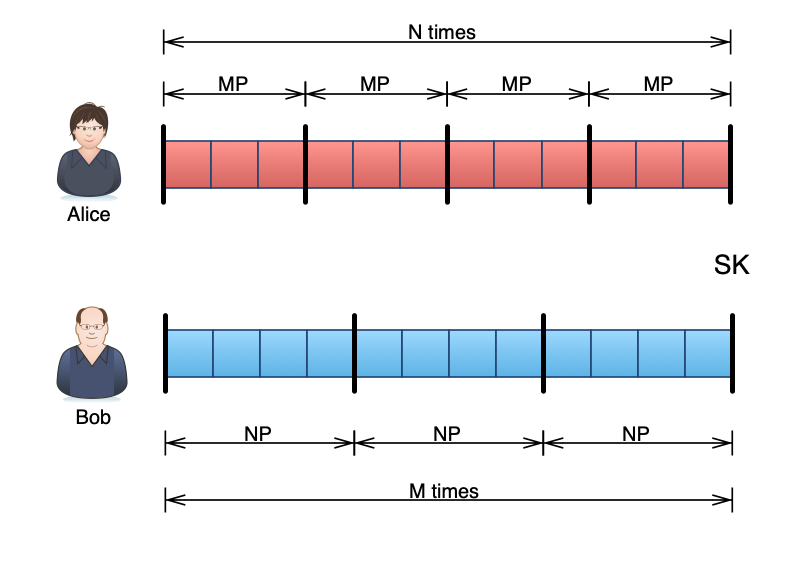

对于窃听者，他们需要找出 N 或 M 才能获得相同的坐标。通过一步一步运算，最终也会到达终点。但是，正如我们前面提到的，鉴于数字足够大，以致没有简单的方法可以做到这一点，因此我们可以确定只有 Alice 和 Bob 才能知道这个秘密坐标。这种密钥交换协议被称为[椭圆曲线 Diffie–Hellman 密钥交换](https://en.wikipedia.org/wiki/Elliptic-curve_Diffie%E2%80%93Hellman)。


# 加密
现在让我们谈谈加密。Alice 想要安全地向 Bob 发送信息，他们需要首先进行我们上面刚刚提到的椭圆曲线 Diffie–Hellman 密钥交换：

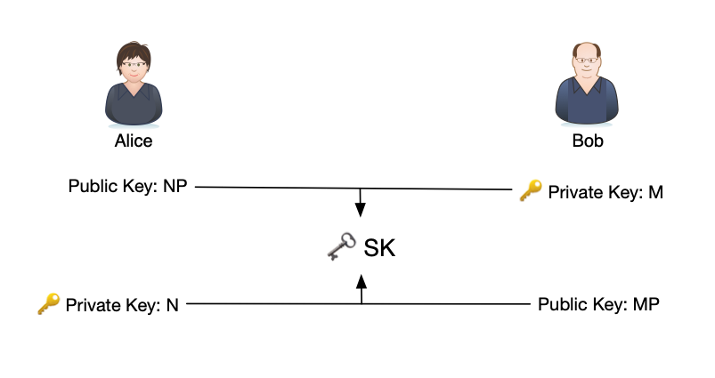

这里请注意，Alice 需要能够验证公钥 MP 真的是属于 Bob 的。否则，冒名顶替者可以向 Alice 提供自己的公钥，并声称自己是 Bob，然后，Alice 将与攻击者交换共享密钥，再然后，攻击者就可以执行[中间人攻击](https://en.wikipedia.org/wiki/Man-in-the-middle_attack)。 要解决该问题，就需要另一个概念，它被称为[公钥基础架构](https://en.wikipedia.org/wiki/Public_key_infrastructure)，因为这个属于离题范围，如果你感兴趣，可以搜索相关资料。      

由于今天我们只想专注于 ECC，所以在此假设 Alice 已经取得 MP 并不加思索地相信它来自 Bob，而 Bob 也得到了 Alice 的公钥。现在，在交换密钥之后，他们最终得到了相同的共享秘密坐标，我们可以得到 x 值作为密钥。一旦我们拥有一个共享的密钥，一切就很简单了。得到共享密钥后，我们可以在任何安全的对称加密算法中使用共享密钥 SK 对我们的机密数据进行加密（译者注：出于性能因素的考量，通常只使用 ECC 等非对称加密算法交换对称加密算法所需的共享密钥，此后的通信使用对称加密而不是非对称加密算法进行加密，在这里就是这样做的）。假设我们在这里使用 [AES256](https://en.wikipedia.org/wiki/Advanced_Encryption_Standard)。接收者 Bob 可以使用相同的共享密钥 SK 解密经过加密的消息。      

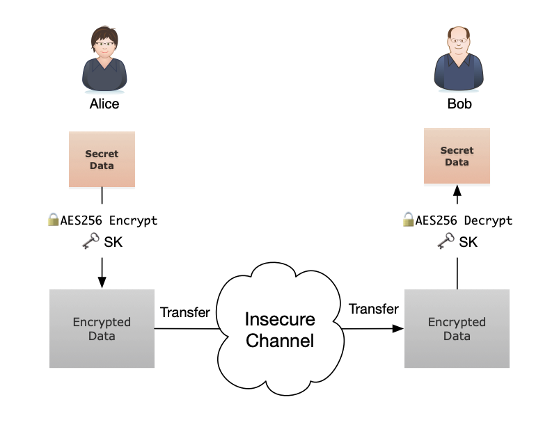

太好了，现在即使帝国的无人机窃听了所有通信，Alice 仍可以安全地将反抗军的新总部位置分享给 Bob。同样的，Bob 可以使用相同的共享密钥 SK 加密消息，并将其发送回 Alice。      

当 Alice 和 Bob 彼此认识时，我们知道可以使用 ECC 安全地发送消息。但是，如果在某些情况下我们想安全地向某人发送消息，但他们不知道并且可能不在乎你是谁，该怎么办？简单，我们在这举个例子，假设 Bob 已经知道 Alice 的公钥，如果 Alice 知道 Bob 的公钥 MP，她可以使用她自己的私钥 N 生成相同的共享密钥 SK，加密数据并将纯文本形式的公钥 NP 与经过加密的数据一起发送出去。一旦 Bob 收到消息，他就可以使用 NP 和他的私钥 M 创建相同的密钥 SK 并解密经过加密的数据。但是，由于信息中附带的公钥 NP 可能属于任何人，因此 Bob 将无法确认消息是来自谁的。如果 Bob 不在乎发送者是谁，Alice 也可选择为同一操作创建一个临时的新密钥对。


# 浮点数的问题
到目前为止，我们一直在讨论在实数范围进行计算的 ECC。我们在这里使用实数的原因是，它更易于解释和理解。在现实世界中，这实际上并不是我们进行加密的方式。使用实数会带来很多问题，我们之前展示的一个大问题就是会出现计算错误。还有另一个问题，在某些极端情况下，该数字可能会非常大，而浮点数可能无法容纳它。        

要回答你可能会问的这个问题，我们给出的答案是在[有限域](https://en.wikipedia.org/wiki/Finite_field_arithmetic)，或者更精确地来说是在对整数 p 取模（p 为质数）的有限域上进行计算。同样的，我们也不想将兔子洞挖得太深，因此，如果你对此有兴趣，可以阅读 [Elliptic Curve Cryptography: finite fields and discrete logarithms](https://andrea.corbellini.name/2015/05/23/elliptic-curve-cryptography-finite-fields-and-discrete-logarithms/)，或者观看 [Trustica 的系列视频](https://www.youtube.com/watch?v=mFVKuFZ29Fc&list=PLN9KZDpNfsHMd7d7PX87JGesGY_Qzyb3V&index=2)及[其相关文章](https://trustica.cz/en/category/ecc/page/3/)。       

要解释数学中的位于对整数 p 取模的有限域的椭圆曲线：     

$$y^{2} \equiv x^{3} + a x + b\pmod{p}$$

先让我们取 p = 19，a = −3，b = 5，然后画出来：

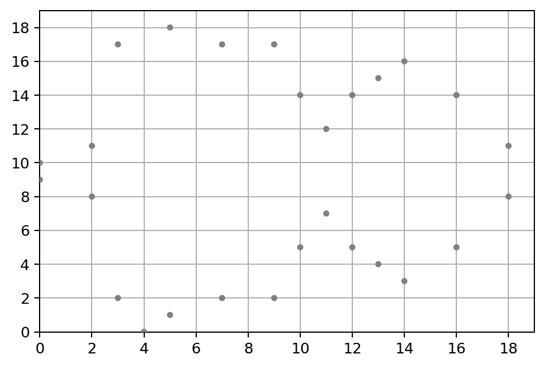

这看起来似乎不太像是一条“曲线”，但这确实是在有限域上的椭圆曲线。基本上，$y^{2}\pmod{p}$ 仅在特定整数点上等于 $x^{3} + a x + b\pmod{p}$。以点(11,7)为例，对于 y：    

$$y^{2} \equiv 7^{2} \equiv 49 \equiv 11 \pmod{19}$$

以及对于 x：        

$$x^{3} + a x + b \equiv 11^{3} - 3 \times 11 + 5 \equiv 1303 \equiv 11 \pmod{19}$$

由于两者在被 19 相除后得到相同的余数 11，所以这确实是曲线上的一个点。      

虽然它看起来不像是一条曲线，但它确实与在实数范围的椭圆曲线一样遵循相同的群律。让我们看一个例子，假设点 A = (3,2)，B = (5,18)，并使用相同的相加操作来计算 A + B：

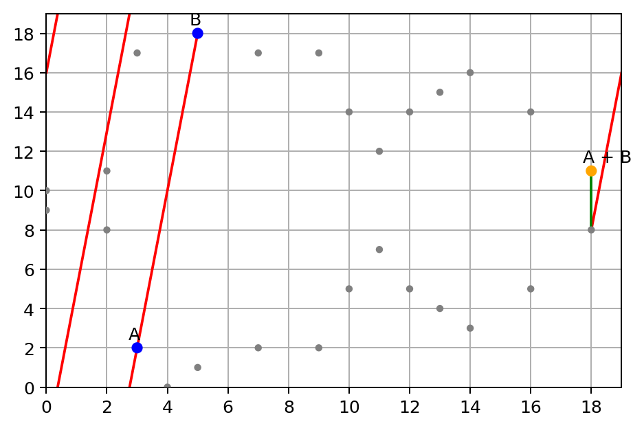

是的，在有限域上的该曲线有些特殊，当一条线到达边界时，实际上可以弯曲到另一端，因为取模操作就是在绕来绕去的。这条线会碰到第三点，就像是在实数上的曲线一样。      

在此给出我们的例子，(18,8)是我们要到达的点。然后将 y 值 8 翻转为 −8 并将其除以 19 取余，这将会得到(18,11)。 因此，A 和 B 的和为(18,11)。        

为了让这更容易被理解，我个人非常喜欢将其以甜甜圈的形状呈现在 3D 空间中，就像 [Trustica 的关于 ECC 的视频系列](https://www.youtube.com/watch?v=mFVKuFZ29Fc&list=PLN9KZDpNfsHMd7d7PX87JGesGY_Qzyb3V&index=2)那样：

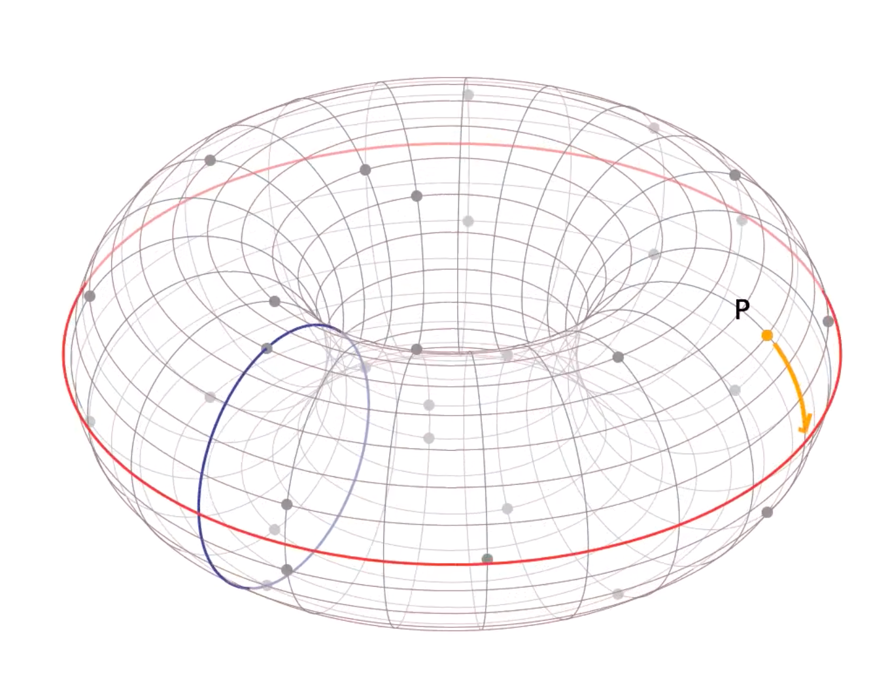

但是考虑到我正在写一篇文章，所以在此将其以简单的 2D 图像呈现出来更加容易。      

现在，让我们向 A + B 点添加一个新点 C = (10,14)：

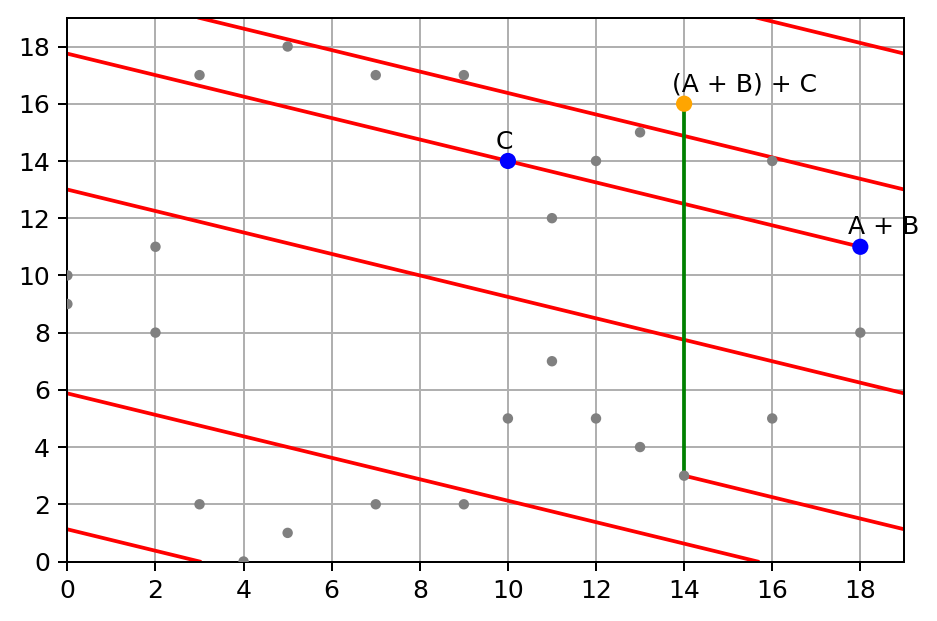

接下来，让我们看看群律的关联性是否仍适用于有限域，这一次我们首先添加 B + C 点：

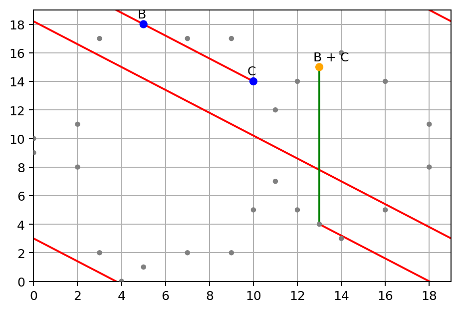

然后，我们将 A 加到 B + C 点：

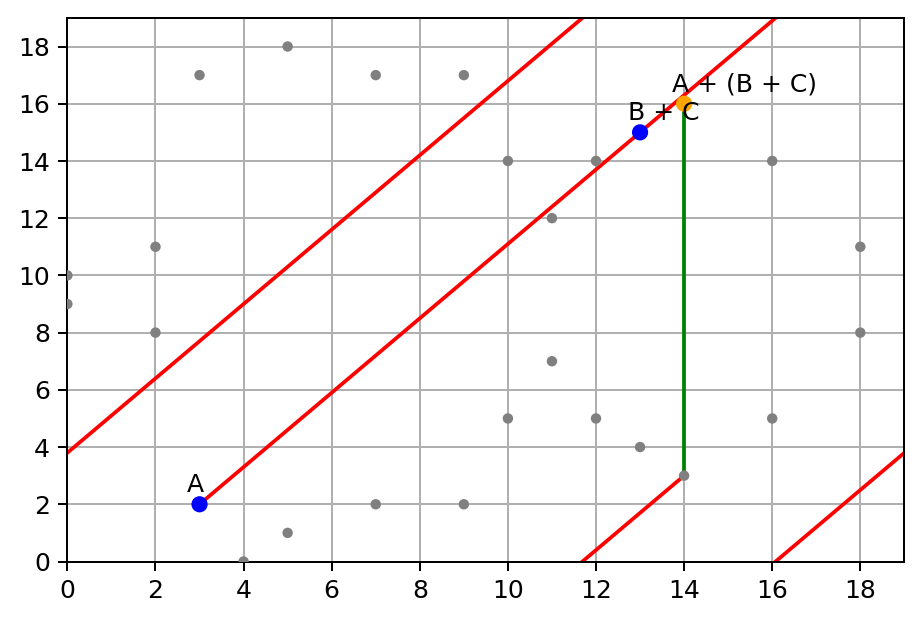

是的，它们最终都在同一个点(14,16)：

```Python
a_b = a + b
b_c = b + c
(a_b + c), (a + b_c)
```

```
(Point(p=19, x=14, y=16), Point(p=19, x=14, y=16))
```

现在你可能会问，在有限域上如何对一个点进行自加操作？是的，对一个点进行自加操作也是遵循与实数域相同的规则，即用有限域上的切线连接第三点。正如我们已经展示的它如何处理实数一样，我们不想在这里重复一遍，或者说实际上是因为我很懒😅。      

最后，由于有限域仅在整数上进行运算，所以我们不会损失任何精度。这令它更适合用于密码学。
